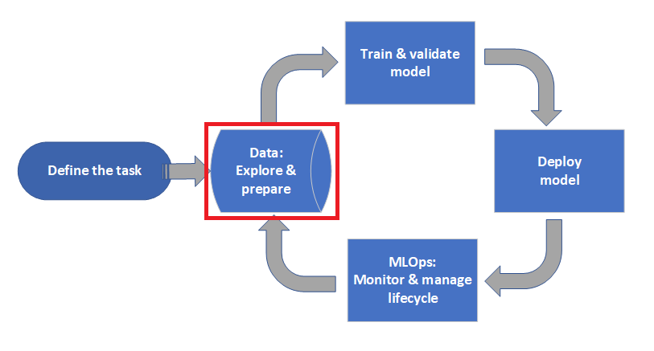
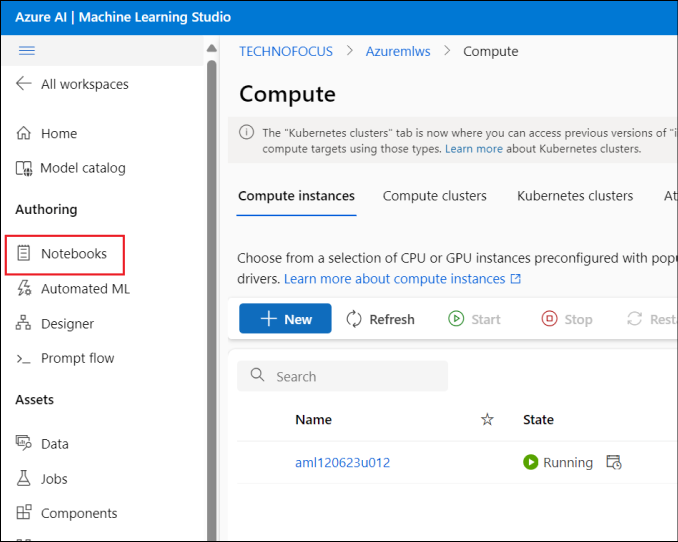
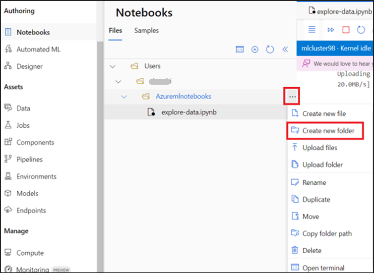
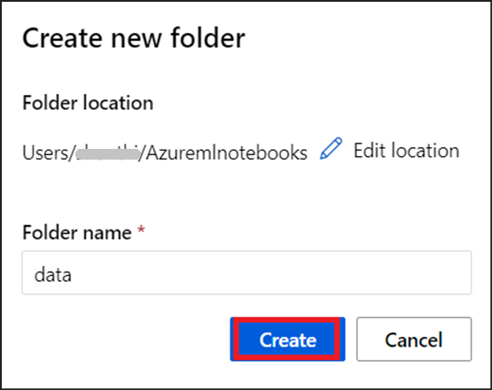
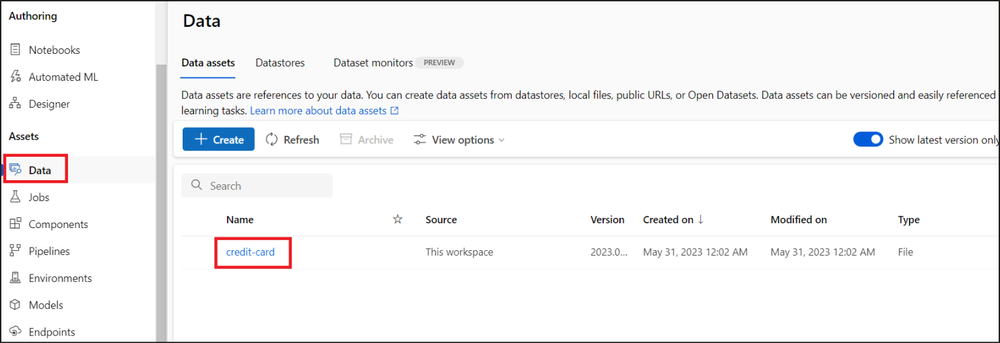
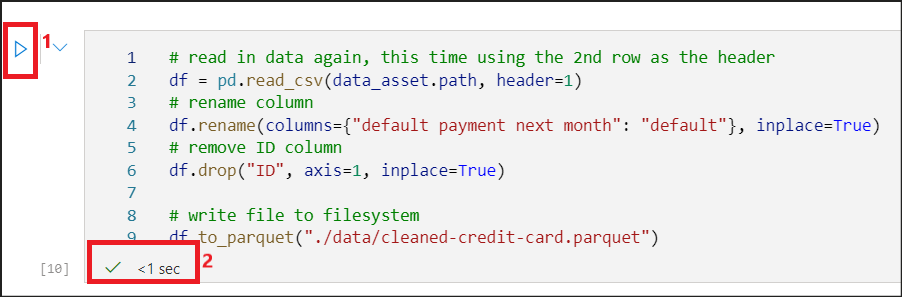
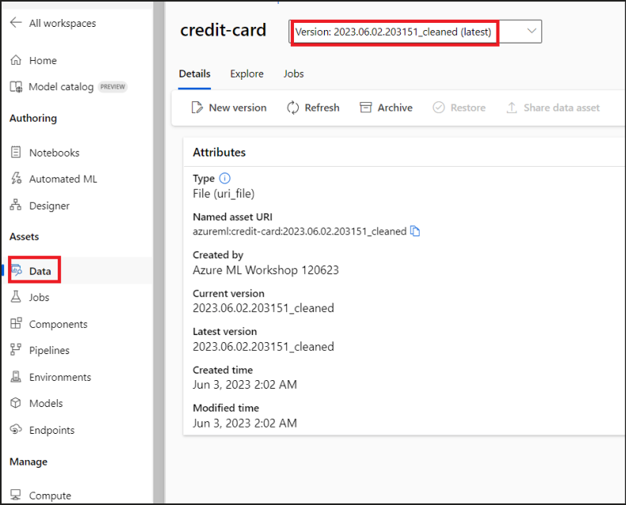
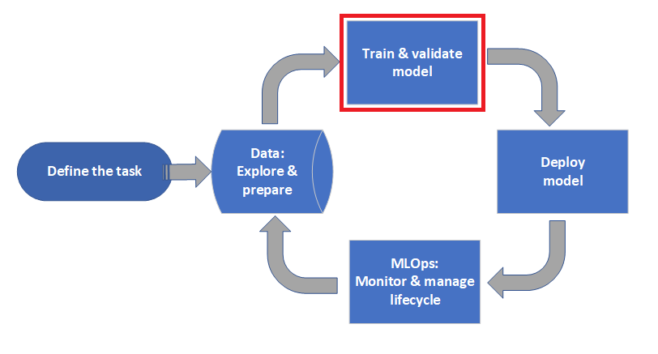

# 실습 01- Azure Machine Learning Studio를 사용하여 데이터세트 준비, 분류 모델 학습 및 배포하기

**목표**

이 실습에서는Azure Machine Learning 환경을 설정하고, 데이터를 업로드,
액세스 및 탐색하고 Azure Machine Learning Studio를 사용하여 이미지 분류
모델을 학습 및 배포하는 프로세스를 안내하는 데 집중합니다.

예상 소요 시간 – 45분

## 연습 1: Azure Machine Learning 작업 공간을 설정하기

### 작업 1: VM 시계를 동기화하기

1.  VM에 로그인한 후 화면 오른쪽 하단의 시계를 마우스 오른쪽 버튼으로
    클릭하세요.

2.  **Adjust date and time**를 선택하세요.

&nbsp;

3.  열리는Settings 화면에서Additional settings의 **Sync now**를
    클릭하세요.

> 

4.  이렇게 하면 자동 동기화가 작동하지 않는 경우를 대비하여 시간을
    동기화합니다.

> 

### 작업 2: Azure 리소스를 준비하기

이 작업은 Azure Machine Learning 작업 공간을 생성하는 데 집중합니다.
Machine learning 프로젝트를 효과적으로 구성하고 관리하기 위해 전용 작업
공간을 설정하는 방법을 알아봅니다. 이 작업 공간은 작업, 실험 및 배포를
위한 중앙 허브 역할을 합니다.

#### 작업 2.1: 필요한 Resource Providers를 등록하기 

1.  Azure portal 홈페이지에서 할당된 **subscription**으로 이동하세요.

2.  왼쪽 창에서 **Settings**의 Resource Providers를 선택하세요.

3.  +++Microsoft.StreamAnalytics+++를 검색하고 이름에 있는 세 개의 점을
    선택하고**Register**를 클릭하세요.

4.  단계를 반복하여 +++Microsoft.Cdn+++ 및
    +++Microsoft.PolicyInsights+++를 등록하세요

#### 작업 2.2: Azure Machine Learning 작업 공간을 생성하기

1.  **Resources** 탭에서**Username** 및 **Password**를 사용하여
    +++https://portal.azure.com+++에서 Azure portal에 로그인하세요.

> 

2.  Azure홈페이지에서 **+ Create a resource**를 선택하세요.

3.  **Create a resource** 페이지에서 검색 바에 +++**Azure Machine
    Learning+++** 를 찾고 **Azure** **Machine Learning**를 선택하세요.

> 

4.  **Marketplace**에서 **Create dropdown**를 클릭하고**Azure Machine
    Learning**를 선택하세요.

> 

5.  다음 정보를 제공하여 새 작업 영역을 구성하고 **Review + create**를
    클릭하세요.

    - **Subscription**: **assigned Azure subscription**를 선택하세요

    - **Resource group**: 할당된**Resource Group**를 선택하세요.

> **Workspace Details:**

- **Workspace name:** +++**Azuremlws@lab.LabInstance.Id**+++

- **Region**: 가장 가까운 지역을 선택하세요 **(North Central US**가
  여기에서 선택됩니다)

&nbsp;

- **Container registry: Select Create new. Enter
  +++azuremlcr@lab.LabInstance.Id+++**

**참고:** 리소스 이름에 추가되는 숫자는 고유성을 보장하기 위해
Labinstance ID입니다. 스크린샷은 고유하기 떼문에 다른 번호를 갖습니다.

6.  Validation이 통화되면 **Create**를 클릭하세요.

7.  새 작업 공간을 보기 위해 **Go to resource**를 클릭하세요.

8.  **Microsoft.MachineLEarningServices | Overview page**에서**Work with
    your model in Azure Machine Learning studio**의 **Launch studio**를
    선택하세요.

#### 작업 2.3: 컴퓨팅을 생성하기

이 작업은 Azure에서 컴퓨팅 리소스를 생성하는 방법을 보여줍니다. 가상
머신이나 관리형 컴퓨팅 클러스터와 같을 다양한 컴퓨팅 옵션을 탐색하고
machine learning 워크로드를 효율적으로 실행하기 위해 리소스를 구성하고
프로비저닝하는 방법을 이해할 것입니다.

1.  **Azure Machine Learning Studio**가 열리면 왼쪽 창의 **Manage**에서
    **Compute**를 클릭하세요.

2.  **Compute instances** 화면에서 **+ New**를 클릭하세요.

3.  Create compute instance 화면에서 다음 세부 정보를 입력하세요.

    1.  Compute name – +++**cpu-cluster-fs@lab.labInstance.Id**+++

    2.  Virtual machine type – **CPU**

    3.  Virtual machine size – **Standard_E4ds_v4**를 선택하세요

> **Review + Create**를 클릭하세요.

**참고:** 나중에 사용할 수 있도록 이 컴퓨팅 이름을 기록해 두세요.

4.  다음 화면에서 **Create**를 클릭하세요.

**참고:** 컴퓨팅이 실행 중 상태로 올라가는 데 약 10분이 걸립니다.

**중요:** 컴퓨팅이 실행되면 다음 작업을 계속할 수 있습니다. 그러나 실습
실행을 중단하는 경우 컴퓨팅 인스턴스를 **중지**하고 휴식 후 다시
시작하세요.

**연습 요약:**

이 연습을 통해 참가자는 Azure Machine Learning 환경을 설정하는 데 관련된
필수 단계를 숙지할 수 있습니다. 일련의 작업을 통해 참가자는 스토리지
계정을 생성하고 Machine Learning SDK를 설치하고 Azure CLI를 사용하여
로그인하고 Azure Machine Learning 작업 공간을 생성하고 컴퓨팅 리소스를
설정하는 방법을 배웠습니다. 이 연습을 완료하면 기능적인 Azure Machine
Learning 환경을 설정하는 데 필요한 기본 지식과 실용적인 기술을 습득하여
자신 있게 기계 학습 프로젝트를 시작할 수 있습니다.

## 연습 2 – Azure Machine Learning에서 데이터 업로드, 액세스 및 탐색하기

**목표**

이 연습에서는 다음을 배울 것입니다:

- 클라우드 스토리지에 데이터를 업록드하기

- Azure Machine Learning 데이터 자산을 생성하기

- 대화형 개발을 위해 노트북의 데이터의 액세스하기

- 데이터 자산의 새 버전을 생성하기

머신 러닝 프로젝트의 시작에는 일반적으로 exploratory data analysis
(EDA), 데이터 전처리 (정리, 기능 엔지니어링) 및 가설을 검증하기 위한
머신 러닝 모델 프로토타입 빌드가 포함됩니다. 이 프로토타이핑 프로젝트
단계는 대화형이 매우 활발합니다. *Python* 대화형 콘솔을 사용하여 IDE
또는 Jupyter 노트북에서 개발하는 데 적합합니다. 이 실습에서는 이러한
아이디어에 대해 설명합니다.

우리는**Machine Learning project workflow**의 **Data: Explore &
prepare** 단계에 있습니다**.**

### 작업 1: Azure 리소스를 준비하기

**중요:** 컴퓨팅이 실행되면 다음 작업을 계속할 수 있습니다. 실습
실행에서 휴식하는 경우 컴퓨팅 인스턴스를 **중지**하고 휴식 후 다시
시작하세요

#### 작업 1.1: Notebook를 업록하기

1.  Azure Machine Learning 스튜디오에서 컴퓨팅이 실행되면 왼쪽 창에서
    **Notebooks** 옵션을 선택하세요. 

2.  **What’s new in Notebooks** 대화상자를 닫으세요.

3.  Notebook Files 창이 구조와 함께 열립니다, **Users -\> \< UserName
    \>** 사용자 이름 옆에 있는 세 개의 점을 클릭하고 **Create new
    folder**를 선택하세요.

4.  폴더 이름을 +++**Azuremlnotebooks**+++로 입력하고 **Create**를
    클릭하세요**.**

5.  폴더가 생성해지면 **Azuremlnotebooks** 폴더의 **Menu options** (폴더
    이름 옆에 있는 세 개의 점)을 클릭하고 **Upload files**를 클릭하세요.

6.  **Click to browse and select file(s)**를 선택하세요**.
    C:\Labfiles**의 **explore-data.ipynb**로 이동하고 **Open**를
    클릭하세요.

7.  확인란 **Open file after upload** 및 **I trust the contents of this
    file**를 선택하세요**. Upload**를 클릭하세요**.**

8.  그러면 업로드된 Notebook이 열립니다.

9.  스튜디오에서 인증을 요청하는 경우 **Authenticate**를 클릭하세요.
    이는 스튜디오에 처음 로그인하기 때문입니다.

> 

### 작업 2: 데이터를 업로드, 액세스 및 탐색하기 

#### 작업2.1: 데이터를 다운로드하기

1.  **Notebooks**의 **Files** 창에서 폴더 이름 **Azuremlnotebooks** 옆에
    있는 점 3개를 클릭하고**Create new folder**를 클릭하세요**.**

2.  폴더 이름을 +++**data**+++로 입력하고 **Create**를 클릭하세요.

3.  폴더 생성에 성공하면 폴더 **data**의 메뉴 옵션을 클릭하고 **Upload
    files**를 선택하세요.

4.  **Click to browse and select file(s)**를 선택하고 **C:\Labfiles**로
    이동하고**default_of_credit_card_clients.csv** 파일을 선택하고
    **Open**를 클릭하세요.

> 

5.  업로드가 완료되면 **File uploaded successfully**라는 메시지가
    Notifications 아래에 표시됩니다.

#### 작업 2.2: 작업 공간에 대한 핸들을 생성하기

1.  노트북(**explore-data**)으로 다시 이동하세요.

2.  코드를 살펴보기 전에 작업 공간을 참조하는 방법이 필요합니다. 작업
    영역에 대한 핸들에 대한 ml_client 생성할 것입니다. 그 후 ml_client
    사용하여 리소스와 작업을 관리할 것입니다.

3.  **Create handle to workspace**아래의 첫 번째 셀에서 \<
    **SUBSCRIPTION_ID** \>, **\< RESOURCE_GROUP \>** 및 **\<
    AML_WORKSPACE_NAME \>**의 자리 표시자를 바꾸세요**.**

4.  \< RESOURCE_GROUP\>를 할당된 리소스 그룹의 이름으로 바꾸세요.

5.  \<AML_WORKSPACE_NAME\>를
    [+++**Azuremlws@lab.LabInstance.Id**](mailto:+++Azuremlws@lab.LabInstance.Id)**+++**로
    바꾸세요

6.  \< SUBSCRIPTION_ID \>를
    [+++**@lab.CloudSubscription.Id**](mailto:+++@lab.CloudSubscription.Id)+++로
    바꾸세요.

7.  셀의 왼쪽 상단에 있는 **Run cell** 버튼을 클릭하세요. 실행이
    성공적으로 완료되면 셀 아래쪽에 있는 눈금 표시를 찾으세요.

#### 작업 2.3: 데이터를 클라우드 스토리지로 업로드하세요

1.  Azure Machine Learning 데이터 자산은 웹 브라우저 책갈피(즐겨찾기)와
    비슷합니다. 가장 자주 사용되는 데이터를 가리키는 긴 스토리지 경로
    (URI)를 기억하는 대신 데이터 자산을 생성한 후 친숙한 이름으로 해당
    자산에 액세스할 수 있습니다.

2.  다음 Notebook 셀은 데이터 자산을 생성합니다. 코드 샘플은 원시 데이터
    파일을 지정된 클라우드 스토리지 리소스에 업로드합니다.

3.  데이터 자산을 생성할 때마다 고유한 버전이 필요합니다. 버전이 이미
    있는 경우 오류가 발생합니다. 이 코드에서는 셀을 실행할 때마다 시간을
    사용하여 고유한 버전을 생성합니다.

4.  셀의 왼쪽 상단에 있는 Execute 버튼을 클릭하여 다음 셀을 실행하세요.

5.  **“Data asset created. Name: credit-card, version:
    YYYY:MM:DD.xxxxxx”**는 셀 아래에 표시되는 출력입니다.

6.  왼쪽 창에서 **Data**를 클릭하고 위 단계에서 수행한 실행에 의해
    생성된 **credit-card** 데이터 자산을 클릭하세요. 세부 정보를
    탐색하고 **Notebooks** 창으로 다시 이동하세요.

#### 작업 2.4: Notebook에서 데이터를 액세스하기

1.  Notebook으로 돌아가서 **%pip** 명령으로 셀을 실행하여 **Jupyter**
    커널에 **azureml-fsspec** Python 라이브러리를 설치하세요.

2.  **Pandas**에서 CSV 파일에 액세스하려면 다음 셀을 실행하세요.

3.  셀 아래쪽에 Data asset URI가 인쇄되고 데이터도 표시됩니다.

#### 작업 2.5: 데이터 자산의 새 버전을 생성하기

1.  Machine learning 모델을 학습시키는 데 적합하도록 데이터를 약간
    가볍게 정리해야 한다는 것을 알아차렸을 수 있습니다. 다음을 가지고
    있습니다:

    1.  두 개의 헤더

    2.  클라이언트 ID 열; Machine Learning에서는 이 기능을 사용하지
        않습니다

    3.  응답 변수 이름의 공백

2.  또한 CSV 형식과 비교할 때 **Parquet** 파일 형식은 이 데이터를
    저장하는 더 나은 방법이 됩니다. Parquet는 압축을 제공하며 스키마를
    유지 관리합니다. 따라서 데이터를 정리하고 Parquet에 저장하려면 다음
    셀을 실행합니다.

3.  셀 아래쪽에 있는 눈금 표시로 실행이 성공했는지 확인하세요.

4.  이 표는 이전 단계에서 다운로드한 원본
    **default_of_credit_card_clients.csv** 파일 .CSV 파일의 데이터
    구조를 보여줍니다. 업로드된 데이터에는 다음과 같이 23개의 설명
    변수와 1개의 응답 변수가 포함되어 있습니다:

[TABLE]

5.  데이터 자산의 새 *버전*을 생성하려면 다음 셀을 실행하세요. (데이터는
    Cloud Storage에 자동으로 업로드됩니다).

6.  성공적으로 실행되면 다음과 같은 출력이 **Data asset created. Name:
    credit_card, version: YYYY.MM.DD.xxxxxx_cleaned**이 셀 뒤에
    표시됩니다.

**중요:**

이 Python 코드 셀은 생성하는 데이터 자산의 **name** 및 **version** 값을
설정합니다. 결과적으로 이 셀의 코드는 이러한 값을 변경하지 않고 두 번
이상 실행하면 실패합니다. 고정 **name** 및 **version** 값은 자동
생성이나 임의로 생성된 값에 대한 걱정 없이 특정 상황에서 작동하는 값을
전달하는 방법을 제공합니다.

7.  정리된 parquet 파일은 최신 버전 데이터 원본입니다. 다음 셀의 코드는
    CSV 버전 결과 집합을 먼저 표시한 후 실행 시 Parquet 버전을
    표시합니다.

8.  다음 셀을 실행하고 아래 결과를 확인하세요.

> 

9.  **Data**에서 정리된 데이터를 찾으세요.

> 

**중요:** 컴퓨팅이 실행되면 다음 작업을 계속할 수 있습니다. 실습
실행에서 휴식하는 경우 컴퓨팅 인스턴스를 **중지**하고 휴식 후 다시
시작하세요.

**연습 요약**

이 연습에서는 클라우드 스토리지에 데이터를 업로드하고, Azure Machine
Learning 데이터 자산을 생성하고 대화형 개발을 위해 Notebook의 데이터에
액세스하고 새 버전의 데이터 자산을 생성하는 방법을 알아보았습니다.

## 연습 3 – Azure Machine Learning 스튜디오에서 이미지 분류 모델 학습 및 배포하기

**목표**

이 연습에서는 다음을 학습할 것입니다

1.  Azure Machine Learning Studio Notebook UI를 사용하여 작업 공간에
    연결 및 계산 리소스를 설정하기

2.  교육을 사용하기 위해 데이터를 가져오기

3.  이미지 분류를 위한 모델을 학습하기

4.  모델 최적화를 위한 메트릭 보기 및 분석하기

5.  모델을 온라인으로 배포하고 테스트하기

우리는 **Machine Learning project workflow**의 **Train & validate
model** 단계에 있습니다**.**

### 작업 1: Upload Notebook을 업로드하기

1.  Azure Machine Learning Studio에서 **Notebooks** 페이지,
    **AzureMLnotebooks** 폴더의 메뉴 옵션을 클릭하고 **Upload files**를
    클릭하세요.

> 

2.  **Click to browse and select file(s)**를 선택하고 **C:\Labfiles**로
    이동하고 파일 **azureml-getting-started-studio** (a Jupyter Source
    File)을 선택하세요.

> 
>
> 

3.  **Open file after upload** 확인란을 선택하고 **Upload**를
    클릭하세요.

> 

4.  파일 업로드가 성공하면 스튜디오에서 열리고 실행 중 상태인 Compute
    (cpu-cluster-fs)에 자동으로 연결됩니다.

> 

### 작업 2: Azure Machine Learning 작업 공간에 연결하기

코드를 살펴보기 전에 작업 공간에 연결해야 합니다. 작업 공간은 Azure
Machine Learning의 최상위 리소스로 Azure Machine Learning을 사용할 때
생성하는 모든 아티팩트를 사용할 수 있는 중앙 집중식 위치를 제공합니다.

**DefaultAzureCredential**을 사용하여 작업 영역에 대한 액세스 권한을
얻고 있습니다. **DefaultAzureCredential**은 대부분의 시나리오를 처리할
수 있어야 합니다.

*\# Handle to the workspace*

**from** azure.ai.ml **import** MLClient

*\# Authentication package*

**from** azure.identity **import** DefaultAzureCredential

credential **=** DefaultAzureCredential()

*\# Get a handle to the workspace. You can find the info on the
workspace tab on ml.azure.com*

ml_client **=** MLClient(

credential**=**credential,

subscription_id**=**"\<SUBSCRIPTION_ID\>", *\# this will look like
xxxxxxxx-xxxx-xxxx-xxxx-xxxxxxxxxxxx*

resource_group_name**=**"\<RESOURCE_GROUP\>",

workspace_name**=**"\<AML_WORKSPACE_NAME\>",

)

1.  위의 코드 (노트북의 첫 번째 셀)에서 **SUBSCRIPTION_ID,
    RESOURCE_GROUP NAME** 및 **AML_WORKSPACE_NAME** 자리 표시자를 이전
    연습에서 저장한 값으로 바꾸세요.

2.  이제 Notebook의 첫 번째 셀이 다음과 같이 표시됩니다. 첫 번째 셀의
    왼쪽 상단 근처에 있는 **Run** 버튼을 클릭하세요.

3.  셀 아래쪽에서 상태를 확인하여 셀이 성공적으로 실행되었는지
    확인하세요.

In \[ \]:

### 작업 3: 데이터를 업로드하기

Azure Machine Learning 학습 작업을 실행하려면 환경이 필요합니다.

이 실습에서는 필요한 모든 라이브러리 (python, MLflow, numpy, pip 등)를
포함하는 AzureML-sklearn-1.0-ubuntu20.04-py38-cpu@latest라는 미리
생성해진 환경을 사용할 것입니다.

1.  데이터를 업로드하기 위해 다음 셀에서 코드를 실행하세요.

2.  **Data asset created**다는 메시지가 셀의 출략으로 표시되는지
    확인하세요.

### 작업 4: 학습할 명령 작업을 빌드하기

이제 작업을 실행하는 데 필요한 모든 자신이 있으므로 Azure ML Python SDK
v2를 사용하여 작업 자체를 빌드할 차례입니다. 명령 작업을 생성할
것입니다.

AzureML 명령 작업은 클라우드에서 학습 코드를 실행하는 데 필요한 모든
세부 정보 (입력 및 출력, 사용할 하드웨어 유형, 설치할 스프트웨어 및 코드
실행 방법)를 지정하는 리소스입니다. 명령 작업에는 단일 명령을 실행하기
위한 정보가 포함되어 있습니다.

#### 작업 4.1: 학습 스키립트를 생성하기

1.  먼저 학습 스크립트를 생성해 보겠습니다 - **main.py** python 파일.

2.  다음 셀을 실행하고 성공적으로 실행되었는지 확인하세요.

3.  다음 셀의 스크립트는 데이터의 전처리를 처리하여 테스트 데이터와 학습
    데이터로 분할합니다. 이 데이터를 사용하여 트리 기반 모델을
    학습시키고 출력 모델을
    반환합니다. [MLFlow](https://mlflow.org/docs/latest/tracking.html)는
    파이프라인 실행 중에 매개 변수와 메트릭을 기록하는 데 사용됩니다.

4.  셀을 실행하고 출력과 함께 성공적으로 실행되는지 확인하세요,

**Writing ./src/main.py**

> 
>
> 

5.  이 스크립트에서 볼 수 있듯이 모델이 학습되면 모델 파일이 저장되고
    작업 공간에 등록됩니다. 이제 추론 엔드포인트에서 등록된 모델을
    사용할 수 있습니다.

#### 작업 4.2: 명령을 구성하기

이제 원하는 작업을 수행할 수 있는 스크립트가 있으므로 명령줄 작업을
실행할 수 있는 범용 명령을 사용할 것입니다. 이 명령줄 작업은 시스템
명령을 직접 호출하거나 스크립트를 실행할 수 있습니다.

1.  여기서는 입력 데이터, 분할 비율, 학습률 및 등록된 모델 이름을 입력
    변수로 사용할 것입니다.

2.  왼쪽 창에서**Data**를 선택하고 **credit-card-data**를 선택하세요.

3.  **Data sources** 섹션에서 **Datastore URI** 값을 찾아 복사하세요.
    다음 단계에서 사용할 수 있도록 저장하세요.

4.  다음 셀에서 다음을 바꾸세요

    1.  이전 단계에서 저장된 **Database URI**가 있는 **path**의 값.

    2.  ++**cpu-cluster-fs@lab.LabInstance.Id**+++를 사용한 **compute**
        값 (실습 1에서 저장한 클러스터의 이름입니다)

5.  **Run**를 클릭하세요. 셀이 성공적으로 실행되는지 확인하세요.

### 작업 6: 작업을 제출하기

이제 AzureML에서 실행할 작업을 제출할 차례입니다. **The job will take 2
to 3 minutes to run**. 컴퓨트 인스턴스가 0개의 노드로 축소되었고 사용자
지정 환경이 여전히 빌드 중인 경우 더 오래 걸릴 수 있습니다 (최대 10분).

1.  작업을 제출하기 위해 아래 명령으로 셀을 실행하세요.

> ***\# submit the command job***
>
> **ml_client.create_or_update(job)**

2.  **Run**을 클릭하세요. 실행이 성공적으로 완료되었고 **Details
    Page**열 아래에 결과에 대한 링크가 있는지 확인하세요.

**참고**: 완료하는 데 약 2분 정도 소요됩니다.

3.  새 탭에서 결과의 **Details Page** 열 아래에 있는 링크를 여세요.

### 작업 7: 교육 작업의 결과를 보기

1.  **Clicking the URL generated after submitting a job**을 통해 학습
    작업의 결과를 볼 수 있습니다.

> 

2.  또는 왼쪽 탐색 메뉴에서 **Jobs** 을 클릭할 수도 있습니다. 작업은
    지정된 스크립트 또는 코드 조각에서 여러 실행을 그룹화한 것입니다.
    실행에 대한 정보는 해당 작업 아래에 저장됩니다.

3.  **Overview** 페이지에는 먼저 **Properties** 창 아래의 **Status가
    Running**으로 표시됩니다.

4.  준비가 되면 상태가 **Completed**으로 변경됩니다.

5.  메트릭을 보려면 **Metrics**창을 선택하세요.

6.  training_confusion 행렬, 정밀도 재현율 곡선 및 ROC 곡선을 확인하려면
    **Images**탭을 선택하세요.

1)  **Overview**에서는 작업 상태를 볼 수 있습니다.

2)  **Metrics**은 스크립트에서 지정한 메트릭의 다양한 시각화를
    표시합니다.

3)  **Images**는 MLflow로 기록한 이미지 아티팩트를 볼 수 있는
    위치입니다.

4)  **Child jobs**에는child jobs이 추가한 경우 포합됩니다.

5)  **Outputs + logs**에는 문제 해결이나 기타 모니터링 목적으로 필요한
    로그 파일이 포함되어 있습니다.

6)  **Code**에는 작업에 사용되는 스크립트/코드가 포함되어 있습니다.

7)  **Explanations** 및 **Fairness**은 모델이responsible AI 표준에 대해
    어떻게 작동하는지 확인하는 데 사용됩니다. 현재 미리 보기 기능이며
    추가 패키지 설치가 필요합니다.

8)  **Monitoring**에서는 컴퓨팅 리소스의 성능에 대한 메트릭을 볼 수
    있습니다.

### 작업 8: 모델 온라인 엔드포인트로 배포하기

기계 학습 모델을 학습시킨 후에는 다른 사용자가 추론에 사용할 수 있도록
배포해야 합니다. 이를 위해 Azure Machine Learning을 사용하면
**endpoints**를 생성하고 **deployments**를 추가할 수 있습니다.

이 컨텍스트에서 **endpoint**는 클라이언트가 학습된 모델에 요청(입력
데이터)을 보내고 모델에서 추론(점수 매기기) 결과를 받을 수 있는
인터페이스를 제공하는 HTTPS 경로입니다. 엔드포인트는 다음을 제공합니다:

- "키 또는 토큰" 기반 인증을 사용한 인증

- TLS(SSL) 종료

- 안정적인 점수 매기기 URI (endpoint-name.region.inference.ml.azure.com)

**Deployment**는 실제 추론을 수행하는 모델을 호스팅하는 데 필요한 리소스
집합입니다.

#### 작업 8.1: 온라인 엔드포인트를 생성하기

1.  이제 machine learning 모델을 온라인 엔드포인트인 Azure 클라우드에서
    웹 서비스로 배포하세요.

2.  왼쪽 창에서 **Endpoints**를 선택하세요.

3.  Real-time endpoint를 **Create**를 선택하세요

4.  **credit_defaults_model**를 선택하고 **Select**를 클릭하세요**.**

5.  Virtual machine에서 **Standard_E4s_v3**를 선택하세요. 인스턴스 수를
    **1**로 제공하세요.

> 고유한 **Endpoint name**과 **Deployment name**의 다른 기본값을 적용한
> 후**Deploy**를 선택하세요.

**참고:** 엔드포인트 생성을 완료하는 데 약 20분이 걸립니다.

6.  완료되면 프로비저닝 상태가 **Succeeded**으로 변경됩니다.

#### 작업 8.2: 샘플 쿼리로 테스트하기

1.  엔드포인트 페이지에서 **Test** 탭을 선택하세요.

2.  다음 샘플 요청 파일을 복사하여 **Input data to test real-time
    endpoint** 필드에 붙여넣고 이미 있는 코드를 바꾸세요.

> **{**
>
> **"input_data": {**
>
> **"columns":
> \[0,1,2,3,4,5,6,7,8,9,10,11,12,13,14,15,16,17,18,19,20,21,22\],**
>
> **"index": \[0, 1\],**
>
> **"data": \[**
>
> **\[20000,2,2,1,24,2,2,-1,-1,-2,-2,3913,3102,689,0,0,0,0,689,0,0,0,0\],**
>
> **\[10, 9, 8, 7, 6, 5, 4, 3, 2, 1, 10, 9, 8, 7, 6, 5, 4, 3, 2, 1, 10,
> 9, 8\]**
>
> **\]**
>
> **}**
>
> **}**

3.  **Test result**에서 결과를 보려면 **Test**를 선택하세요.

> 

### 작업 9: Endpoint를 삭제하기

1.  왼쪽 창에서 **Endpoints**를 선택하세요. 생성한 endpoint를 선택하고
    **Delete**를 클릭하세요.

2.  확인 대화 상자에서 **Delete**를 클릭하세요.

3.  성공적인 삭제에 대한 알림을 찾으세요.

**요약**

이 실습에서는 Azure Machine Learning Studio에서 이미지 분류 모델을
학습시키고 웹 서비스로 배포하는 방법을 배웠습니다.
