# Lab 01- Prepare dataset, train and deploy a classification model, using Azure Machine Learning Studio

**Lab duration** – 45 minutes

**Objective**

This lab focuses on guiding you through the process of setting up an
Azure Machine Learning environment, uploading, accessing and exploring
data and training and deploying an image classification model using the
Azure Machine Learning Studio.

## Exercise 1: Setting up Azure Machine Learning workspace

### Task 1: Synchronize the VM clock

1.  After logging into the VM, right click on the clock at the bottom
    right corner of the screen.

2.  Select **Adjust date and time.**

3.  On the Settings screen that opens up, click on the **Sync now**
    under Additional settings.

    

4.  This takes care of synchronizing the time just in case the automatic
    synchronization does not work.

    

### Task 2: Redeem the Azure Pass

1.  In your lab VM, open Microsoft Edge and
    enter +++http://www.microsoftazurepass.com+++

     

2.  Ready **to get started?** page, click on the **Start** button. 

     

    >[!Note]**Note**: Do not use your Company/Work Account to login to redeem the
Azure Pass, another Azure Pass will not be issued. 

3.  In the **Sign in** window, enter the **Office 365 Tenant ID** from
    the **Resources** tab and click on the **Next** button. 

     

4.  Enter Office **365 Tenant Password** and click on the **Sign in**
    button. 

     

5.  On **Stayed signed in?** dialog box, click on **Yes** button. 

      

6.  On **The following Microsoft Account will be used for Azure pass**
    page, click on **Confirm Microsoft Account** button. 

     

7.  Enter the **Promocode** provided in the **Resources** tab in the
    **Enter Promo code** field, then enter the characters under the
    **Enter the characters you see** field and click on the **Submit**
    button.  

     

8.  **We are processing your request** page will appear, it may take few
    seconds to process the redemption. 

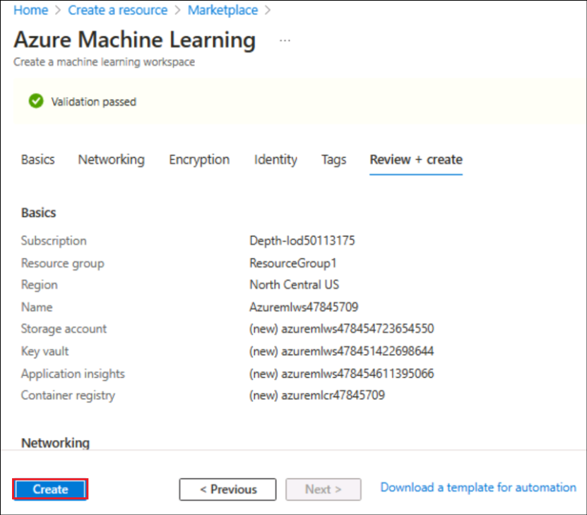 

9.  Enter correct details in **Your Profile** page, tick all the check
    boxes, and then click on **Sign up** button. 

     

     

10. On **Protect your account** dialog box, click on the **Next**
    button. 

     

11. Then, on **More information required** dialog box, click on
    the **Next** button. 

     

12. If prompted, then enter the password and click on the **Sign in**
    button. 

     

13. In your mobile, install the **Microsoft Authenticator App**. Then,
    go back to Microsoft Azure port. In the Azure portal, **Microsoft
    Authenticator -** **Start by getting the app** window, navigate and
    click on the **Next** button. 

     

14. In **Microsoft Authenticator –** **Set up your account** window,
    click on the **Next** button. 

     

15. **Scan the QR code** using the **Authenticator app** installed in
    your mobile phone and click on the **Next** button. 

     

16. Enter the number in your mobile authenticator app and select
    **Yes**. In **testvm1**, click on the **Next** button. 

     

17. Click on the **Next** button. 

     

16. Click on the **Done** button. 

     

17. Enter the number again in your mobile authenticator app and select
    **Yes**.. 

     

18. In the **Stay signed in?** window, click on the **Yes** button. 

    

### Task 3: Getting the Azure resources ready

#### Task 3.1: Create an Azure Machine Learning workspace

This task focuses on creating an Azure Machine Learning workspace. You
will discover how to set up a dedicated workspace to organize and manage
their machine learning projects effectively. This workspace serves as a
central hub for collaboration, experimentation, and deployment.

1.  Sign in to the Azure portal at <https://portal.azure.com> if not
    already logged in.

2.  From the Azure portal home page, select **+ Create a resource**.

    

3.  On the **Create a resource** page, use the search bar to find
    +++Azure **Machine Learning+++** and select **Azure** **Machine
    Learning**.

    

4.  Under **Marketplace**, click on **Create dropdown** and select
    **Azure Machine Learning**.

    

5.  Provide the following information to configure your new workspace:

    - **Subscription**: Select your **assigned Azure subscription**

    - **Resource group**: Select **Click New** and give the name as
      +++RGForMLOps+++

    

    **Workspace Details:**

    - **Workspace name:** +++**AzuremlwsXX**+++ **(Substitute XX with a
      random number to ensure uniqueness)**
    
    - **Region**: Select your nearest region **(North Central US** is
      selected here)

    - **Container registry: Select Create new. Enter +++azuremlcrXX+++**
  (Replace **XX** with a unique number)

    >[!Note] **Note:** The screenshots will not have the **XX**(Random number) since
they were not used while testing. Please ensure to add a unique number
at the end wherever the guide says so.

    

6.  Once you are done configuring the workspace, select **Review +
    Create**.

    

7.  Once the Validation is passed, click on **Create**.

    

8.  Click on **Go to resource**, to view the new workspace.

    

9.  **On the Microsoft.MachineLEarningServices | Overview page**,
    select **Launch studio** under **Work with your model in Azure
    Machine Learning studio**.

    

#### Task 3.2: Create a compute

This task demonstrates the creation of a compute resource in Azure. You
will explore different compute options, such as virtual machines or
managed compute clusters, and understand how to configure and provision
resources to execute machine learning workloads efficiently.

1.  Once the **Azure Machine Learning Studio** opens, click on
    **Compute** under **Manage** from the left pane.

    

2.  Click on **+ New** on the **Compute instances** screen.

    

3.  On the Create compute instance screen, enter the below details.

    - Compute name – +++**cpu-cluster-fs**+++

    -  Virtual machine type – **CPU**

    -  Virtual machine size – Select **Standard_E4ds_v4**

    Click on **Review + Create**.

    >[!Note] **Note:** Make a note of this compute name for later use.

    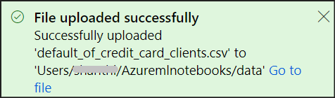

4.  Click on **Create** in the next screen.

    

    >[!Note] **Note:** The compute takes around 10 minutes to come up to the Running
state.

    

    >[!Alert] **Important:** Once the Compute is up and running you can continue with
the next tasks. But, if you are taking a break from the lab execution,
please ensure to **stop** the compute instance and start it again when
you start after the break.

    

**Exercise summary:**

The exercise familiarizes participants with the essential steps involved
in setting up an Azure Machine Learning environment. Through the series
of tasks, participants have learnt how to create a Storage account,
install the Machine Learning SDK, log in using Azure CLI, create an
Azure Machine Learning workspace, and set up a compute resource. By
completing this exercise, you have acquired the fundamental knowledge
and practical skills required to establish a functional Azure Machine
Learning environment, enabling you to embark on your machine learning
projects confidently.

## Exercise 2 – Uploading, accessing and exploring your data in Azure Machine Learning

**Objective**

In this exercise, you will learn how to:

- Upload your data to cloud storage

- Create an Azure Machine Learning data asset

- Access your data in a notebook for interactive development

- Create new versions of data assets

The start of a machine learning project typically involves exploratory
data analysis (EDA), data-preprocessing (cleaning, feature engineering),
and the building of Machine Learning model prototypes to validate
hypotheses. This prototyping project phase is highly interactive. It
lends itself to development in an IDE or a Jupyter notebook, with
a *Python* interactive console. This lab describes these ideas.

We are in the **Data: Explore & prepare** stage of the **Machine
Learning project workflow.**


### Task 1: Getting the Azure resources ready

**Important:** Ensure that the compute that we created in the last
exercise is up and running. If you are taking a break from the lab
execution, please ensure to **stop** and start it again when you start
after the break.

#### Task 1.1: Upload Notebook 

1.  From the Azure Machine Learning studio, once the compute is up and
    running, select **Notebooks** option from the left pane.
    

2.  Close the **What’s new in Notebooks** dialog.

    

    >[!Note] **Note:** Click on **Authenticate** if the studio asks you to authenticate, since this is the first time you are logging into the studio.

    

3.  The Notebook Files pane opens up with the structure, **Users -\>
    \<UserName\>**. Click on the three dots next to the username, and
    select **Create new folder**.

    

4.  Enter the Folder name as +++**Azuremlnotebooks**+++ and click on
    **Create.**

    

5.  Once the folder is created, click on the **menu options**(the three
    dots next to the folder name) of the **Azuremlnotebooks** folder and
    click on **Upload files**.

    

6.  Select **Click to browse and select file(s).** Browse to the
    **explore-data.ipynb** under **C:\Labfiles** and click **Open**.

    

    

7.  Select the checkbox, **Open file after upload** and **I trust the
    contents of this file.** Then click on **Upload.**

    

8.  This opens the uploaded Notebook.

    

### Task 2: Upload, access and explore your data 

#### Task 2.1: Download data

1.  From under the **Files** pane of **Notebooks**, click on the 3 dots
    next to the folder name **Azuremlnotebooks** and click on **Create
    new folder.**

    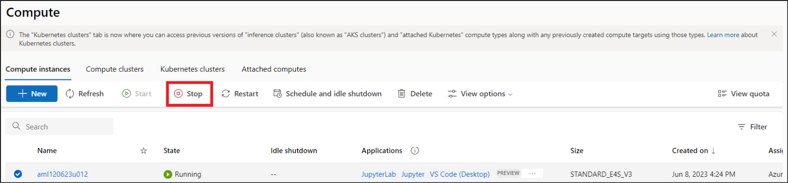

2.  Type in the name of the folder as +++**data**+++ and click on
    **Create**.

    

3.  Once the folder creation is successful, click on the menu options of
    the folder **data** and select **Upload files**.

    

4.  Select **Click to browse and select file(s)** and navigate to
    **C:\Labfiles** to select the **default_of_credit_card_clients.csv**
    file and click **Open**.

    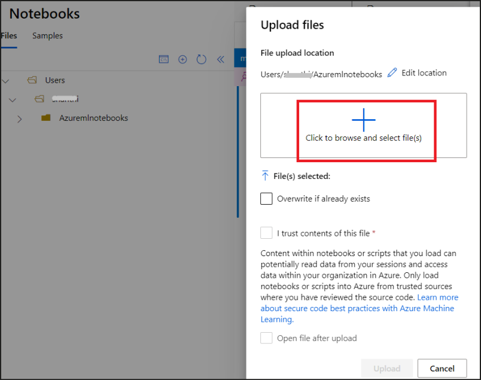

    

5.  A message stating **File uploaded successfully** is displayed under
    the Notifications once the upload finishes.

    

#### Task 2.2: Create handle to workspace

1.  Move back to the notebook(**explore-data**).

2.  Before we dive in the code, you need a way to reference your
    workspace. You'll create ml_client for a handle to the workspace.
    You'll then use ml_client to manage resources and jobs.

3.  In the first cell under, **Create handle to workspace**, replace the
    place holders of **< SUBSCRIPTION_ID >**, **< RESOURCE_GROUP >** and
    the **< AML_WORKSPACE_NAME >.**

4.  Replace < RESOURCE_GROUP > with the name of your assigned Resource
    group.

5.  Replace < AML_WORKSPACE_NAME > with +++**AzuremlwsXX+++(XX being the
    random number that you had used while creating the workspace).**

6.  From the Azure portal, https://portal.azure.com , type
    +++**subscription**+++ in the Search bar and select
    **Subscriptions**.

    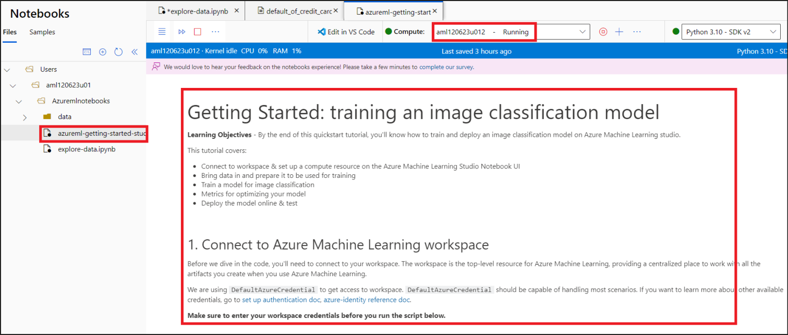

7.  Click on your subscription name.

    

8.  Select the **copy** icon next to the value of Subscription ID and
    replace the < **SUBSCRIPTION_ID** > in the code.

    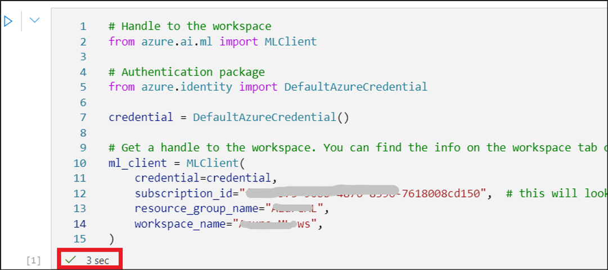

    >[!Alert] **Important:** Save the **Subscription ID**, **Resource group name** and
the **Workspace name** for usage throughout the labs.

9.  Click on the **Run cell** button available to the top left of the
    cell. Look for a tick mark at the bottom of the cell once the
    execution is successful.

    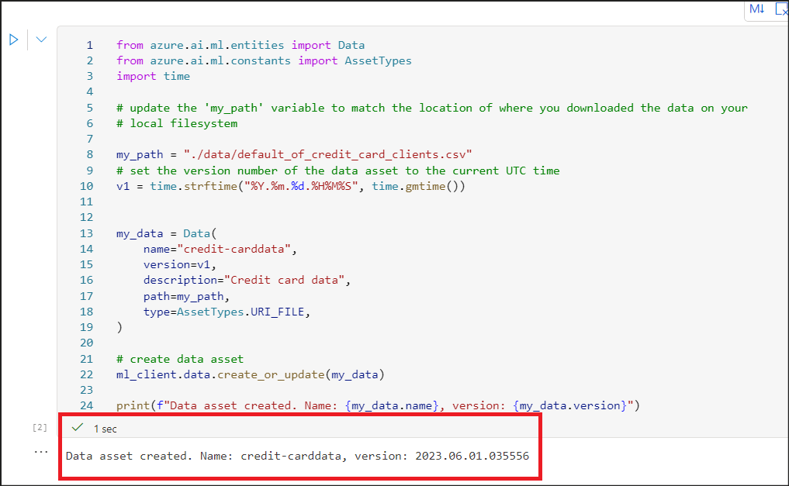

#### Task 2.3: Upload data to cloud storage

1.  An Azure Machine Learning data asset is similar to web browser
    bookmarks (favourites). Instead of remembering long storage paths
    (URIs) that point to your most frequently used data, you can create
    a data asset, and then access that asset with a friendly name.

2.  The next notebook cell creates the data asset. The code sample
    uploads the raw data file to the designated cloud storage resource.

3.  Each time you create a data asset, you need a unique version for it.
    If the version already exists, you'll get an error. In this code,
    we're using time to generate a unique version each time the cell is
    run.

4.  Execute the next cell by clicking on the Execute button to the top
    left of the cell.

    

5.  **“Data asset created. Name: credit-card, version:
    YYYY:MM:DD.xxxxxx”** is the output that gets displayed below the
    cell.

    

6.  Click on **Data** from the left pane and click on the
    **credit-card** Data asset that has got created by the execution we
    did in the above step. Explore the details and navigate back to the
    **Notebooks** pane.

    

#### Task 2.4: Access your data in a notebook

1.  Back in the notebook, execute the cell with the **%pip** command to
    install the **azureml-fsspec** Python library in your **Jupyter**
    kernel.

    

2.  Execute the next cell to access the CSV file in **Pandas**.

3.  You will get the **Data asset URI** printed at the bottom of the
    cell and the data is also displayed.

    

#### Task 2.5: Create a new version of the data asset

1.  You might have noticed that the data needs a little light cleaning,
    to make it fit to train a machine learning model. It has:

    -  two headers

    -  a client ID column; we wouldn't use this feature in Machine
        Learning

    -  spaces in the response variable name

2.  Also, compared to the CSV format, the **Parquet** file format
    becomes a better way to store this data. Parquet offers compression,
    and it maintains schema. Therefore, to clean the data and store it
    in Parquet, execute the next cell.

3.  Ensure that the execution is successful by the tick mark at the
    bottom of the cell.

    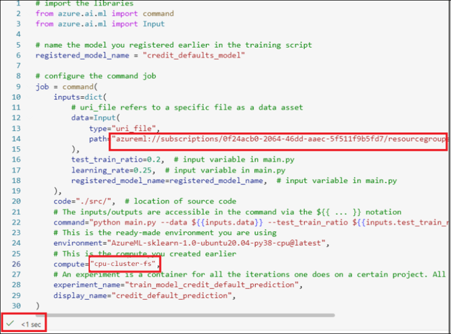

4.  This table shows the structure of the data in the
    original **default_of_credit_card_clients.csv** file .CSV file
    downloaded in an earlier step. The uploaded data contains 23
    explanatory variables and 1 response variable, as shown here:

    |  **Column Name(s)**  |  **Variable Type**  |    **Description**|
    |:--------|:--------|:--------|
    |   X1 |  Explanatory  | Amount of the given credit (NT dollar): it includes both the individual consumer credit and their family (supplementary) credit.   |
    |  X2  |  Explanatory  |  Gender (1 = male; 2 = female). 
    |   X3 |  Explanatory  |   Education (1 = graduate school; 2 = university; 3 = high school; 4 = others).  | 
    |   X4 |  Explanatory  |Marital status (1 = married; 2 = single; 3 = others).  |
    |  X5  |  Explanatory  |  Age (years).  |
    |  X6-X11  |   Explanatory |  History of past payment. We tracked the past monthly payment records (from April to September 2005). -1 = pay duly; 1 = payment delay for one month; 2 = payment delay for two months; . . .; 8 = payment delay for eight months; 9 = payment delay for nine months and above. |
    | X12-17   |  Explanatory  | Amount of bill statement (NT dollar) from April to September 2005.   |
    |  X18-23  |  Explanatory  |  Amount of previous payment (NT dollar) from April to September 2005.  |
    |  Y  | Response   |  Default payment (Yes = 1, No = 0)  |

    
6.  Execute the next cell to create a new *version* of the data asset
    (the data automatically uploads to cloud storage).

7.  On successful execution, an output stating, **Data asset created.
    Name: credit_card, version: YYYY.MM.DD.xxxxxx_cleaned** appears
    after the cell.

    

    

    >[!Alert] **Important:** This Python code cell sets **name** and **version** values for the data
asset it creates. As a result, the code in this cell will fail if
executed more than once, without a change to these values.
Fixed **name** and **version** values offer a way to pass values that
work for specific situations, without concern for auto-generated or
randomly-generated values.

7.  The cleaned parquet file is the latest version data source. The code
    in the next cell shows the CSV version result set first, then the
    Parquet version on execution.

8.  Execute the next cell and check for the result below.

    

    

    

    

9.  Look for the cleaned data under the **Data**.

    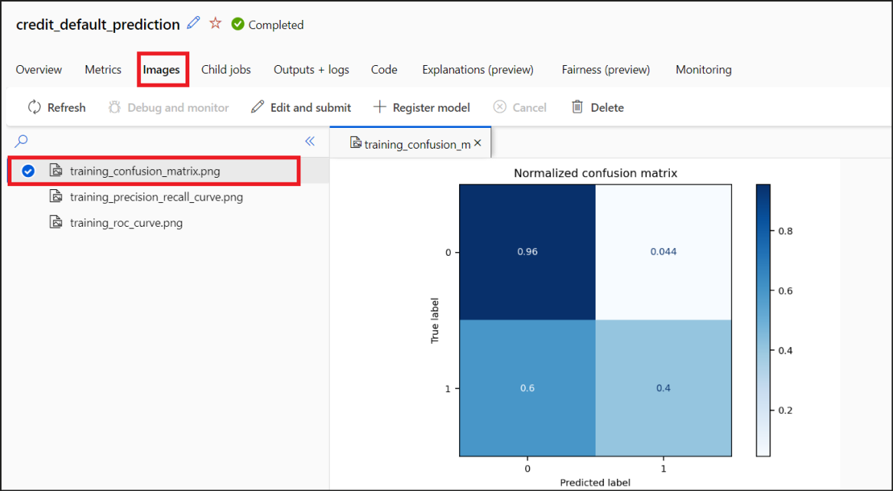

    >[!Alert] **Important:** You can continue with the next exercise from here. But,
if you are taking a break from the lab execution, please ensure to
**stop** the compute instance and start it again when you resume from
the break.

    

**Exercise summary**

In this exercise, you have learnt how to upload your data to cloud
storage, create an Azure Machine Learning data asset, access your data
in a notebook for interactive development and Create new versions of
data assets.

## Exercise 3 – Train and deploy an image classification model on Azure Machine Learning studio

**Objective**

In this exercise, you will learn to

1.  Connect to workspace & set up a compute resource using the Azure
    Machine Learning Studio Notebook UI

2.  Bring data in and prepare it to be used for training

3.  Train a model for image classification

4.  View and analyze the Metrics for optimizing your model

5.  Deploy the model online & test it

We are in the **Train & validate model** stage of the **Machine Learning
project workflow.**

### 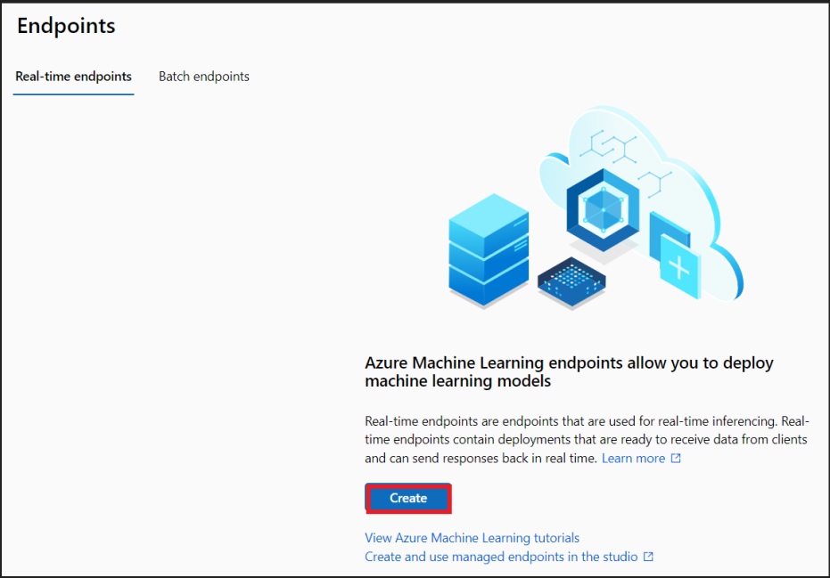Task 1: Upload Notebook

1.  From the Azure Machine Learning Studio, **Notebooks** page, click on
    the menu options for the folder **AzureMLnotebooks** and click on
    **Upload files**.

    

2.  Select, **Click to browse and select file(s)**, browse to
    **C:\Labfiles** and select the file,
    **azureml-getting-started-studio** (a Jupyter Source File).

    

    

3.  Select the checkbox **Open file after upload** and then click on
    **Upload**.

    

4.  Once the file upload is successful, it gets opened in the studio,
    connected automatically to the Compute(cpu-cluster-fs) that is in
    Running state.

    

### Task 2: Connect to Azure Machine Learning workspace

Before we dive in the code, you'll need to connect to your workspace.
The workspace is the top-level resource for Azure Machine Learning,
providing a centralized place to work with all the artifacts you create
when you use Azure Machine Learning.

We are using **DefaultAzureCredential** to get access to
workspace. **DefaultAzureCredential** should be capable of handling most
scenarios.

```nocopy
# Handle to the workspace
from azure.ai.ml import MLClient

# Authentication package
from azure.identity import DefaultAzureCredential

credential = DefaultAzureCredential()

# Get a handle to the workspace. You can find the info on the workspace tab on ml.azure.com
ml_client = MLClient(
    credential=credential,
    subscription_id="<SUBSCRIPTION_ID>",  # this will look like xxxxxxxx-xxxx-xxxx-xxxx-xxxxxxxxxxxx
    resource_group_name="<RESOURCE_GROUP>",
    workspace_name="<AML_WORKSPACE_NAME>",
)

```

1.  In the above code(First cell of the notebook), replace
    **SUBSCRIPTION_ID, RESOURCE_GROUP name** and the
    **AML_WORKSPACE_NAME** place holders with the values that we saved
    in the earlier exercise.

2.  Your first cell in the Notebook should now look like this. Click on
    the **Run** button near the top left of the first cell.

    

3.  Ensure that the cell executed successfully by seeing its status at
    the bottom of the cell.

    

### Task 3: Upload data

To run an Azure Machine Learning training job, you'll need an
environment.

In this lab, you'll using a ready-made environment
called AzureML-sklearn-1.0-ubuntu20.04-py38-cpu@latest that contains all
required libraries (python, MLflow, numpy, pip, etc).

1.  Execute the code in the next cell to upload the data.

2.  Ensure that a message stating **Data asset created** gets displayed
    as output of the cell.

    

### Task 4: Build the command job to train

Now that you have all assets required to run your job, it's time to
build the job itself, using the Azure ML Python SDK v2. We will be
creating a command job.

An AzureML command job is a resource that specifies all the details
needed to execute your training code in the cloud: inputs and outputs,
the type of hardware to use, software to install, and how to run your
code. the command job contains information to execute a single command.

#### Task 4.1 : Create training script

1.  Let's start by creating the training script - the **main.py** python
    file.

2.  Execute the next cell and ensure that it is executed successfully.

    

3.  The script in the next cell handles the preprocessing of the data,
    splitting it into test and train data. It then consumes this data to
    train a tree-based model and return the output
    model. [MLFlow](https://mlflow.org/docs/latest/tracking.html) will
    be used to log the parameters and metrics during our pipeline run.

4.  Execute the cell and ensure that it gets executed successfully with
    the output,

    **Writing ./src/main.py**

    

    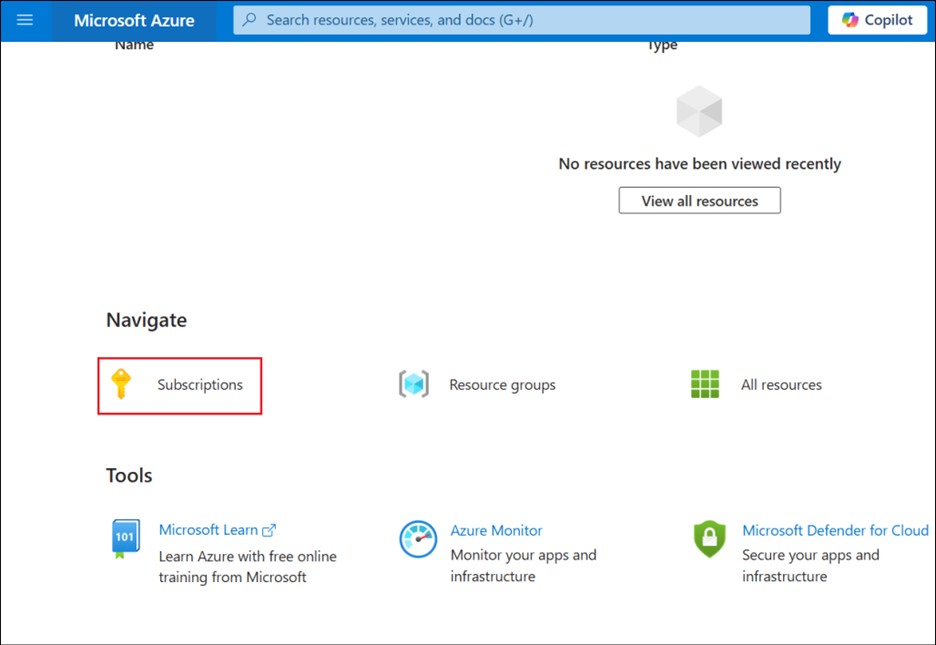

5.  As you can see in this script, once the model is trained, the model
    file is saved and registered to the workspace. Now you can use the
    registered model in inferencing endpoints.

#### Task 4.2: Configure the Command

Now that you have a script that can perform the desired tasks, you’ll
use the general purpose command that can run command line actions. This
command line action can be directly calling system commands or running a
script.

1.  Here, you'll use input data, split ratio, learning rate and
    registered model name as input variables.

2.  From the left pane, select **Data** and select the
    **credit-card-data** .

    

3.  Under **Data sources** section, look for the **Datastore URI** value
    and copy it. Save it for use in the next step.

    

4.  In the next cell, replace the

    1.  Value of **path** with the **Datastore URI** saved in the
        previous step.

    2.  Value of **compute** with +++**cpu-cluster-fs**+++ (the name of
        the cluster we saved in Lab 1)

5.  Click on **Run**. Ensure that the cell gets executed successfully.

    

### Task 6: Submit the job

It's now time to submit the job to run in AzureML. **The job will take 2
to 3 minutes to run**. It could take longer (up to 10 minutes) if the
compute instance has been scaled down to zero nodes and custom
environment is still building.

1.  Execute the cell with the below command to submit the job.

    ```nocopy
    # submit the command job
    ml_client.create_or_update(job)
    ```

2.  Click on **Run**. Ensure that the execution is successful and there
    is a link to the result under the **Details Page** column.

    >[!Note] **Note**: This will take around 2 minutes to complete.

    

3.  Open the link available under the **Details Page** column of the
    result, in a new tab.

### Task 7: View the result of a training job

1.  You can view the result of a training job by **clicking the URL
    generated after submitting a job**.

    

2.  Alternatively, you can also click **Jobs** on the left navigation
    menu. A job is a grouping of many runs from a specified script or
    piece of code. Information for the run is stored under that job.

    

3.  The **Overview** page first shows the **Status** under
    **Properties** pane to be **Running**.

4.  The status changes to **Completed** once it is ready.

    

    

5.  Select the **Metrics** pane to view the metrics.

    

6.  Select the **Images** tab to view the training_confusion matrix,
    precision recall curve and the roc curve.

    

1)  **Overview** is where you can see the status of the job.

2)  **Metrics** would display different visualizations of the metrics
    you specified in the script.

3)  **Images** is where you can view any image artifacts that you have
    logged with MLflow.

4)  **Child jobs** contains child jobs if you added them.

5)  **Outputs + logs** contains log files you need for troubleshooting
    or other monitoring purposes.

6)  **Code** contains the script/code used in the job.

7)  **Explanations** and **Fairness** are used to see how your model
    performs against responsible AI standards. They are currently
    preview features and require additional package installations.

8)  **Monitoring** is where you can view metrics for the performance of
    compute resources.

### Task 8: Deploy the model as an online endpoint

After you train a machine learning model, you need to deploy it so that
others can use it for inferencing. For this purpose, Azure Machine
Learning allows you to create **endpoints** and add **deployments** to
them.

An **endpoint**, in this context, is an HTTPS path that provides an
interface for clients to send requests (input data) to a trained model
and receive the inferencing (scoring) results from the model. An
endpoint provides:

- Authentication using "key or token" based auth

- TLS(SSL) termination

- A stable scoring URI (endpoint-name.region.inference.ml.azure.com)

A **deployment** is a set of resources required for hosting the model
that does the actual inferencing.

#### Task 8.1: Create an online endpoint

1.  Now deploy your machine learning model as a web service in Azure
    cloud, an online endpoint.

2.  Select **Endpoints** from the left pane.

    

3.  Select **Create** for Real-time endpoints

    

4.  Select **credit_defaults_model** and then click on **Select.**

    

5.  Select **Standard_E4s_v3** under the Virtual machine. Provide the
    Instance count as **1**

    Accept the other defaults of a unique **Endpoint name** and the **Deployment name** and then select **Deploy**.

    

**Note:** The endpoint creation takes around 20 minutes to complete.

6.  Once complete, the Provisioning state changes to **Succeeded**.

    

#### Task 8.2: Test with a sample query

1.  From the endpoint page, select the **Test** tab.

2.  Copy & paste the following sample request file into the **Input data
    to test real-time endpoint** field replacing the code already
    present in there.

    ```
    {
      "input_data": {
        "columns": [0,1,2,3,4,5,6,7,8,9,10,11,12,13,14,15,16,17,18,19,20,21,22],
        "index": [0, 1],
        "data": [
                [20000,2,2,1,24,2,2,-1,-1,-2,-2,3913,3102,689,0,0,0,0,689,0,0,0,0],
                [10, 9, 8, 7, 6, 5, 4, 3, 2, 1, 10, 9, 8, 7, 6, 5, 4, 3, 2, 1, 10, 9, 8]
            ]
      }
    }
    
    ```

3.  Select **Test** and view the result under **Test result**.

    

### Task 9: Delete the Endpoint

1.  From the left pane, select the **Endpoints**. Select the endpoint
    that we created, and click on **Delete**.

    

2.  Click on **Delete** on the confirmation dialog box.

    

3.  Look for a notification on the successful deletion.

    

**Summary**

In this lab, you have learnt to train an image classification model on
the Azure Machine Learning Studio and deploy it as a web service.
