# **Lab 10 – Verwendung des Responsible AI-Dashboards zur Verbesserung der Leistung von Machine Learning-Modellen**

**Objektiv**

In diesem Lab soll praxisnah gelernt werden, wie das Responsible
AI-Dashboard zum Debuggen der Machine Learning-Modelle verwendet werden
kann, um die Leistung des Modells zu verbessern, um fairer,
integrativer, sicherer, zuverlässiger und transparenter zu sein.

In diesem Lab wird untersucht, wie Sie den Abschnitt **"Model
Overview**" des Azure Responsible AI (RAI)-Dashboards verwenden. Wir
werden die Kohorten verwenden, die aus dem Fehleranalyse-Lab erstellt
wurden, um zu untersuchen, warum das Verhalten des Modells in einer
Kohorte besser ist als in einer anderen.

Erwartete Dauer – 60 Minuten

## **Übung 1: Vorbereiten der Ressourcen**

### Aufgabe 1: Klonen des Repositorys für dieses Lab

1.  Melden Sie sich in einem Browser beim Azure-Portal unter
    <https://portal.azure.com>

2.  Öffnen Sie die **Cloud Shell**, indem Sie im Azure-Portal auf das
    Cloud Shell-Symbol klicken.

3.  Klonen Sie in der Azure Cloud Shell-Command Prompt das
    GitHub-Repository des Projekts **Diabetes Hospital Readmission**,
    indem Sie den folgenden Befehl ausführen.

> **+++git clone
> <https://github.com/getazureready/RAI-Diabetes-Hospital-Readmission-classification>**+++
>
> Dadurch wird der Inhalt des Repositorys lokal geklont.
>
> 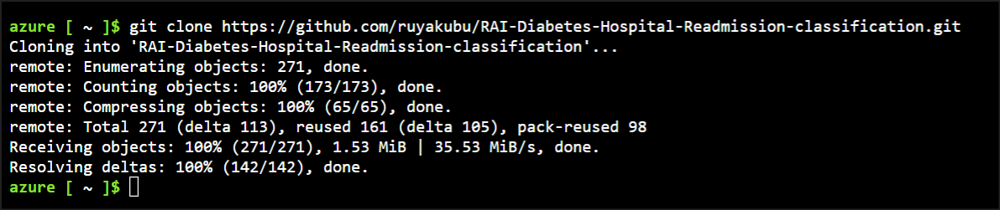

4.  Wechseln Sie in das Projektverzeichnis, indem Sie den folgenden
    Befehl ausführen.

**+++cd RAI-Diabetes-Hospital-Readmission-classification+++**

### Aufgabe 2: Anmelden mit der Azure CLI

1.  Führen Sie in der Cloud Shell den folgenden Befehl aus.

**az login**

2.  Öffnen Sie die URL in der Konsole, und geben Sie den Code in den
    Browser ein.

> 

3.  Wählen Sie die **Azure Login**-Anmeldeinformationen aus.

> 

4.  Klicken Sie auf **Continue**.

> 

5.  Schließen Sie den Browser, und kehren Sie zum Azure-Portal zurück.

> 

6.  Die Anmeldedaten werden in der Cloud Shell angezeigt.

> 

7.  Legen Sie den Standardwert Ihrer Umgebung auf die **zugewiesene**
    **Ressourcengruppe** fest.

**+++az configure --defaults group="\<resource-group-name\>"
workspace="Azuremlws@lab.LabInstance.Id"+++**

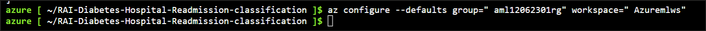

## **Übung 2: Ausführen von Jobs zum Trainieren des Modells und zum Erstellen des RAI-Dashboards**

1.  Führen Sie den folgenden Befehl aus, um das **Training dataset** im
    Azure Machine Learning-Arbeitsbereich zu registrieren.

> **az ml data create -f cloud/train_data.yml**

Das Datenasset wird erstellt, und die Details werden in der Cloud Shell
angezeigt.

2.  Führen Sie den folgenden Befehl aus, um das **Testing dataset** im
    Azure Machine Learning-Arbeitsbereich zu registrieren.

> **az ml data create -f cloud/test_data.yml**

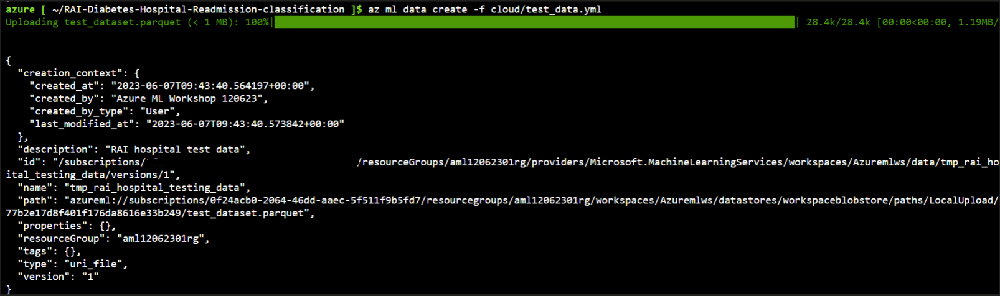

3.  Erstellen Sie eine **Compute-Instance** zum Ausführen der Jobs.
    Kopieren Sie dann den Computenamen (z. B.
    ***compute-xxxxxxxxxxxx***) am Ende der Ausführung, um ihn später zu
    verwenden.

- Führen Sie den folgenden Befehl aus, um die **Compute** zu
  **erstellen**.

**az ml compute create --name compute@lab.LabInstance.Id --type
computeinstance --size Standard_E4ds_v4**

4.  Klicken Sie im Menü Cloud Shell auf den Bereich **Open editor { }**,
    um einige der Dateien zu bearbeiten.

> 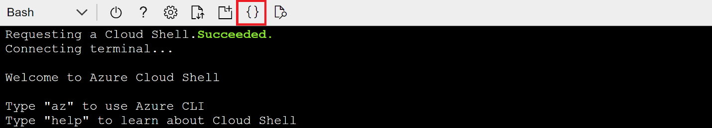

5.  Klicken Sie auf den Ordner
    **RAI-Diabetes-Hospital-Readmission-classification,** um das
    Verzeichnis zu erweitern.

6.  Navigieren Sie zur **Cloud-/training_job.yml** Datei. Ersetzen Sie
    dann den Platzhalter für den Compute-Namen durch den **Namen Ihrer**
    **Compute-Instance** , den Sie zuvor kopiert haben.

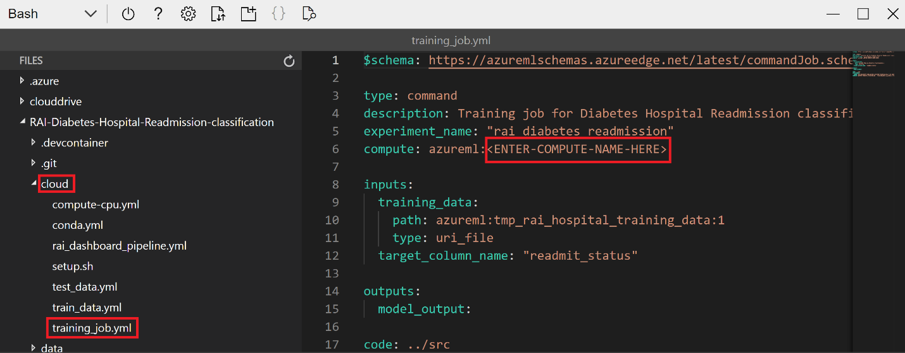

7.  Klicken Sie mit der rechten Maustaste auf eine beliebige Stelle in
    der Datei und wählen Sie dann die Option **Save** aus, um die Datei
    zu speichern.

8.  Navigieren Sie als Nächstes zur
    **cloud-/rai_dashboard_pipeline.yml** Datei. Aktualisieren Sie dann
    den Platzhalter für den Compute-Namen mit dem **Namen Ihrer**
    **Compute-Instance,** den Sie zuvor kopiert haben.

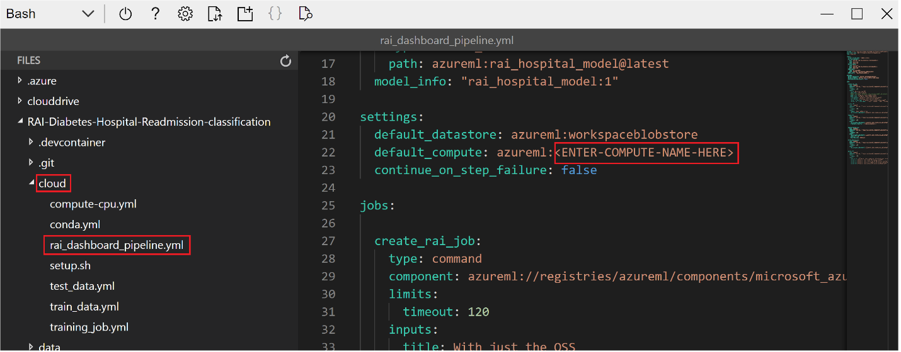

9.  Klicken Sie mit der rechten Maustaste auf eine beliebige Stelle in
    der Datei und wählen Sie dann die Option **Save** aus, um die Datei
    zu speichern.

10. Klicken Sie mit der rechten Maustaste auf eine beliebige Stelle in
    der Datei und wählen Sie dann die Option **Quit**, um das
    Editorfenster zu schließen.

11. Übermitteln Sie an der Cloud Shell-Command Prompt den Job, um das
    Modell zu trainieren. Warten Sie, bis der Ausführungsstatus des Jobs
    während des Trainings auf **Completed** aktualisiert wurde. Kopieren
    Sie dazu den folgenden Codeblock.

> **run_id=$(az ml job create --name my_training_job -f
> cloud/training_job.yml --query name -o tsv)**
>
> **\# wait for job to finish while checking for status**
>
> **if \[\[ -z "$run_id" \]\]**
>
> **then**
>
> **echo "Job creation failed"**
>
> **exit 3**
>
> **fi**
>
> **status=$(az ml job show -n $run_id --query status -o tsv)**
>
> **if \[\[ -z "$status" \]\]**
>
> **then**
>
> **echo "Status query failed"**
>
> **exit 4**
>
> **fi**
>
> **running=("Queued" "Starting" "Preparing" "Running" "Finalizing")**
>
> **while \[\[ ${running\[\*\]} =~ $status \]\]**
>
> **do**
>
> **sleep 8**
>
> **status=$(az ml job show -n $run_id --query status -o tsv)**
>
> **echo $status**
>
> **done**
>
> **Hinweis:** Wenn dieses Skript nicht richtig eingefügt wird, kopieren
> Sie es und fügen Sie es manuell ein
>
> **Hinweis:** Die Ausführung dieses Skripts sollte etwa 3 bis 5 Minuten
> dauern.
>
> 
>
> 

12. Optional können Sie den Status des laufenden Jobs im **Azure Machine
    Learning Studio** überprüfen **(**<https://ml.azure.com/>**)** -\>
    **Jobs**

> 

13. Nachdem der Trainingsjob erfolgreich abgeschlossen wurde,
    registrieren Sie das Modell im Azure Machine
    Learning-Arbeitsbereich. Führen Sie dazu den folgenden Befehl aus.

**az ml model create --name rai_hospital_model --path
"azureml://jobs/$run_id/outputs/model_output" --type mlflow_model**

> Mit diesem Befehl wird das Modell im AML-Arbeitsbereich registriert
> und die Details in der Cloud Shell bereitgestellt, wie in den
> folgenden Screenshots dargestellt.
>
> 
>
> 

14. Übermitteln Sie die Job-Pipeline, um das **RAI-Dashboard** zu
    erstellen. Führen Sie dazu den folgenden Befehl aus.

az ml job create --file cloud/rai_dashboard_pipeline.yml

Mit diesem Befehl wird der Job übermittelt, und die Cloud Shell wird mit
der Anfangsphase der Pipeline aufgefüllt, bei der es sich um den
**Preparing**(Vorbereitend)**-**Zustand.

15. Melden Sie sich bei **Azure Machine Learning Studio** unter
    <https://ml.azure.com/> an, um den Pipelinejob zum Erstellen des
    RAI-Dashboards zu überwachen.

16. Wählen Sie **Pipelines** aus. Um den Fortschritt des Pipeline-Jobs
    beim Erstellen des RAI-Dashboards anzuzeigen, klicken Sie auf den
    **Display name** des Jobs.

> 

17. Das Experiment befindet sich im Status **Running**.

18. Der Status ändert sich in **Completed**, sobald er abgeschlossen ist
    und das RAI-Dashboard erstellt wurde.

19. Klicken Sie in der linken Navigation auf die Registerkarte
    **Models**. Klicken Sie dann auf den Namen des Modells, um die
    Detailseite zu öffnen.

> 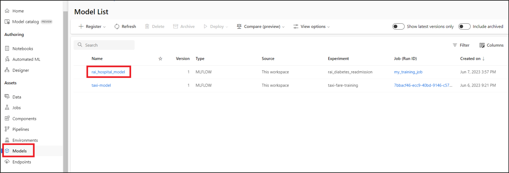

20. Wählen Sie im oberen Menü die Option **Responsible AI** aus.

> 

21. Jetzt können Sie mit der Verwendung des **RAI-Dashboards** beginnen.

## **Übung 3: Fehleranalyse:**

Der Abschnitt Error Analysis des RAI-Dashboards hilft bei der
Bereitstellung einer Fehlerverteilung der Feature-Gruppen, die zur
Fehlerrate des Modells beitragen. Fehler sind oft nicht gleichmäßig auf
verschiedene Datenuntergruppen verteilt, und die Fehleranalyse hilft
Ihnen, Features mit den höchsten Fehlerraten zu identifizieren.

### Aufgabe 1: Suchen von Modellfehlern:

In dieser Aufgabe wird untersucht, wie Sie die Fehleranalyse verwenden,
um Fehler im trainierten Modell zu finden und zu identifizieren, wo sich
die Fehler befinden. Darüber hinaus lernen wir, wie man Datenkohorten
erstellt, um zu untersuchen, warum ein Modell in einigen Kohorten
schlecht abschneidet und in anderen nicht.

1.  Klicken Sie auf den Namen **Diabetes Hospital Readmission.**

> 

2.  Wählen Sie das **Compute** aus.

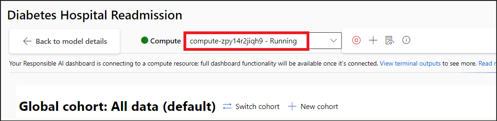

#### **Aufgabe 1.1: Identifizieren und Erstellen einer Kohorte für den Baumpfad mit den höchsten Fehlern**

Um die Analyse zu starten, können Sie feststellen, dass der Stammknoten
anzeigt, dass von insgesamt 994 Testdaten 168 falsche Vorhersagen bei
der Auswertung des Modells gefunden wurden.

1.  Suchen Sie den Baumpfad mit der höchsten Anzahl von Fehlern. Je
    dunkler der rote Farbton im Knoten ist, desto höher ist die
    Fehlerquote.

2.  In unserem Fall ist der Baumpfad mit der dunkelsten roten Farbe der
    Blattknoten, der an zweiter Stelle von rechts unten steht.

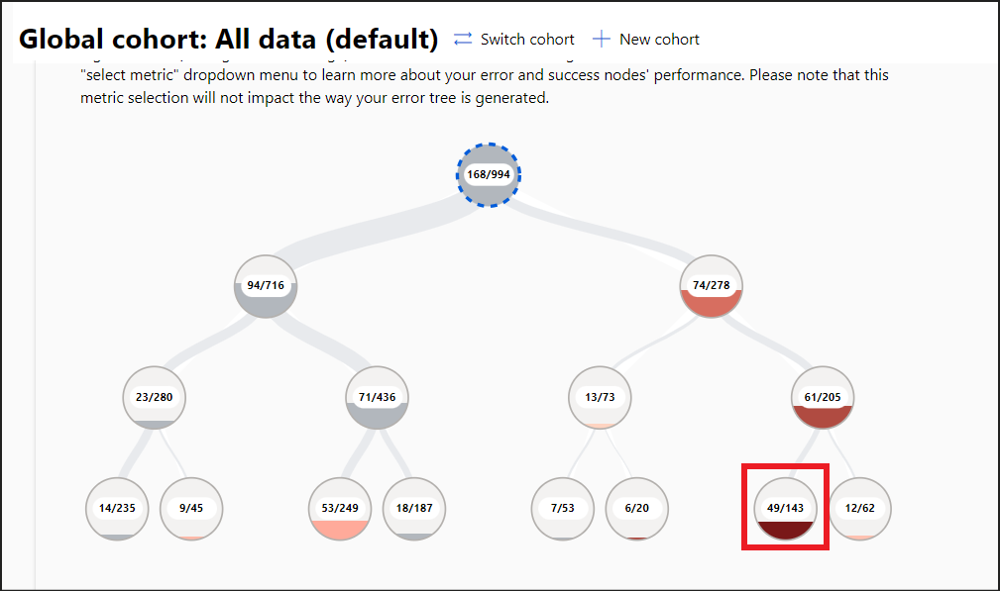

3.  **Doppelklicken Sie** auf diesen **Knoten**, um den **gesamten
    Pfad** auszuwählen, der zum Knoten führt. Dadurch wird der Pfad
    hervorgehoben und die Feature-Bedingung für jeden Knoten im Pfad
    angezeigt.

4.  Erstellen Sie eine Kohorte aus dem ausgewählten Pfad, indem Sie auf
    die Schaltfläche **Save as a new cohort** oben rechts im Abschnitt
    “Error Analysis” klicken.

> 

5.  Geben Sie den **Namen der** **Kohorte** als **+++Err:
    Prior_Inpatient \>0; 11,50 Num_meds \> & \<= 21,50+++**

**Klicken Sie auf Save.**

> 

#### **Aufgabe 1.2: Identifizieren und Erstellen einer Kohorte für den Baumpfad mit den wenigsten Fehlern**

Erstellen Sie zu Kontrastzwecken eine weitere Kohorte mit dem Baumpfad
mit der geringsten Anzahl von Fehlern, um zu sehen, ob wir Erkenntnisse
darüber gewinnen können, warum das Modell in einer Kohorte im Vergleich
zu einer anderen gut abschneidet. Der **Blattknoten**(Leaf Node) mit der
Feature-Bedingung **num_lab_procedures ≤ 56,50** ganz links in der
Struktur ist der Pfad der Struktur mit den wenigsten Fehlern.

1.  **Doppelklicken Sie** auf den Knoten.

> 

2.  Klicken Sie auf **Save as a new cohort**. Der **Filter** in diesem
    Dataset lautet: num_lab_procedures \<= 56,50, number_diagnoses \<=
    6,50, prior_inpatient \<= 0,00.

> 

3.  **Benennen Sie** die Kohorte: **+++Prior_Inpatient = 0;
    num_diagnoses \<= 6,50; lab_procedures \<= 56,50+++** und klicken
    Sie auf **Save**.

> 

#### **Aufgabe 1.3: Verwenden Sie die Feature-Liste, um das Hauptmerkmal zu identifizieren, das zu Modellfehlern beiträgt**

1.  Klicken Sie auf **Feature-List**.

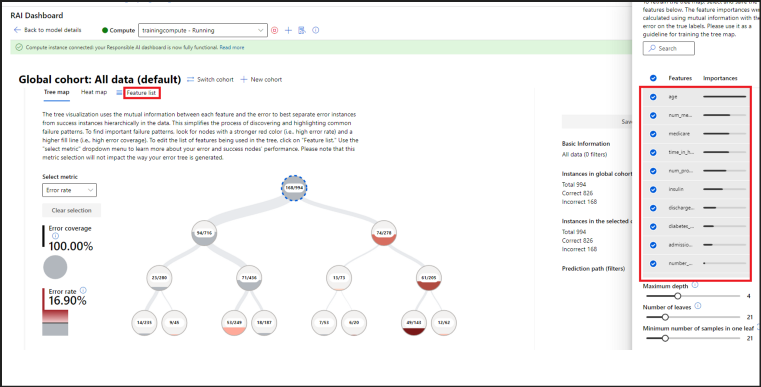

2.  Die Liste wird nach dem Beitrag der Funktionen zu den Fehlern
    sortiert. Je höher ein Feature in dieser Liste steht, desto
    wichtiger ist seine Bedeutung für die Modellfehler.

3.  In unserem Diabetes Hospital Readmission-Modell gibt die
    **Feature-List** die folgenden Merkmale an, die zu den
    Hauptverursachern der Fehler des Modells gehören.

    - Age

    - num_medications

    - medicare

    - time_in_hospital

    - num_procedures

    - insulin

    - discharge_destination

### Aufgabe 2: Suchen von Fehlern mithilfe der Heatmap

In der Feature-Liste war **Age** einer der Hauptursachen für Fehler.
Daher verwenden wir die Registerkarte Heatmap, um zu untersuchen, welche
Altersgruppe der Patienten dazu führt, dass das Modell eine schlechte
Leistung erbringt.

1.  Wählen Sie unter **Error Analysis** die Option **Heatmap** aus.

> 

2.  Wählen Sie auf der Registerkarte Heatmap im Dropdown-Menü **Rows:
    Feature 1** die Option **Age** aus, um zu sehen, welcher Faktor es
    bei den Fehlern des Modells spielt.

3.  Nachdem wir das **Age** ausgewählt haben, können wir sehen, wie das
    Dashboard über eine integrierte Intelligenz verfügt, um das Merkmal
    mit den möglichen Bedingungen in verschiedene Zellen zu unterteilen.

> 

2.  **Bewegen Sie den Mauszeiger** über jede Zelle, um die Anzahl der
    richtigen und falschen Vorhersagen, die Fehlerabdeckung und die
    Fehlerrate für die in der Zelle dargestellte Datengruppe zu sehen.

> 

3.  Die Zelle mit **Over 60 years** hat **536** richtige und **126**
    falsche Modellvorhersagen. Die Fehlerabdeckung beträgt **73,81 %**
    und die Fehlerquote **18,79 %**

4.  Die Zelle mit **30–60 years** hat **273** richtige und **25**
    falsche Modellvorhersagen. Die Fehlerabdeckung beträgt **25,60 %**
    und die Fehlerrate **13,61 %.**

5.  Die Zelle mit **30 years or younger** hat **17** richtige und **1**
    falsche Modellvorhersagen.

> Da unsere Beobachtung zeigt, dass **Age** eine wichtige Rolle bei den
> fehlerhaften Vorhersagen des Modells spielt, werden wir Kohorten für
> jede Altersgruppe erstellen, die im nächsten Lab weiter analysiert
> werden können.

#### ***Aufgabe 2.1: Erstellen von Kohorten basierend auf den Altersgruppen***

1.  Klicken Sie auf das Prozentfeld der Zelle **Over 60 years**. Sie
    sehen einen blauen Rahmen um die quadratische Zelle.

2.  Klicken Sie auf **Save as a new cohort**.

> 

3.  Geben Sie im Dialogfeld Save as a new cohort den Namen

    - Name der Kohorte - **+++Age==Over 60 year+++**

Klicken Sie auf **Save**.

4.  Wiederholen Sie die Schritte 2 und 3, um für jede der beiden anderen
    Alterszellen eine Kohorte zu erstellen.

- **Cohort \#4: Name - +++Age == 30–60 years+++**

- **Cohort \#5: Name - +++Age \<= 30 years+++**

### Aufgabe 3: Anzeigen der Kohortenlisten

1.  Klicken Sie auf das Zahnradsymbol **"Settings**" in der oberen
    rechten Ecke des Abschnitts "Error Analysis".

> 

2.  Dadurch wird ein **Fensterbereich Cohort Settings** mit der Liste
    aller Kohorten geöffnet, die Sie erstellt haben.

> 

## Übung 4: Verwenden von RAI zum Durchführen der Modellanalyse

In diesem Lab wird untersucht, wie Sie den Abschnitt **" Model
Overview** **"** des Azure Responsible AI (RAI)-Dashboards verwenden.
Wir werden die Kohorten verwenden, die aus dem Error Analysis -Lab
erstellt wurden, um zu untersuchen, warum das Verhalten des Modells in
einer Kohorte besser ist als in einer anderen.

## **Übung 4.1: Überblick über das Modell**

### Aufgabe 1: Überprüfen und Vergleichen der Tabelle mit Modellleistungsmetriken

1.  Scrollen Sie unter der Fehleranalyse nach unten, um den Abschnitt
    Model Overview zu finden.

2.  Wählen Sie unter Model Overview den Bereich **Dataset Cohorts** aus.
    Hier werden die verschiedenen Kohorten angezeigt, die in einer
    Tabelle mit den Modellmetriken erstellt wurden.

> 

3.  Vergleichen Sie die Kohorte mit den meisten Fehlern **Err:
    Prior_Inpatient \> 0; Num_Meds \> 11 und ≤ 21.50** mit der Kohorte
    mit den wenigsten Fehlern **Prior_inpatient = 0; num_diagnose ≤
    6.50; lab_procedures \< 56.50.**

4.  Bewegen Sie den Mauszeiger über die Boxplot-Linie im Diagramm, um
    die Messdetails anzuzeigen.

5.  Beachten Sie, dass die Genauigkeitsbewertung für die **erroneous
    cohort** 0,806 beträgt, was schlecht ist. Die **False-Positiv**-Rate
    ist **sehr niedrig** und der **False-Negative**-Wert ist **hoch**.
    Das bedeutet, dass die Mehrheit der Patienten, die das Modell
    vorhersagt, eine hohe Rate an Vorhersagen von Patienten aufweist,
    die nicht in 30 Tagen wieder ins Krankenhaus aufgenommen werden.

> 

6.  Schauen Sie sich als Nächstes die Metriken für die **Kohorte** mit
    den **geringsten Fehlern** an, die eine Genauigkeitsbewertung von
    0,94 aufweist, was weitaus besser ist als die Gesamtgenauigkeit des
    Modells mit allen Daten. Allerdings hat auch diese Kohorte eine
    niedrige **Falsch-Positiv**-Rate von **0**.

### Aufgabe 2: Untersuchen des Wahrscheinlichkeitsverteilungsdiagramms

1.  Scrollen Sie nach unten, um die **Probability distribution**
    anzuzeigen.

2.  Das Wahrscheinlichkeitsverteilungsdiagramm zeigt die
    Wahrscheinlichkeit des Modells, mit der vorhergesagt wird, ob
    Patienten in den Kohorten innerhalb von 30 Tagen wieder ins
    Krankenhaus eingewiesen werden oder nicht.

3.  Vergleichen Sie die Wahrscheinlichkeit, dass die Patienten für alle
    3 Kohorten nicht wieder aufgenommen werden.

4.  Sie werden sehen, dass die Kohorte **All Data** mit dem gesamten
    Patiententestdatensatz zeigt, dass die Mehrheit der Patienten
    innerhalb von 30 Tagen nicht wieder ins Krankenhaus aufgenommen
    wird, wobei die mittlere Wahrscheinlichkeit, dass Patienten nicht
    wieder aufgenommen werden, bei 0,854 und das obere Quartil bei 0,986
    liegt, was gut ist.

5.  Als nächstes die Kohorte mit der höchsten Fehlerquote:
    ***Err:Prior_Inpatient \>0; Num_meds \>11,50 & \<= 21,50***, zeigt
    eine etwas geringere Wahrscheinlichkeit bei 0,89 und einem Median
    von 0,719.

6.  Schließlich die Kohorte mit der geringsten Fehlerquote:
    ***Prior_Inpatient = 0*; *num_diagnoses \< = 6,50*; *lab_procedures
    \<= 56,50 ***zeigen, dass die Wahrscheinlichkeit, dass Patienten
    nicht wieder aufgenommen werden, einen Median von 0,90 und ein
    oberes Quartil von 0,986 hat.

> 

7.  Um das Diagramm so zu ändern, dass die Wahrscheinlichkeit angezeigt
    wird, dass Patienten für die 3 Kohorten wieder aufgenommen werden,
    klicken Sie auf die Schaltfläche **Choose Label** auf der x-Achse.

8.  Wählen Sie das Optionsfeld **Probability: Readmitted** aus . Im
    Popup-Fensterbereich.

9.  Klicken Sie dann auf die Schaltfläche **Apply**.

> 

10. Vergleichen Sie die Wahrscheinlichkeit, dass Patienten für die 3
    Kohorten wieder aufgenommen werden

> 

11. Sie sehen, dass die 3 Kohorten eine Wahrscheinlichkeit von weniger
    als 0,55 haben, wieder aufgenommen zu werden. Die Kohorte mit der
    geringsten Anzahl von Modellfehlern hat die geringste
    Wahrscheinlichkeit von 0,179. Die Kohorte mit den meisten Fehlern
    hat mit 0,543 die höchste Wahrscheinlichkeit.

### Aufgabe 3: Überprüfen des Visualisierungsdiagramms für Metriken

Lassen Sie uns nun ein tieferes Verständnis der Leistung des Modells
erhalten, indem wir zum Bereich Metrikvisualisierungen wechseln.

1.  Klicken Sie auf die Registerkarte Metric visualizations.

> 

2.  Um eine andere Metrik auszuwählen, klicken Sie auf der x-Achse auf
    **Choose metric**, um **Precision score** aus der Liste der anderen
    verfügbaren Metriken auszuwählen. Klicken Sie dann auf die
    Schaltfläche **Apply.**

> **Hinweis**: Da es sich bei dem trainierten Modell um ein
> Klassifizierungsproblem handelt, werden im RAI-Dashboard nur
> Klassifizierungsmetriken angezeigt.
>
> 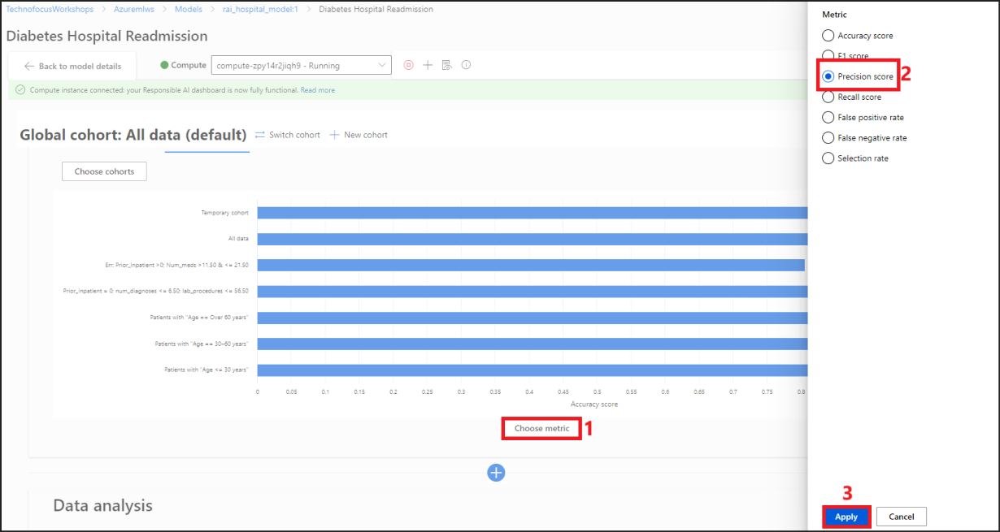

3.  Wenn Sie sich das Diagramm ansehen, werden Sie feststellen, dass die
    Modellleistung für alle Testdatenkohorten und fehlerhaften Kohorten
    in ~70 % der Fälle korrekt ist.

4.  Die **Precision-Score**-Rate für die **am wenigsten fehlerhafte
    Kohorte** beträgt **0,94** für Patienten ohne vorherigen
    Krankenhausaufenthalt und die Anzahl der Diagnosen beträgt weniger
    als 7. Dies stimmt mit der Genauigkeitsbewertung überein.

5.  Ändern Sie abschließend die Metrik in **Recall,** um zu sehen, wie
    gut das Modell in der Lage war, korrekt vorherzusagen, dass die
    Patienten in den Kohorten in 30 Tagen wieder ins Krankenhaus
    aufgenommen werden.

> 

6.  Der Rückruf(Recall) zeigt, dass die **Vorhersage des Modells** in
    **weniger als 25 %** der Fälle für alle Kohorten von Patienten, die
    wieder aufgenommen wurden, **richtig war**. Dies zeigt, dass die
    Vorhersagen des Modells in den meisten Fällen nicht korrekt sind,
    wenn es darum geht, Patienten vorherzusagen, die innerhalb von 30
    Tagen wieder aufgenommen werden.

### Aufgabe 4: Schauen Sie sich die Confusion-Matrix an

Die Confusion-Matrix ist hilfreich, um zu überprüfen, ob das Modell die
richtige Vorhersage trifft. Dies wird zeigen, wie gut das Modell für
Fälle lernt, in denen der Patient innerhalb von 30 Tagen wieder ins
Krankenhaus eingewiesen wird, im Vergleich zu nicht wiederaufgenommen.

1.  Klicken Sie auf die Registerkarte **Confusion matrix**.

&nbsp;

2.  Sie werden feststellen, dass das **Modell** bei Patienten, die
    **nicht wieder aufgenommen** wurden, im Vergleich zu
    **wiederaufgenommenen** Patienten **besser** abschneidet.

3.  Die Anzahl der falsch negativen Werte sollte geringer sein als die
    der richtig negativen Meldungen. Das bedeutet, dass das Modell von
    allen Patientendaten nur in der Lage war, 24 Patienten korrekt
    vorherzusagen, die innerhalb von \< 30 Tagen wieder ins Krankenhaus
    aufgenommen werden würden.

- Die Anzahl der True Positive (TP) beträgt: **802**

- Die Anzahl der False Negative (FN) beträgt: **159**

- Die Anzahl der False Positive (FP) beträgt: **9**

- Die Anzahl der True Negative (TN) beträgt: **24**

> 

## **Übung 2: Feature-Kohorte**

Da die Kohorte mit dem höchsten Fehler Patienten mit der Anzahl von
*Prior_Inpatient \> 0* Tagen und der Anzahl der Medikamente zwischen 11
und 22 hatte, bei denen das Modell eine höhere Fehlerrate aufwies, hilft
ein genauerer Blick auf die *Prior_Inpatient* und *Num_medications* zu
isolieren, wo es Probleme gibt. In diesem Lab analysieren wir nur
*Prior_Inpatient*.

1.  Klicken Sie auf die Registerkarte **Feature Cohorts**.

2.  Scrollen Sie im Dropdown-Menü **"Feature(s)"** in der Liste nach
    unten, und aktivieren Sie das Kontrollkästchen
    **"prior_inpatient**". Dadurch werden 3 verschiedene
    Feature-Kohorten und die Leistungsmetriken des Modells angezeigt.

> 

3.  Die **prior_inpatient** ***\< 3***-Kohorte hat eine Stichprobengröße
    von **943**. Das bedeutet, dass die Mehrheit der Patienten in den
    Testdaten in der Vergangenheit weniger als 3 Mal ins Krankenhaus
    eingeliefert wurde. Die **Genauigkeitsrate des Modells** für diese
    Kohorte beträgt **0,838**, was gut ist.

4.  Nur 39 Patienten aus den Testdaten fallen in die Kohorte
    **prior_inpatient *≥ 3 und \< 6***. Die Genauigkeitsrate des Modells
    liegt bei **0,692**, was nicht gut ist.

5.  Schließlich haben nur 12 Patienten aus den Testdaten einen früheren
    Krankenhausaufenthalt von mindestens 6 Tagen. Die
    **Modellgenauigkeit** von **0,75** für diese Kohorte ist in Ordnung.

> 

### Aufgabe 1: Verteilung der Merkmalswahrscheinlichkeit(Feature probability distribution)

Ähnlich wie bei der Dataset-Kohorte haben Sie die Möglichkeit, die
"Wahrscheinlichkeitsverteilung" anzuzeigen.

1.  Sie können sehen, dass je geringer die Anzahl der prior_inpatient
    Krankenhausaufenthalte des Diabetikers ist, desto wahrscheinlicher
    ist es, dass der Patient innerhalb von 30 Tagen nicht wieder
    aufgenommen wird.

### Aufgabe 2: Visualisierungen von Feature-Metrics

1.  Wählen Sie **Metrics visualization** aus. Klicken Sie auf der
    X-Achse auf die Schaltfläche **Choose metric**. Wählen Sie dann die
    Metrik **Precision score** aus.

> 

2.  Sie sehen, dass der Precision Score für Patienten mit
    **prior_inpatient \< 3** 0,40 beträgt, was sehr schlecht ist. Das
    bedeutet, dass von allen Vorhersagen, die das Modell gemacht hat,
    nur 40 % für diese Kohorte richtig waren.

> 

3.  Die Precision Score für die anderen 2 Kohorten ist gut.

4.  Wählen Sie als Nächstes die Metrik **" Recall score "** für die
    X-Achse aus.

> 

5.  Im Gegenteil, Sie werden sehen, dass der Recall-Score für Patienten
    mit **prior_inpatient \< 3** 0,013 beträgt. Das bedeutet, dass das
    Modell für die Mehrheit der Patienten in den Testdaten
    Schwierigkeiten hat, korrekt vorherzusagen, ob der Patient innerhalb
    von 30 Tagen wieder aufgenommen wird oder nicht.

> 
>
> **Zusammenfassung**
>
> Dieses Lab zeigt, wie wichtig die traditionellen
> Modellleistungsmetriken (z. B. Genauigkeit, Recall, Confusion Matrix
> usw.) immer noch sehr wichtig sind. Durch die Kombination von
> RAI-Erkenntnissen und traditionellen Leistungsmetriken bietet uns das
> Dashboard ein ganzheitliches Tool, um das Modell auf einer
> detaillierteren Ebene zu analysieren und zu debuggen.
