# **Lab 10 - Using the Responsible AI dashboard to improve performance of machine learning models**

Lab Type – Instructor led

Expected Duration – 60 minutes

**Objective**

This lab is to get hands-on learning on how to use the Responsible AI
dashboard to debug the machine learning models in order to improve the
model's performance to be more fair, inclusive, safe & reliable, and
transparent. 

In this lab we will explore how to use the **Model Overview** section of
the Azure Responsible AI (RAI) dashboard. We will use the cohorts
created from the Error Analysis lab to investigate why the model’s
behavior is better in one cohort vs another cohort.

## **Exercise 1: Getting the resources ready**

### Task 1: Clone the repo for this lab

1.  From a browser, login to the Azure portal at
    +++https://portal.azure.com+++

2.  Open the **cloud shell** by clicking on the cloud shell icon on the
    Azure portal.

    

3.  In Azure Cloud Shell command prompt, clone the **Diabetes Hospital
    Readmission** project github repository by executing the below
    command.

    **+++git clone https://github.com/getazureready/RAI-Diabetes-Hospital-Readmission-classification+++**

    This will clone the contents of the repo locally.

    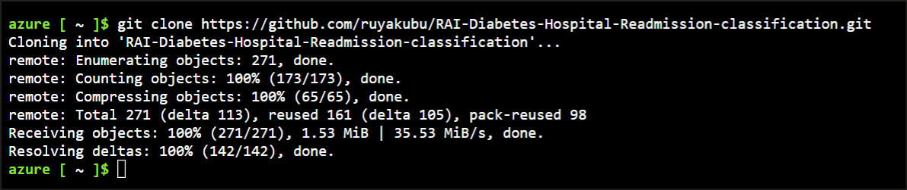

4.  Change to the project directory by executing the below command.

    **+++cd RAI-Diabetes-Hospital-Readmission-classification+++**

### Task 2: Login using Azure CLI

1.  From the cloud shell, execute the below command.

    **az login**

    

2.  Open the url in the console, and type in the code in the browser.

    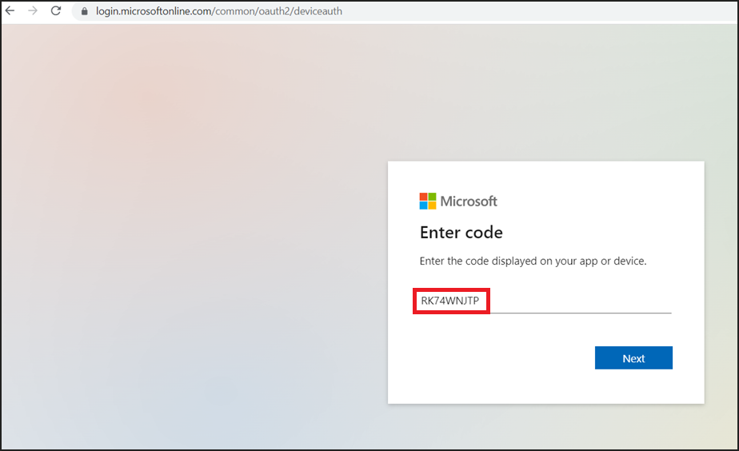

3.  Select the **Azure login** credential.

    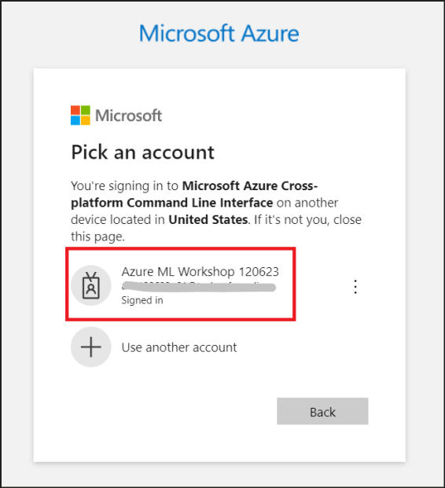

4.  Click on **Continue**.

    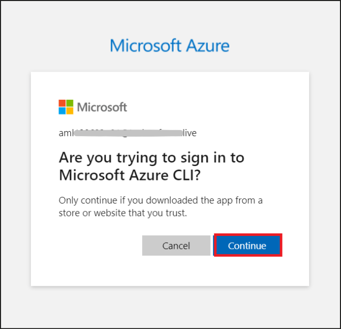

5.  Close the browser and return to the Azure portal.

    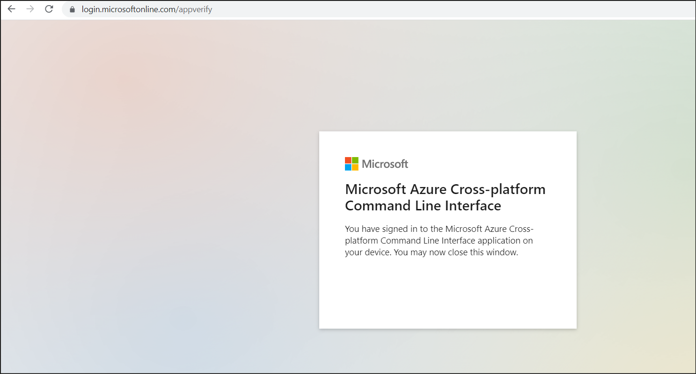

6.  The login details are displayed in the cloud shell.

    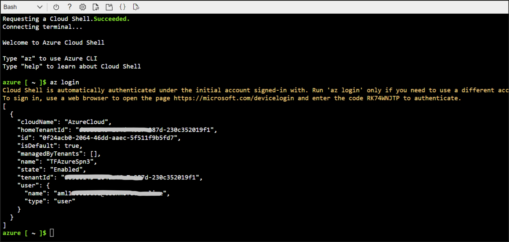

7.  Set your environment default to the **assigned Resource group** and
    **Azure ML workspace**.

    **+++az configure --defaults group="\<resource-group-name\>"
    workspace="\<workspace-name\>"+++**

    **Example:**
    
    **az configure --defaults group="RGForRAI" workspace="azureraiml98"**

    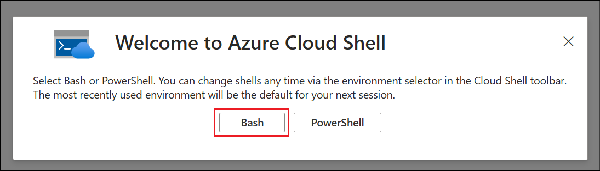

## **Exercise 2: Run jobs for training the model and creating the RAI dashboard**

1.  Execute the below command to register the **training dataset** to
    the Azure Machine Learning workspace.

    **+++az ml data create -f cloud/train_data.yml+++**

    The data asset gets created and the details are displayed on the cloud
shell.

    

2.  Execute the below command to register the **testing dataset** to the
    Azure Machine Learning workspace.

    **+++az ml data create -f cloud/test_data.yml+++**

    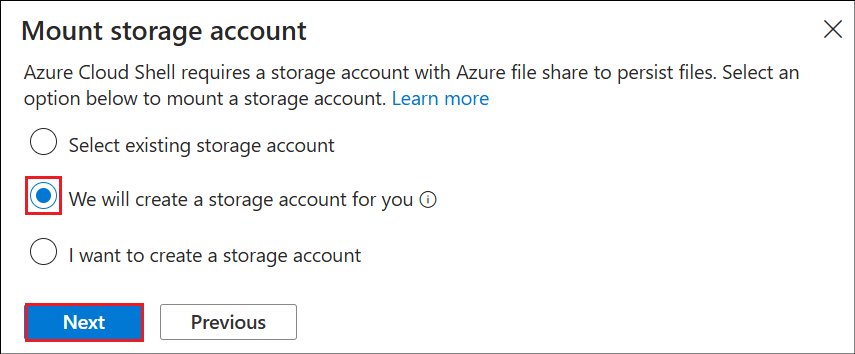

3.  Create a **compute instance** for running the jobs. Then, copy the
    compute name (e.g., ***compute-xxxxxxxxxxxx***) at the end of the
    run to use later.

    - Execute the below command to **create** the **compute**.

    **az ml compute create --name compute9889 --type computeinstance --size
Standard_E4ds_v4**

    

4.  On the Cloud Shell menu, click on the **Open editor** **{ }** pane
    to edit some of the files.

    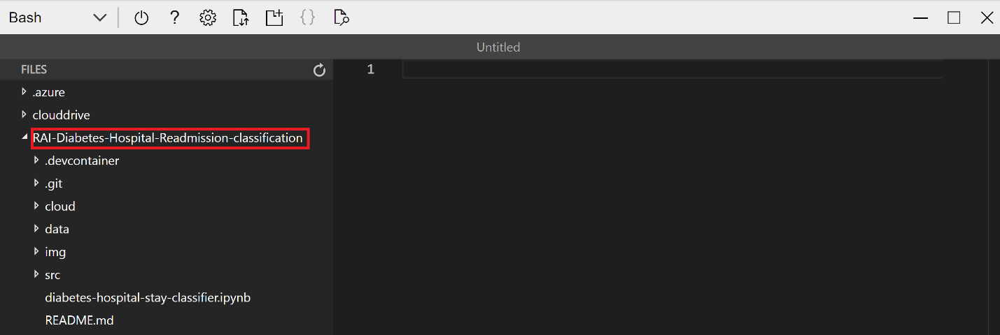

5.  Click on
    the **RAI-Diabetes-Hospital-Readmission-classification** folder to
    expand the directory.

    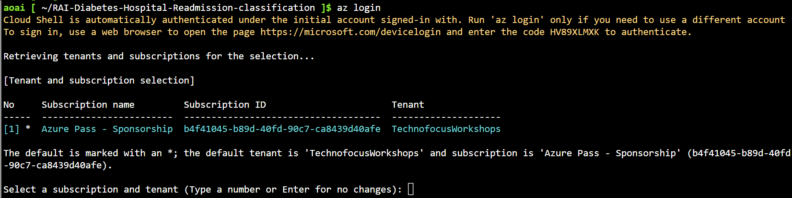

6.  Navigate to the **cloud/training_job.yml** file. Then replace the
    placeholder for the compute name with your **compute instance name**
    that you copied earlier. E.g., **"compute: azureml:**
    **compute-zpy14r2jiqh9 "**.

    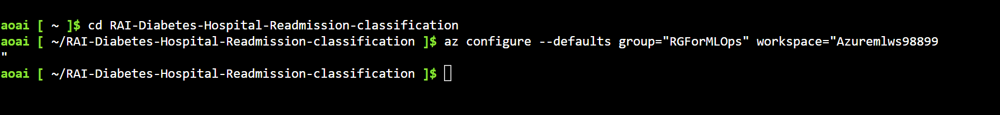

7.  Right-click anywhere in the file, then select the **Save** option to
    save the file. 

    

8.  Next, navigate to the **cloud/rai_dashboard_pipeline.yml** file.
    Then update the placeholder for the compute name with your **compute
    instance name** that you copied earlier. E.g., **"compute:
    azureml:** **compute-zpy14r2jiqh9 "**.

    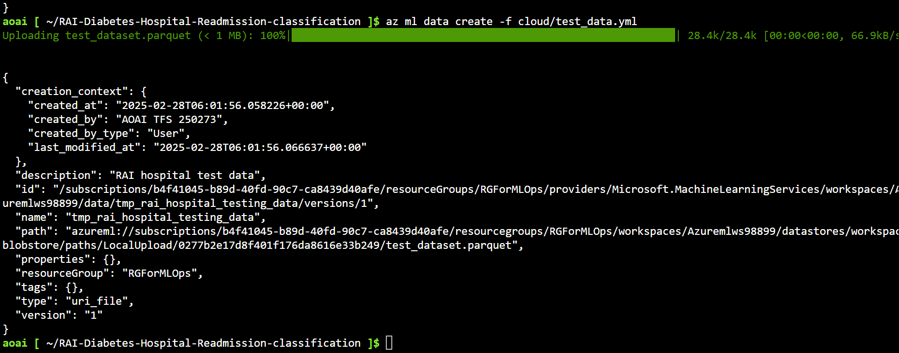

9.  Right-click anywhere in the file, then select the **Save** option to
    save the file.

10. Right-click anywhere in the file, then select the **Quit** option to
    close the editor window.

    

11. Back at the Cloud Shell command prompt, submit the job to train the
    model. Wait for the job to update its run status to **Completed**
    during the training. Copy the below code block to do that.

    ```
    run_id=$(az ml job create --name my_training_job -f cloud/training_job.yml --query name -o tsv)
    
    # wait for job to finish while checking for status
    if [[ -z "$run_id" ]]
    then
      echo "Job creation failed"
      exit 3
    fi
    status=$(az ml job show -n $run_id --query status -o tsv)
    if [[ -z "$status" ]]
    then
      echo "Status query failed"
      exit 4
    fi
    running=("Queued" "Starting" "Preparing" "Running" "Finalizing")
    while [[ ${running[*]} =~ $status ]]
    do
      sleep 8 
      status=$(az ml job show -n $run_id --query status -o tsv)
      echo $status
    done
    ```

    >[!Note] **Note:** If this script does not get pasted properly, use the contents of the file **Scriptfile** in **C:\Labfiles**

    >[!Note] **Note:** The execution of this script should take around 3 to 5 minutes.

    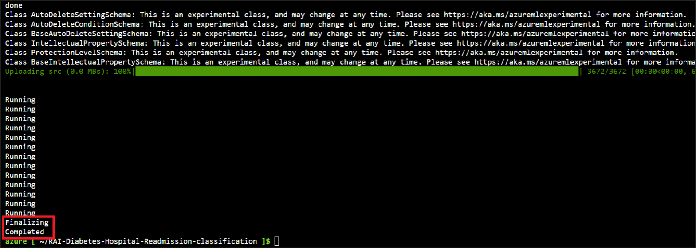

    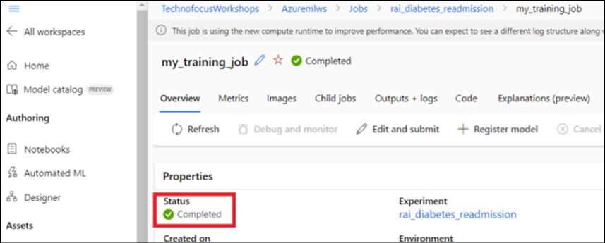

12. Optionally, you can check for the status of the Running job from the
    **Azure Machine Learning Studio (**<https://ml.azure.com/>**)** -\>
    **Jobs**

    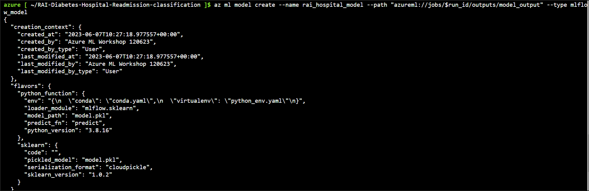

13. After the training job has completed successfully, register the
    model to the Azure Machine Learning workspace. Execute the below
    command to do that.

    +++az ml model create --name rai_hospital_model --path "azureml://jobs/$run_id/outputs/model_output" --type mlflow_model+++

    This command registers the model to the AML workspace and provides the details in the cloud shell, as in the screenshots below.

    

    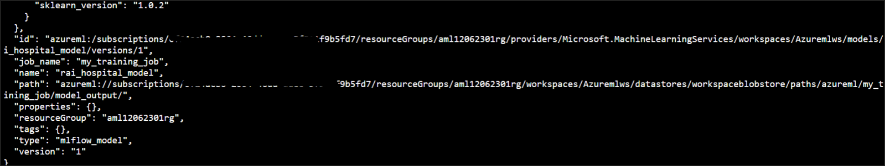

14. Submit the job pipeline to create the **RAI dashboard**. Execute the
    below command to do that.

    +++az ml job create --file cloud/rai_dashboard_pipeline.yml+++

    This command submits the job and the cloud shell is populated with the
initial stage of the pipeline which is the **Preparing** state.

    

    

15. Log into **Azure Machine Learning studio** at
    +++https://ml.azure.com/+++ to monitor the pipeline job for creating the
    RAI dashboard.

16. Select **Pipelines**. To view the progression of the pipeline job
    creating the RAI dashboard, click on the job **Display name**.

    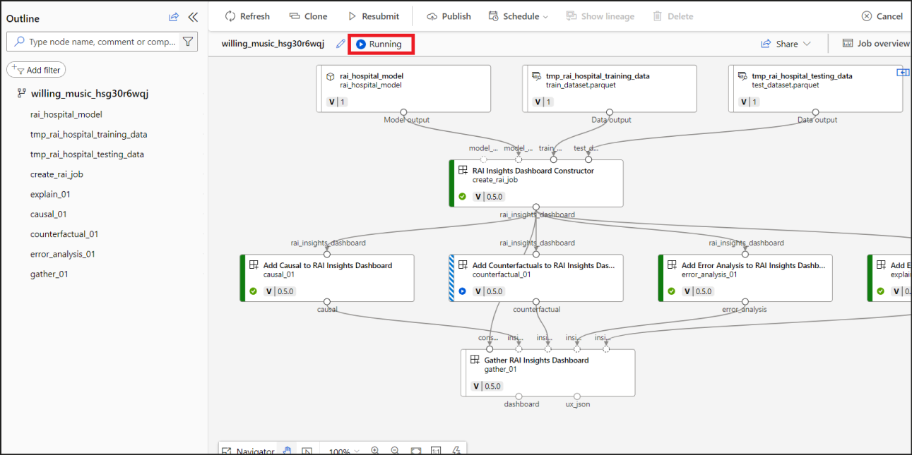

17. The experiment will be in the **Running** state.

    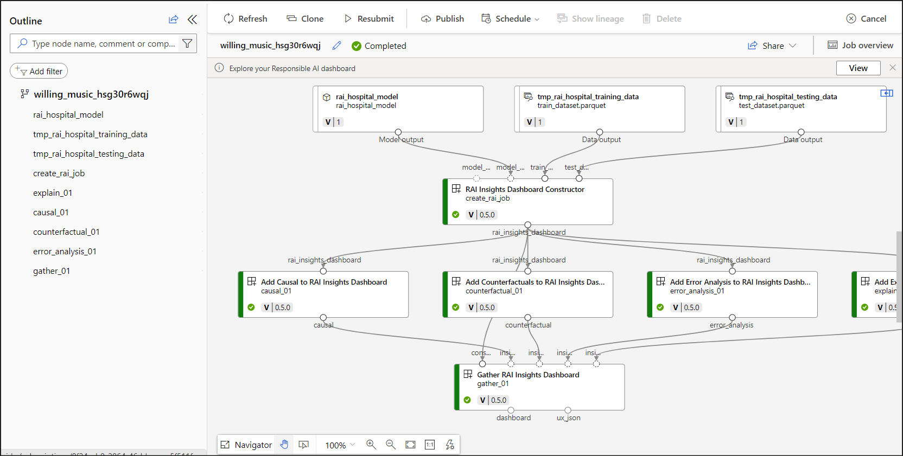

18. The status changes to **Completed** once it is done and the RAI
    dashboard is created.

    

19. Click on the **Models** tab on the left-hand navigation. Then click
    on the name of the model to open the details page.

    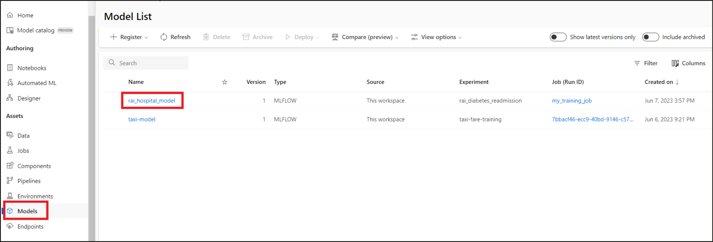

20. Select the **Responsible AI** option in the top menu.

    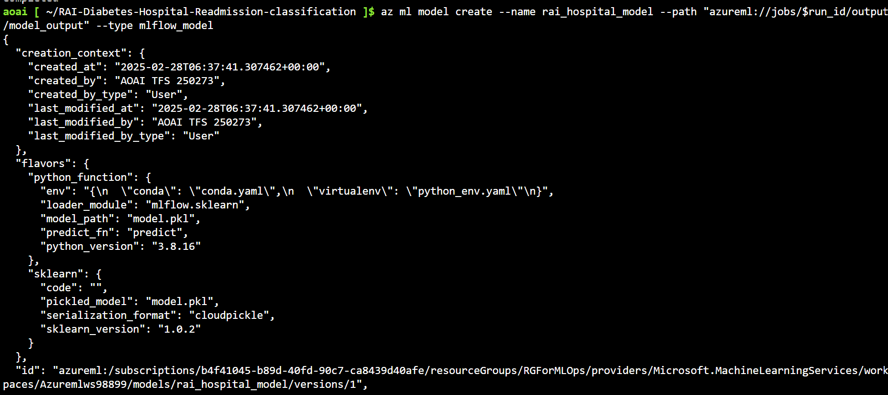

21. Now, you're ready to start using the **RAI dashboard**.

## **Exercise 3: Error Analysis:**

The Error Analysis section of the RAI dashboard helps provide an error
distribution of the feature groups contributing to the error rate of the
model. Errors are often not distributed evenly across different data
subgroups and Error Analysis helps you identify features with the
highest error rates.

### Task 1: Find model errors:

In this task, we are going to explore how to use Error Analysis to find
errors in the trained model to identify where the errors are. In
addition, we’ll learn how to create cohorts of data to investigate why a
model is performing poorly in some cohorts and not in others.

1.  Click on the name **Diabetes Hospital Readmission.**

    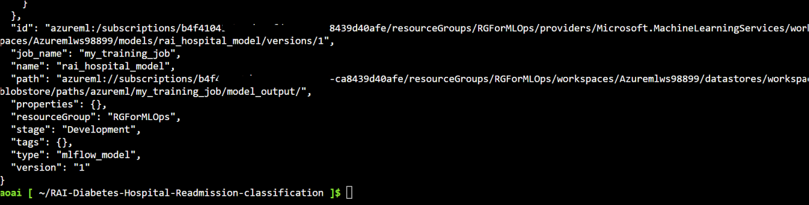

2.  Select the **Compute**.

    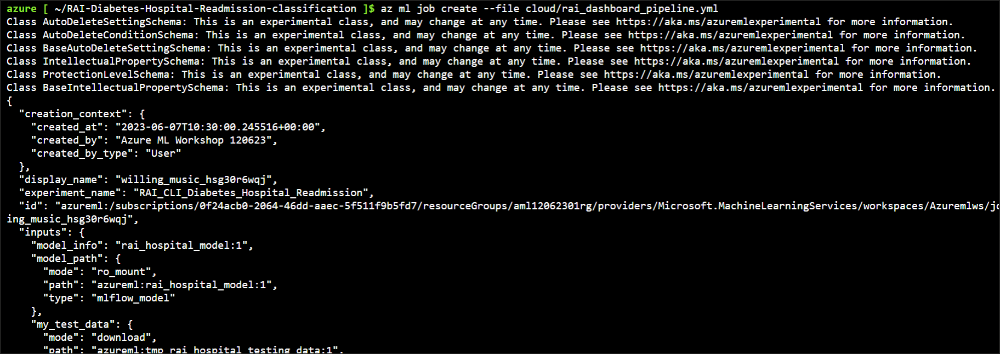

#### **Task 1.1: Identify and create a cohort for the tree path with the highest errors**

To start the analysis, you can observe that the root node shows that out
of 994 total test data, 168 incorrect predictions were found while
evaluating the model.

1.  Find the tree path with the highest number of errors. The darker the
    red shade in the node, the higher the error rate. 

2.  In our case the tree path with the darkest red color is the leaf
    node that is second from the bottom right.

    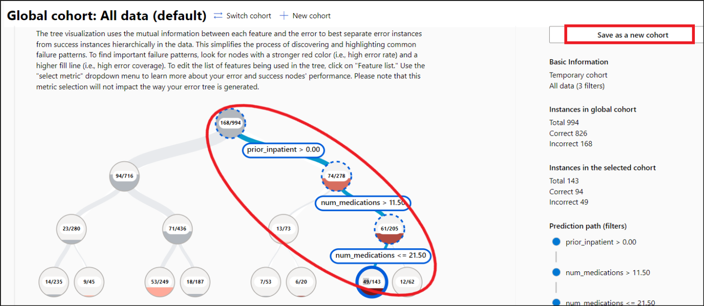

3.  **Double click** on this **node** to select the **entire path**
    leading up to the node. This highlights the path and displays the
    feature condition for each node in the path.

4.  Create a cohort out of the selected path by clicking on the **Save
    as a new cohort** button on the upper right-hand side of the Error
    Analysis section.

    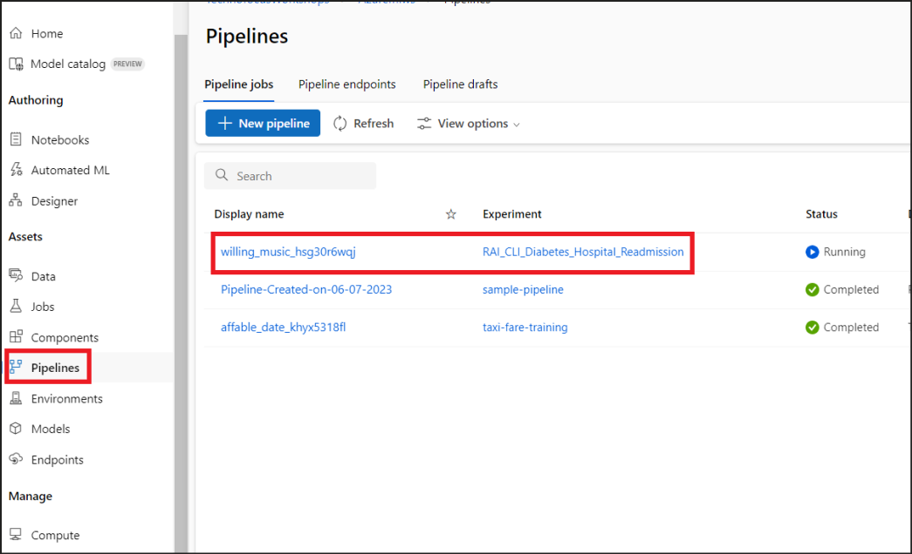

5.  Enter the **Cohort name** as **+++Err: Prior_Inpatient \>0; Num_meds
    \>11.50 & \<= 21.50+++**

    Click on **Save**.

    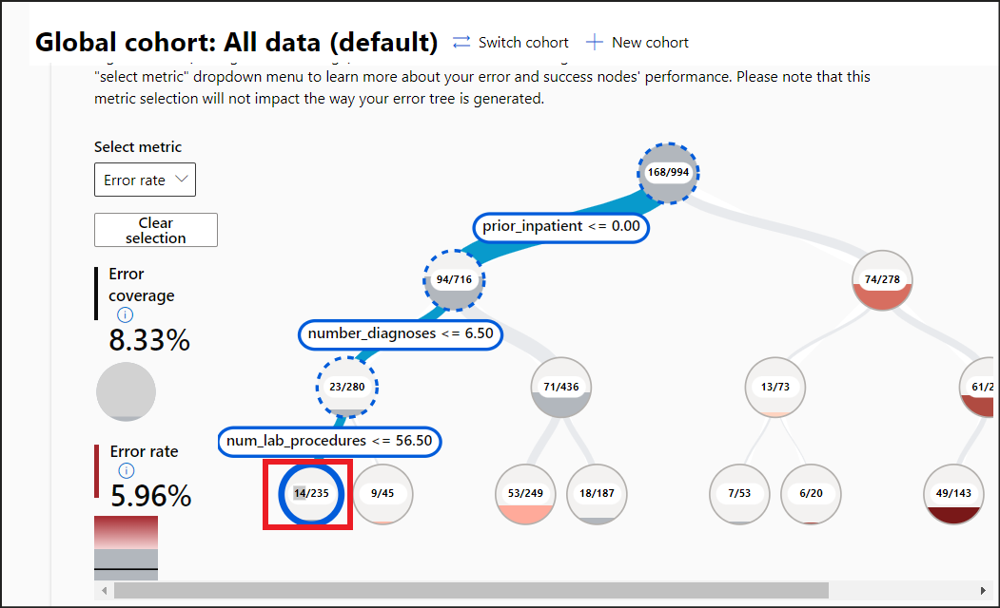

#### **Task 1.2: Identify and create a cohort for the tree path with the least errors**

For contrast purposes, create another cohort with the tree path with the
least number of errors to see if we can gain insights as to why the
model performs well in one cohort vs another. The **leaf node** with the
feature condition **num_lab_procedures ≤ 56.50*,*** on the far left-hand
side of the tree, is the path of the tree with the least errors.

1.  **Double-click** on the node.

> 

2.  Click on **Save as a new cohort**. The **Filter** in this dataset
    is: num_lab_procedures \<= 56.50, number_diagnoses \<= 6.50,
    prior_inpatient \<= 0.00.

    

3.  **Name** the cohort: **+++Prior_Inpatient = 0; num_diagnoses \<=
    6.50; lab_procedures \<= 56.50+++** and click on **Save**.

    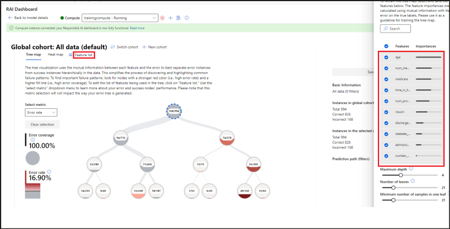

#### **Task 1.3: Use the Feature List to identify the top feature contributing to model errors**

1.  Click on **Feature list**.

    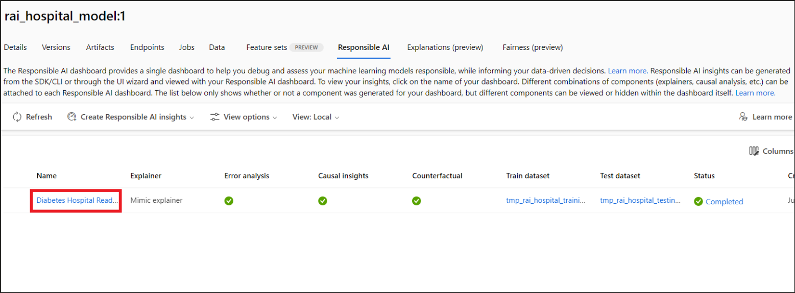

2.  The list is sorted based on contribution of the features to the
    errors. The higher a feature is on this list, the higher its
    contribution importance to your model errors.

3.  In our Diabetes Hospital Readmission model, the **Feature List**
    indicates the following features to be among the top contributors of
    the model's errors.

    - Age

    - num_medications

    - medicare

    - time_in_hospital

    - num_procedures

    - insulin

    - discharge_destination

### Task 2: Find errors using Heat map

From the Feature List, **Age** was one of the top error contributors.
So, we'll use the Heat map tab to explore which age group of the
patients are driving the model to perform poorly.

1.  Select **Heat map** under **Error Analysis**.

    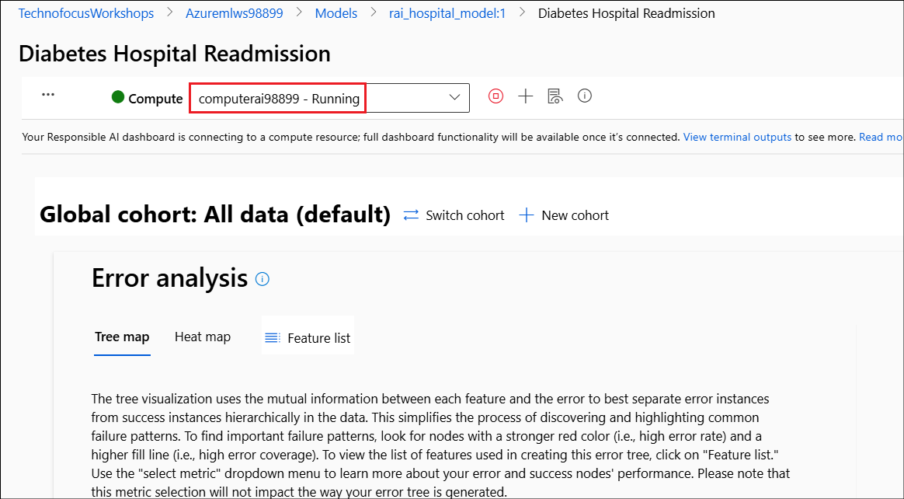

2.  Under the Heat Map tab, select **Age** in the **Rows: Feature
    1** drop-down menu to see what factor it plays in the model's
    errors.

3.  After selecting the **Age**, we can see how the dashboard has a
    built-in intelligence to divide the feature into different cells
    with the possible conditions.

    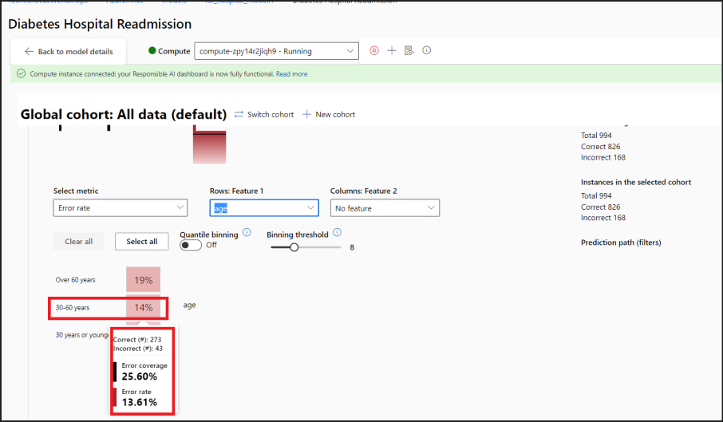

2.  **Hover** your mouse over each cell, you can see the number of
    correct vs incorrect predictions, error coverage and error rate for
    the data group represented in the cell.

    

3.  The cell with **Over 60 years** has **536** correct
    and **126** incorrect model predictions. The error coverage
    is **73.81%**, and error rate **18.79%**

4.  The cell with **30–60 years** has **273** correct
    and **25** incorrect model predictions. The error coverage
    is **25.60%**, and error rate **13.61%**.

5.  The cell with* ***30 years or younger*** *has **17** correct
    and **1** incorrect model predictions.

Since our observation shows that **Age** plays a significant role in the model's erroneous predictions, we are going to create cohorts for each age group for further analysis in the next lab.

#### ***Task 2.1: Create Cohorts based on the age groups***

1.  Click on the percentage box of **Over 60 years** cell. You'll see a
    blue border around the square cell.

2.  Click on **Save as a new cohort**.

    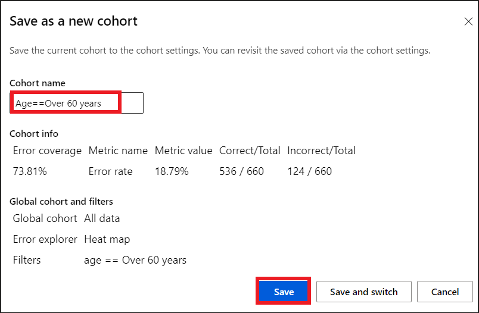

3.  In the Save as a new cohort dialog, enter

    - Cohort name - **+++Age==Over 60 year+++**

    Click on **Save**.

    

4.  Repeat the steps 2 and 3, to create a cohort for each of the other
    two Age cells.

    - **Cohort \#4:** Name - **+++Age == 30–60 years+++**
    
    - **Cohort \#5:** Name - **+++Age \<= 30 years+++**

### Task 3: View the cohorts lists

1.  Click on the **Settings** gear icon on the upper right-hand corner
    of the Error Analysis section.

    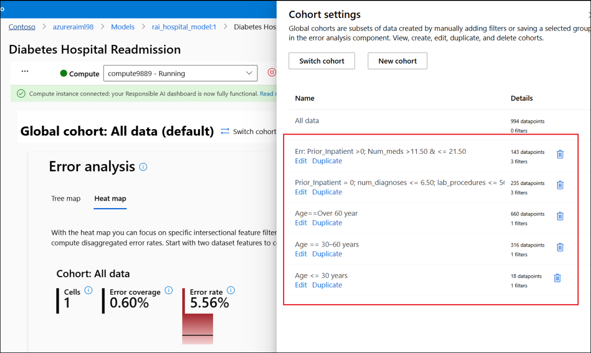

2.  This will open a **Cohort Settings** **window pane** with the list
    of all the cohorts you created.

    

## Exercise 4: Using RAI to perform Model Analysis

In this lab we will explore how to use the **Model Overview** section of
the Azure Responsible AI (RAI) dashboard. We will use the cohorts
created from the Error Analysis lab to investigate why the model’s
behavior is better in one cohort vs another cohort.

## **Exercise 4.1: Model Overview**

### Task 1: Review and compare model performance metric table

1.  Scroll down below the Error Analysis to find the Model Overview
    section.

    

2.  Under Model Overview, select the **Dataset Cohorts** pane. This
    displays the different cohorts created in a table with the model
    metrics.

    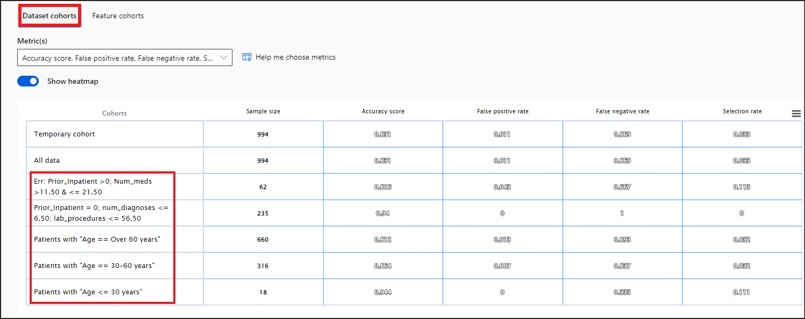

3.  Compare the cohort with the most errors **Err: Prior_Inpatient \> 0;
    Num_Meds \> 11 and ≤ 21.50** verse the least errors
    **Prior_inpatient = 0; num_diagnose ≤ 6.50; lab_procedures \<
    56.50.**

    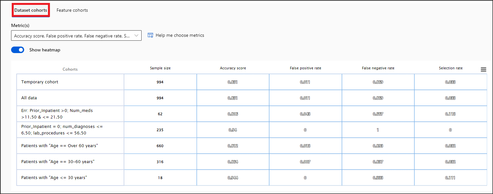

4.  Hover the mouse over the box plot line on the chart to see the
    measurement details.

    

5.  Observe that the accuracy score for the **erroneous cohort** is
    0.806, which is bad. The **False Positive** rate is **very low** and
    the **False Negative** value is **high**. Meaning, a majority of
    patients that the model is predicting has a high rate of predicting
    patients that will not be readmitted as readmitted in 30 days back
    to the hospital.

    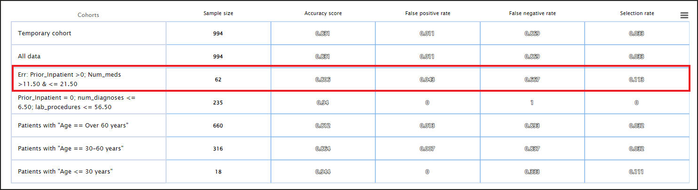

6.  Next, look at the metrics for the **cohort** with the **least
    errors** has an accuracy score of 0.94, which is far better than the
    overall accuracy score of the model with all the data. However, this
    cohort also has a low **False positive** rate at **0**.

    

### Task 2: Examine the Probability distribution chart

1.  Scroll down to see the **Probability distribution**.

2.  The Probability distribution chart shows the model’s probability
    predicting if patients in the cohorts will be Readmitted or Not
    readmitted back to the hospital within 30 days.

3.  Compare the probability of the patients not being readmitted for all
    3 cohorts.

4.  You'll see that the **All data** cohort with all the patients test
    dataset, show that a majority of the patients will not be readmitted
    back in the hospital within 30 days, with a median probability of
    patients not readmitted at 0.854 and upper quartile at 0.986, which
    is good.

5.  Next, the cohort with the highest error rate: ***Err:
    Prior_Inpatient \>0; Num_meds \>11.50 & \<= 21.50***, shows a
    slightly lower probability at 0.89 and a median of 0.719.

6.  Lastly, the cohort with the least error rate: ***Prior_Inpatient =
    0*; *num_diagnoses \<= 6.50*; *lab_procedures \<= 56.50***, show a
    probability of patients not readmitted has a median of 0.90 and
    upper quartile of 0.986.

    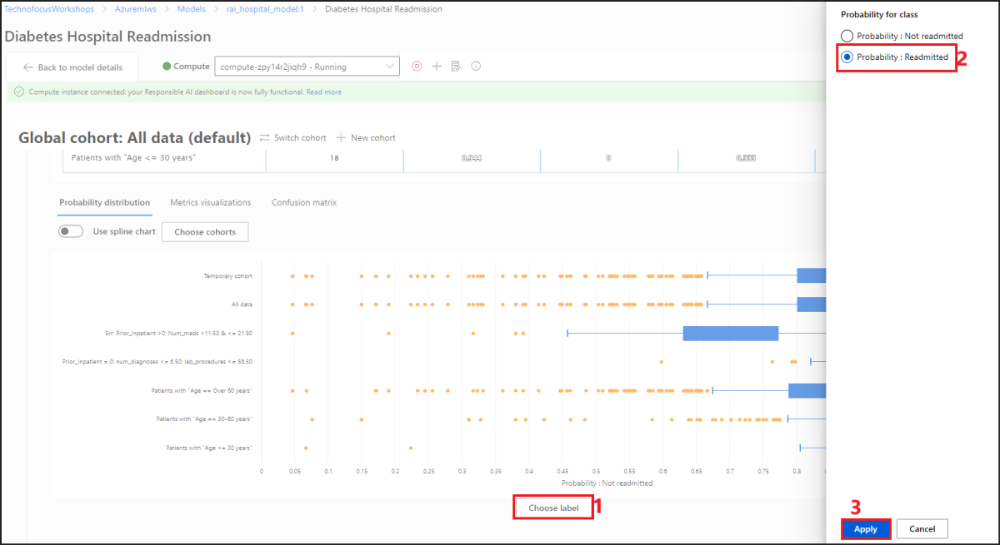

7.  To change the chart to show the probability of patients being
    Readmitted for the 3 cohorts, click on the **Choose Label** button
    on the x-axis.

8.  Select the **Probability: Readmitted** radio button. On the pop-up
    window pane.

9.  Then click on the **Apply** button.

    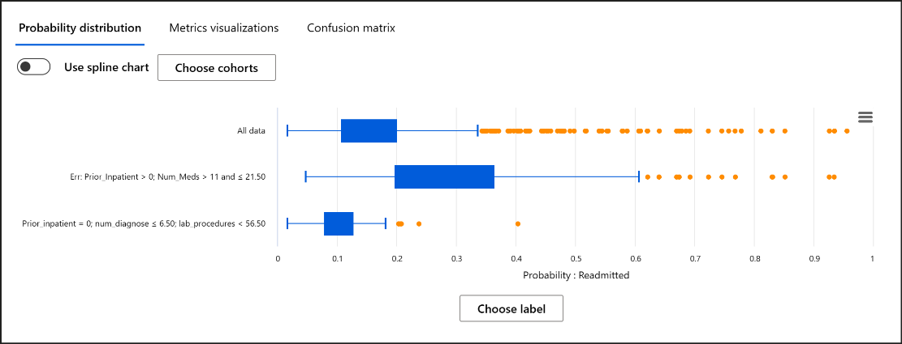

10. Compare the probability of patients being Readmitted for the 3
    cohorts

    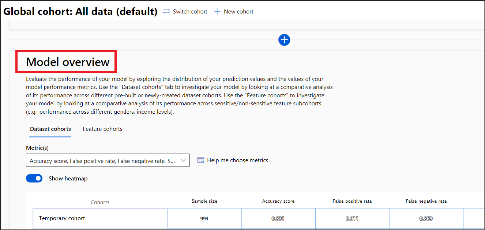

9.  You see that the 3 cohort have a probability of being readmitted
    less than 0.55. The cohort with the least number of model errors has
    the lowest probability of 0.179. The cohort with the most errors
    have the highest probability at 0.543.

### Task 3: Review the Metric visualization chart

Now let's get a deeper understanding of the model's performance by
switching to the Metric visualizations pane. 

1.  Click on the Metric visualizations tab.

    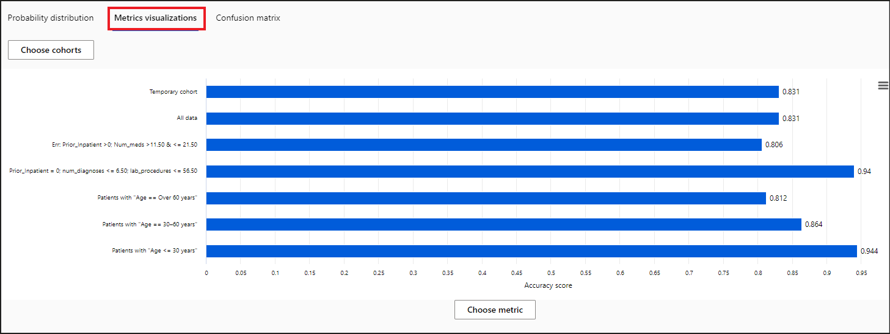

2.  To choose another metric, click on the **Choose metric** on the
    x-axis to choose **Precision score** from the list of other
    available metrics. Then click on the **Apply** button. 

    >[!Note] **Note**: Since the trained model is a classification problem, the RAI dashboard will display only classification metrics.

    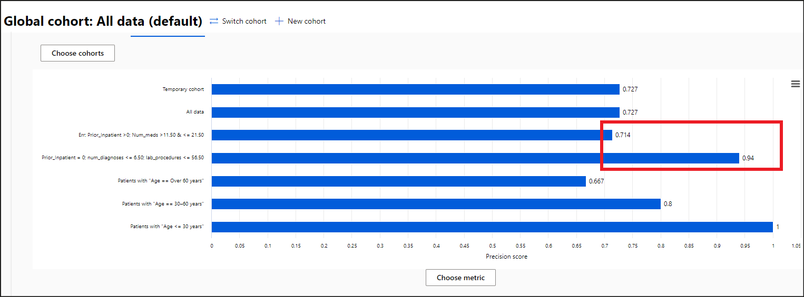

3.  From reviewing the chart, you will see that the model performance
    for all test data cohort and erroneous cohort is correct at ~70% of
    the time. 

4.  The **Precision score** rate for the **least erroneous cohort** is
    **0.94** for patients with no prior hospitalization and the number
    of diagnoses is less than 7. This is consistent with the accuracy
    score.

    

5.  Finally, change the metric to **Recall** to see how well the model
    was able to correctly predict that the patients in the cohorts will
    be readmitted back in the hospital in 30 days.

    

6.  The recall shows that the **model's prediction** was **correct less
    than 25%** of the time for all the cohorts for patients being
    readmitted. This reveals that the model's predictions are not
    correct a majority of the time when trying to predict patients that
    will be readmitted within 30 days.

    

### Task 4: Look at the Confusion Matrix

The Confusion Matrix is helpful to check the rate of the model correctly
making the right prediction. This will reveal how well the model is
learning for cases where the patient is Readmitted back in the hospital
within 30 days vs Not Readmitted.

1.  Click on the **Confusion matrix** tab.


2.  You will observe that the **model** is performing **better** with
    patient that are **Not Readmitted** compare to **Readmitted**.

3.  The number of False Negative should be less that True Negative. This
    mean out of all the patient data, the model was only able to predict
    24 patients correctly to be Readmitted back to the hospital in \< 30
    days.

    - The number of True Positive (TP) is: **802**
    
    - The number of False Negative (FN) is: **159**
    
    - The number of False Positive (FP) is: **9**
    
    - The number of True Negative (TN) is: **24**

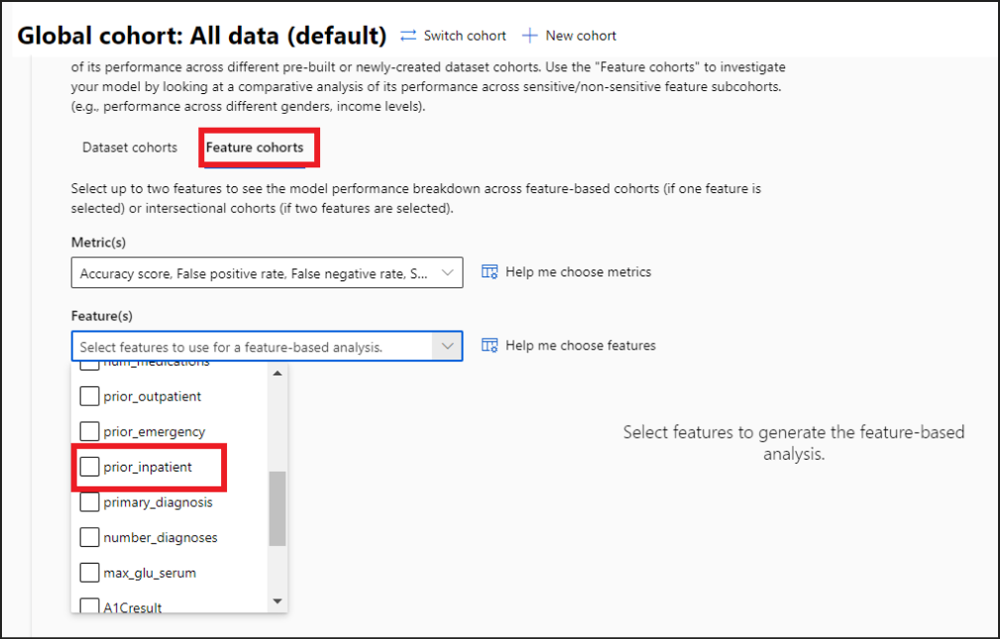

## **Exercise 2: Feature Cohort**

Since the cohort with the highest error has patients with the number
of *Prior_Inpatient \> 0* days and number of medications between 11 and
22 was where the model had a higher error rate, taking a closer look at
the *Prior_Inpatient* and *Num_medications* will help isolate where
there are issues. For this lab, we'll only analyze *Prior_Inpatient*.

1.  Click on the **Feature Cohorts** tab.

2.  Under the **Feature(s)** drop-down menu, scroll down the list and
    select the **prior_inpatient** checkbox. This will display 3
    different feature cohorts and the model performance metrics.

    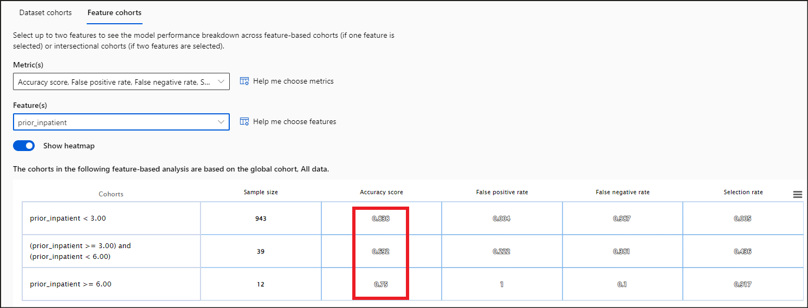

3.  The **prior_inpatient** ***\< 3*** cohort has a sample size of
    **943**. This means a majority of patients in the test data were
    hospitalized less than 3 times in the past. The **model's accuracy
    rate** for this cohort is **0.838**, which is good.

4.  Only 39 patients from the test data fall in the **prior_inpatient**
    ***≥ 3 and \< 6*** cohort. The model's accuracy rate is **0.692**,
    which is not good.

5.  Lastly, just 12 patients from the test data have a prior
    hospitalization greater than or equal to 6 days. The **model
    accuracy** of **0.75** for this cohort is ok.

    

### Task 1: Feature probability distribution

Similar to the Dataset cohort, you have the ability to view the
“Probability Distribution”.

1.  You can see that the lesser the diabetic patient’s number of
    prior_inpatient hospitalizations, the more likely the patient was
    not going to be readmitted in 30 days. 

    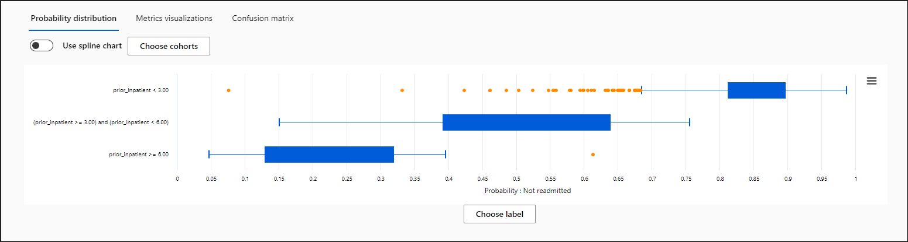

### Task 2: Feature Metrics visualizations

1.  Select **Metrics visualization**. On the x-axis, click on the
    **Choose metric** button. Then select the **Precision score**
    metric.

    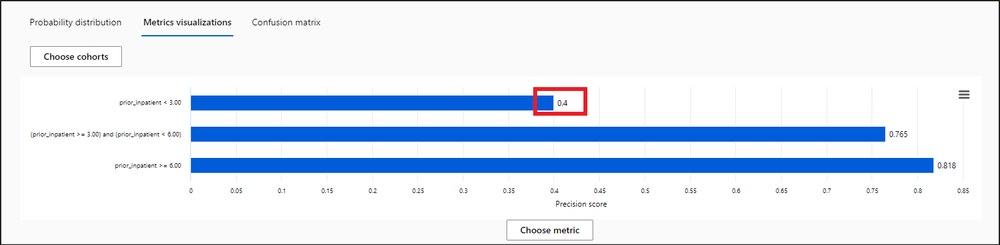

2.  You see that the precision score for patients with **prior_inpatient
    \< 3** is 0.40, which is very bad. This means that of all the
    predictions that the model made, only 40% were correct for this
    cohort.

    

3.  The precision score for the other 2 cohorts are good.

4.  Next, select **Recall score** metric for the x-axis.

    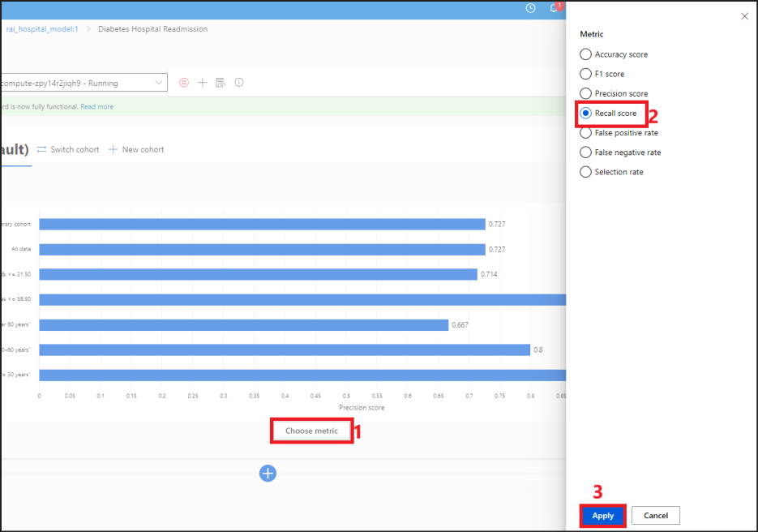

5.  On the contrary, you'll see the recall score for patients
    with **prior_inpatient \< 3** is 0.013. Meaning, for a majority of
    patients in the test data, the model is having difficulty correctly
    predicting whether the patient will be readmitted within 30 days or
    not.

    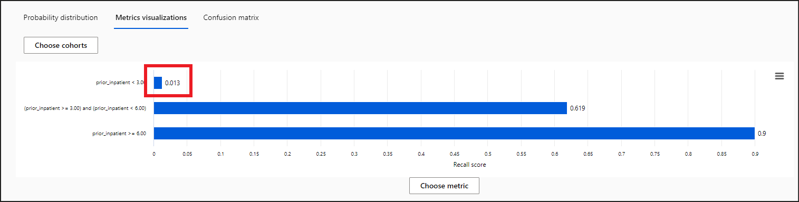

**Summary**

This lab shows how the traditional model performance metrics (e.g., accuracy, recall, confusion matrix etc) are still very important. By combining RAI insights and traditional performance metric, the dashboard gives us a wholistic tool to analyze and debug the model on a more granular level.
