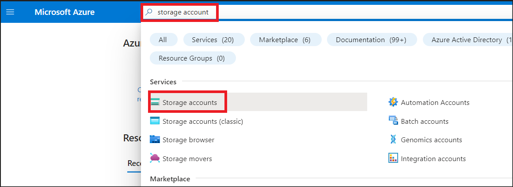
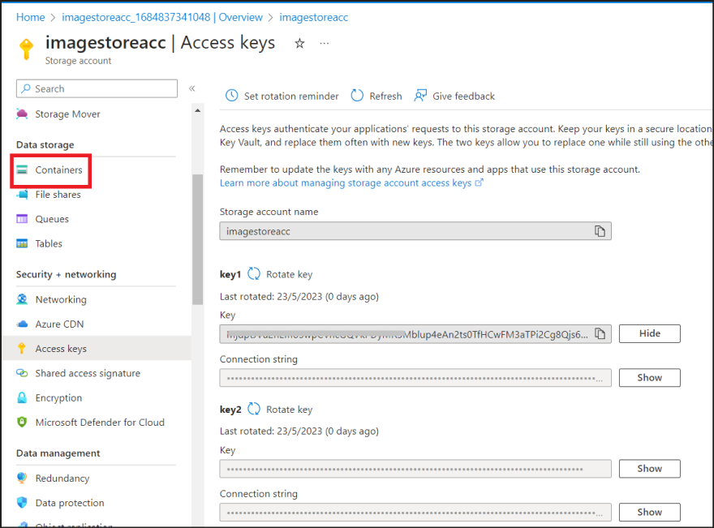
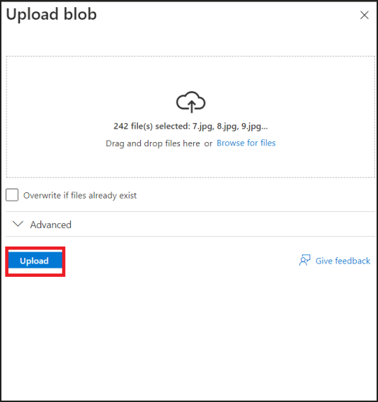
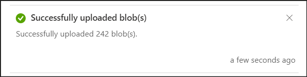
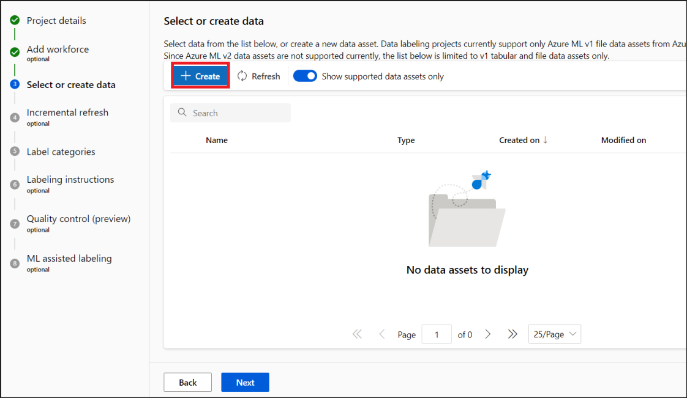
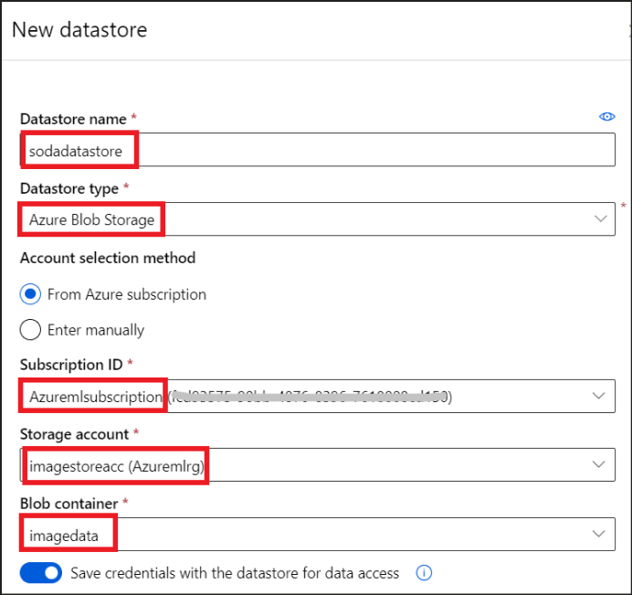
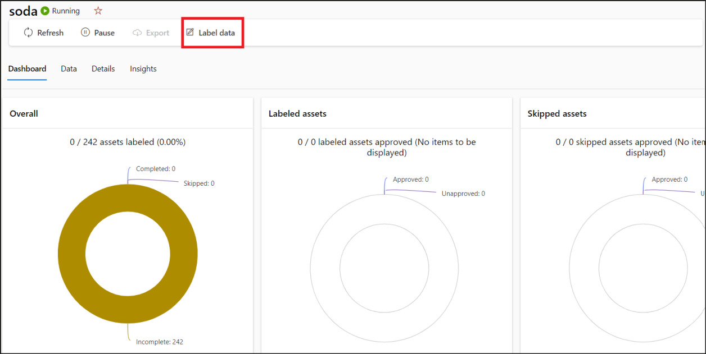
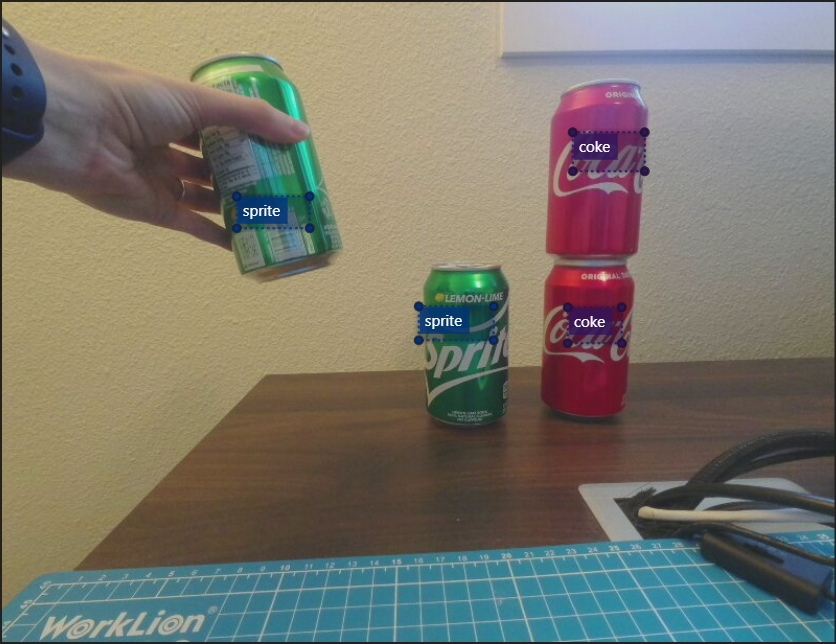
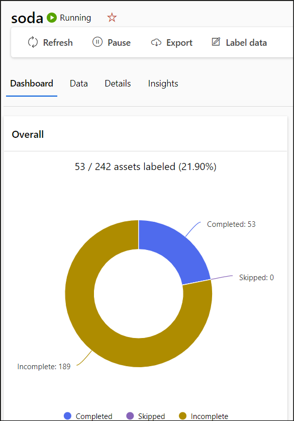
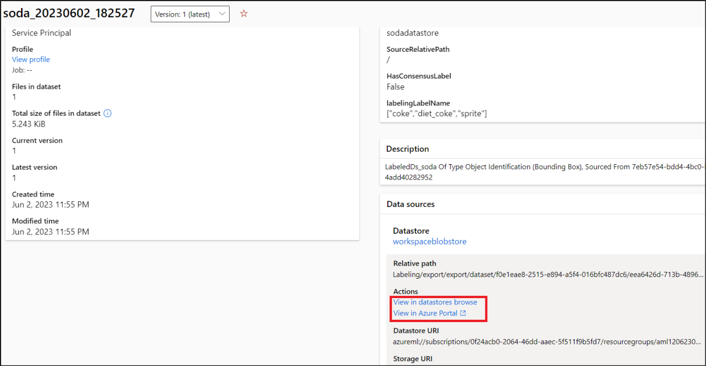

> **Laboratório 02 – Criação de um conjunto rotulado de dados usando
> ferramentas de rotulagem de dados do Azure Machine Learning **
>
>  
>
> **Objetivo** 
>
> Neste laboratório, você aprenderá a usar as Ferramentas de Dados do
> Azure Machine Learning no Azure Machine Learning Studio, para
> organizar grupos de dados não rotulados em conjuntos de dados
> rotulados, que acomodam as classes que seriam detectadas pelo modelo
> de detecção de objeto treinado. 
>
> Duração prevista - 40 min 
>
> **Exercício 1: Preparando os recursos do Azure** 
>
> **Tarefa 1: Criar uma conta de armazenamento do Azure** 

1.  Na página inicial do **Portal do Azure,**
    (+++**https://portal.azure.com**+++), digite +++**storage
    account**+++ na barra de pesquisa e selecione **Storage accounts**. 

>  
>
>  

2.  Selecione **+Create**. 

>  

3.  Na página Create a storage account page, insira os detalhes abaixo. 

**Detalhes do projeto** 

- Subscription – Selecione sua **assinatura**. 

&nbsp;

- Resource group – selecione o **Grupo de recursos** atribuído a você. 

**Instance details** 

- Storage account name – +++**imagestoreacc@lab.LabInstance.Id** +++  

- Region – Selecione a **região** na qual você criou seu **AML
  Workspace** 

- Performance – Selecione **Standard** 

- Redundancy – Selecione **Locally-redundant Storage (LRS)** 

> Selecione **Next.** 
>
>  
>
>  
>
>  

4.  Na guia Advanced, verifique se a opção **Allow cross-tenant
    replication **na seção **Blob Storage** está desmarcada. Aceite os
    outros padrões e selecione **Review + Create**. 

>  
>
>  
>
>  

5.  Assim quando a validação for aprovada, clique em **Create**. 

>  

6.  Quando a implementação estiver concluída, clique em **Go to
    resource**. 

>  

7.  Anote o nome da conta de armazenamento, este será usado
    posteriormente no laboratório. Permaneça na mesma página e continue
    para a próxima tarefa. 

>  
>
> **Tarefa 2: Criar um contêiner de armazenamento do Azure** 
>
>  
>
>  

1.  No menu esquerdo da página da conta de armazenamento, role até
    a seção **Data Storage** e selecione **Containers**. 

>  

2.  Selecione +**Container**. No painel New Container que será aberto,
    digite o nome do container como +++imagedata+++ e clique em
    **Create**. 

>  
>
>  

3.  Após a criação do container, selecione as **Access Keys**
    em **Security + networking **no painel esquerdo. Na página Access
    Keys, clique em **Show** ao lado do valor da chave e, em seguida,
    **copie** a chave. Armazene o valor copiado em um bloco de notas
    para referência futura. 

>  
>
>  
>
>  

4.  Navegue de volta para a página de contêineres selecionando
    **Containers** no painel esquerdo. 

>  
>
>  

5.  Selecione o contêiner recém-criado, **imagedata**. 

>  
>
>  
>
>  

6.  Clique em **Upload**. No painel **Upload blob**, clique em **Browse
    for files** e abra a pasta **train_img** localizada em
    **C:\Labfiles** 

>  
>
>  

7.  Selecione todos os arquivos na pasta train_img e clique em
    **Open.** 

>  
>
>  
>
>  

8.  Na página Upload blob, clique em **Upload**. 

>  
>
>  
>
>  

9.  Depois de carregado, a mensagem **Successfully uploaded blob(s)**
    será exibida. Feche o painel **Carregar blob**. 

>  
>
>  
>
>  

10. Depois de concluído, você deverá ver que todas as 242 imagens foram
    adicionadas ao Contêiner de Armazenamento do Azure. 

>  
>
>  
>
>  
>
> **Exercício 2: Criar um projeto de rotulagem de dados do Azure Machine
> Learning** 

1.  Na página inicial do Azure Machine Learning Studio, selecione **Data
    Labeling** em **Manage** no painel esquerdo. 

>  
>
>  
>
>  
>
>  

2.  Selecione **+Create.** 

 

 

 

3.  Na seção **Project Details**, forneça os seguintes detalhes. 

&nbsp;

1.  **Project Name** - +++**soda**+++ 

&nbsp;

2.  Media type – **Image** 

&nbsp;

3.  **Labeling task type - Object Identification (Bounding Box)**  

> Selecione **Next**. 
>
>  
>
>  

4.  Na tela **Add workforce (optional),** deixe a opção desativada e
    selecione **Next** para continuar. 

 

5.  Na **página Select or create data**, clique em **+Create**. 

 

 

 

6.  No painel **Data Type** da página **Create Data Asset**, forneça os
    detalhes abaixo. 

&nbsp;

1.  **Name** – +++**sodaObjects**+++ 

&nbsp;

2.  **Description –** +++**Image labelling**+++ 

&nbsp;

3.  **Type –** File 

Clique em **Avançar**. 

 

 

 

7.  No painel **Data Source** da página **Create Data Asset**, selecione
    a opção **From Azure Storage** e clique em **Next.** 

 

 

8.  No painel **Storage Type** da página **Create data asset**,
    selecione **Create new datastore**. 

 

 

 

9.  No painel **New datastore**, forneça os detalhes abaixo. 

&nbsp;

1.  **Datastore name** – +++**sodadatastore**+++ 

&nbsp;

2.  **Datastore type** – Selecione **Azure Blob Storage** 

&nbsp;

3.  **Account selection method – **Selecione **From Azure
    subscription** 

&nbsp;

4.  **Subscription ID – **Selecione sua assinatura 

&nbsp;

5.  **Storage account –** Selecione **imagestoreacc** 

&nbsp;

6.  **Blob container – **Selecione** imagedata** 

&nbsp;

7.  **Authentication type – **Selecione **Account Key** 

&nbsp;

8.  **Account key –** Insira a chave da conta salva anteriormente no
    Exercício 1 

>  
>
> Clique em **Create.** 

 

 

 

 

10. A mensagem **Create Success** é exibida na página **Select a
    datastore.** Selecione o **sodadatastore** que acabou de ser Criado.
    Clique em **Next**. 

 

 

 

11. Em Choose a storage path selecione **Enter storage path manually** e
    digite **/** para o Storage path. Habilite **Skip data validation**.
    Clique em **Next**. 

 

 

 

 

 

 

 

12. Revise os detalhes e clique em **Create**. 

 

 

 

13. De volta ao painel **Select or create data**, selecione
    **sodaObjects.** Clique em **Next**. 

 

 

 

14. Na página **Incremental refresh**, selecione **Enable incremental
    refresh at regular intervals.** Clique em **Next**. 

>  

 

 

15. Na página **Label Categories**, clique em **Add label category**
    duas vezes para adicionar dois novos espaços reservados para nomes
    de categorias, além do já existente. 

 

 

 

16. Depois de adicionar, digite +++**coke**+++, +++**diet_coke**+++
    e +++**sprite**+++, um em cada espaço reservado para label category.
    Clique em **Next**. 

 

 

 

17. Deixe as instruções de rotulagem em branco e clique em **Next**. 

 

 

18. Clique em **Next** na página **Quality control(preview)**. 

 

 

 

19. Desative a opção **Enable** **ML assisted labelling **e clique em
    **Create project**. 

 

20. Uma mensagem **Success: soda data labelling project created
    successfully. Project is initializing** será exibida na tela Data
    Labelling. Clique no projeto **soda.** 

 

 

 

21. Clique em **Label data**. 

 

 

 

22. As **Shortcut keys **no canto superior direito mostram os diferentes
    atalhos disponíveis. 

 

 

 

23. A barra de menu superior fornece as diferentes opções disponíveis. 

 

 

 

24. A primeira imagem é aberta na tela. Selecione a marca apropriada no
    painel **Tags** à esquerda. 

> Em seguida, clique na imagem e arraste um pouco para ver o rótulo
> sendo anexado à imagem.
>
> Clique em **submit**. 

 

 

 

 

25. Repita o mesmo processo para as próximas imagens que surgirem após
    enviar a primeira. 

Rotule pelo menos 10 imagens. 

 

 

 

 

26. A próxima imagem será carregada até que se chegue ao final das
    imagens. Pare em qualquer ponto após a décima imagem, ou prossiga e
    complete a rotulagem de todas as imagens. 

&nbsp;

27. Clique em soda no menu de navegação superior para voltar ao
    **Dashboard**. 

 

 

 

 

 

28. O **Dashboard** fornece os detalhes sobre os **labeled assets **e a
    **label distribution**. 

 

 

 

 

 

 

29. Clique em **Export.** 

 

 

 

 

 

30. No painel **Export data**, selecione 

- **Asset type - Labeled ** 

&nbsp;

- **Export format -** **Azure ML dataset** 

> Clique em **Submit**. 

 

 

 

31. A mensagem **Labels successfully exported** será exibida na página
    Dashboard quando a exportação é concluída. Clique no **file link**
    na mensagem de sucesso, para abrir os detalhes do arquivo
    exportado. 

 

 

 

 

 

 

 

32. Clique no link **View in** **datastores** ou **View in Azure
    portal** na seção **Datasources** -\> **Actions**. 

 

 

 

33. Exibir em datastores. 

 

 

>  
>
> **Resumo** 
>
> Neste laboratório, você aprendeu a criar um data asset pelo
> armazenamento Azure, e a rotular as imagens, criando um conjunto de
> dados rotulado.  
>
> Todo esse conjunto de tarefas também pertence ao estágio **Data:
> Explore & prepare** do **Machine Learning project workflow.** 
>
>   
