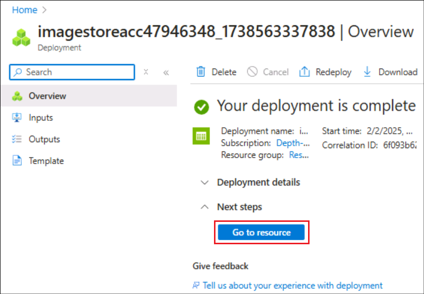
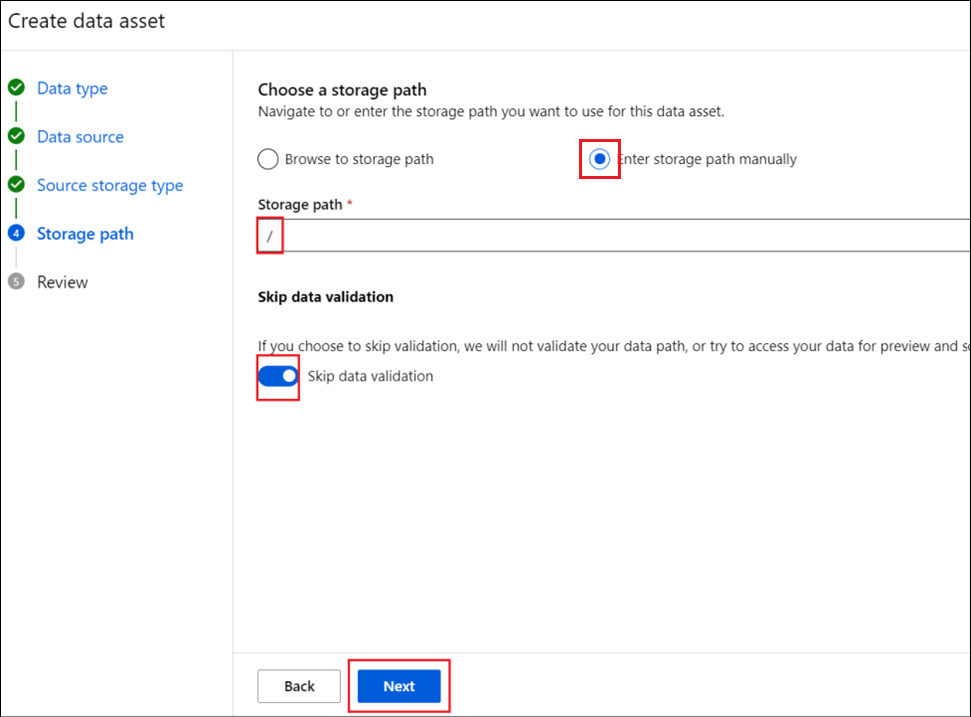
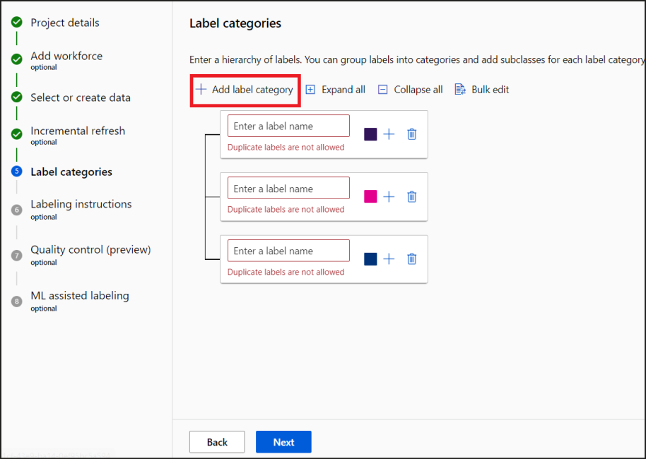
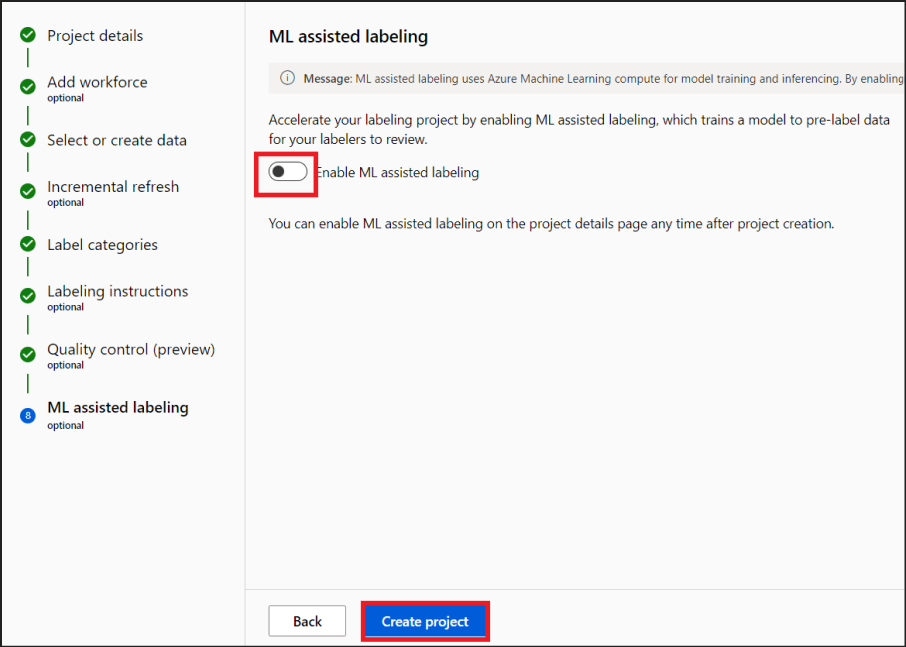
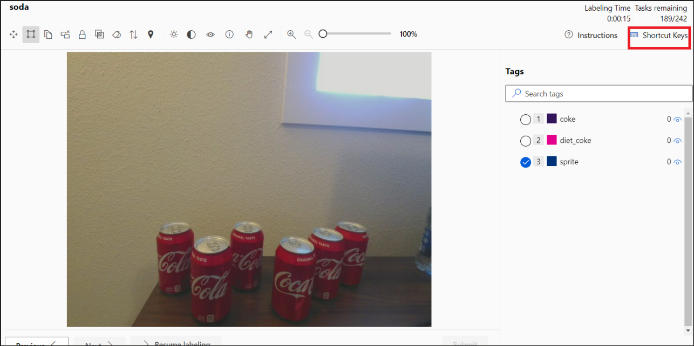
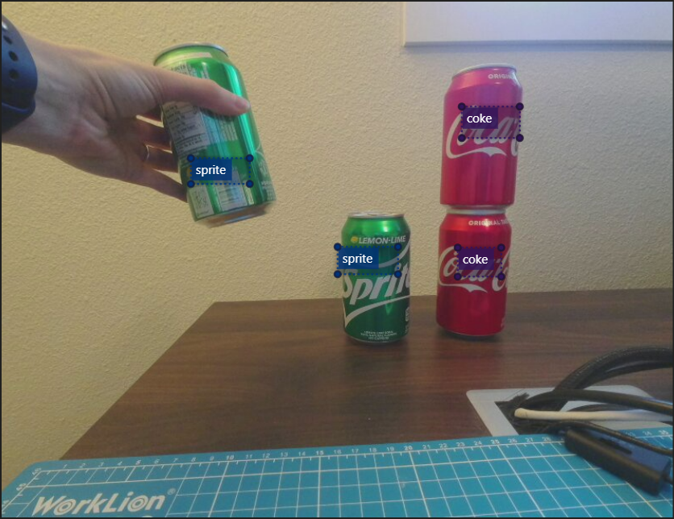
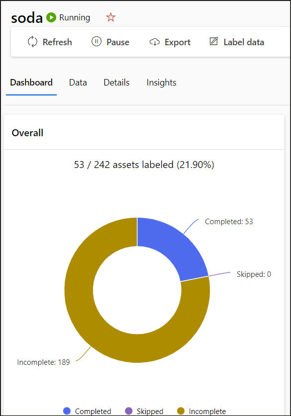
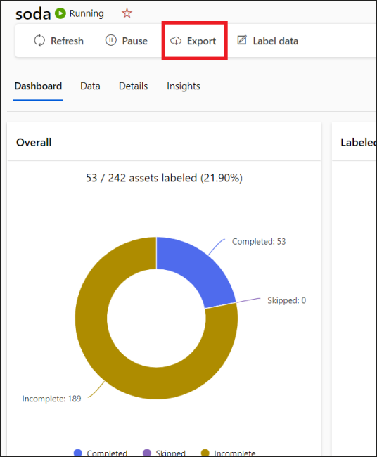
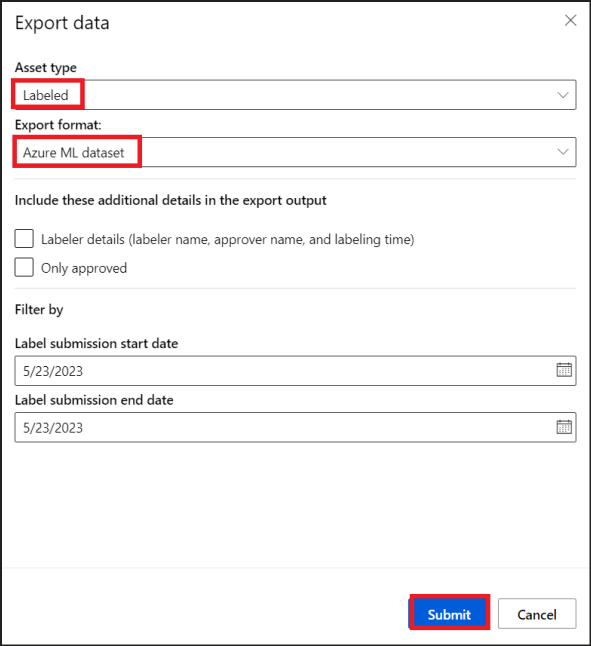

# Lab 02 - Creating a labeled dataset using Azure Machine Learning data labeling tools

Expected execution time: **40 min**

Lab type: **Instructor led**

**Objective**

In this lab you will learn how to use the Azure Machine Learning Data
Tools in Azure Machine Learning studio to manage their collections of
unlabeled data into labeled datasets that accommodate the classes that
would be detected by the trained object detection model.

## **Exercise 1: Getting the Azure resources ready**

### **Task 1: Create an Azure Storage Account**

1.  Login to Azure portal at +++**https://portal.azure.com**+++ if not
    already logged in.

2.  Type in +++**storage account**+++ in the search bar and select the
    **Storage account**.

    

3.  Select **+Create**.

    

4.  On the Create a storage account page, enter the below details.

    **Project details**

    - Subscription – Select your **subscription**.
    
    - Resource group – Select the **Resource group** created in the previous
      lab.

    **Instance details**

    - Storage account name – +++**imagestoreaccXX**+++ (Replace XX with a
      unique number)
    
    - Region – Select the Region in which you had created your AML Workspace
      (**East US/East US2/North Central US**)
    
    - Performance – Select **Standard**
    
    - Redundancy – Select **Locally-redundant storage(LRS)**
    
    Select **Next.**

    

5.  On the Advanced tab, ensure that the option **Allow cross-tenant
    replication** under **Blob storage** section is unchecked. Accept
    the other defaults and select **Review + create**.

    

6.  Once the validation passes, click on **Create**.

    

7.  Once the deployment is completed, click on **Go to resource**.

    

8.  Keep a note of the Storage account name(**imagestoreaccXX**) as this
    will be used in the later part of the lab. Stay on the same page and
    continue with the next task.

    

### **Task 2: Create an Azure Storage Container**

1.  From the left menu of the storage account page, scroll to the **Data
    Storage** section, then select **Containers**.

    

2.  Select the **+ Container**. In the New container pane that opens,
    type in the name of the container as +++imagedata+++ and then click
    on **Create**.

    

3.  Once the container is created, select the **Access keys** under
    **Security + networking** from the left pane. On the Access keys
    page, click on **Show** against the key value and then **copy** the
    key. Store the copied value in a notepad for future reference.

    

4.  Navigate back to the containers page by selecting **Containers**
    from the left pane.

    

5.  Select the newly created container, **imagedata**.

    

6.  Click on **Upload**. On the **Upload blob** pane, click on **Browse
    for files** and open the **train_img** folder from under
    **C:\Labfiles**

    

7.  Select all the files in the train_img folder and click on **Open**.

    

8.  Click on **Upload** on the Upload blob page.

    

9.  Once uploaded, **Successfully uploaded blob(s)** message is
    displayed, close the **Upload blob** pane.

    

10. Once completed, you should see that all the 242 images have been
    added to the Azure Storage Container.

    

## **Exercise 2: Create an Azure Machine Learning data labeling project**

1.  From the Home page of the Azure Machine Learning Studio, select
    **Data Labeling** from under **Manage** in the left pane.

    

2.  Select **+ Create.**

    

3.  Under the **Project details** section, give the following details.

    -  **Project name** - +++**soda**+++

    -  Media type – **Image**

    -  **Labeling task type - Object Identification (Bounding Box)** 

    Select **Next**.

    

4.  In the **Add workforce (optional)** screen, leave the option
    disabled and select **Next** to continue.

    

5.  On the **Select or create data page**, click on **+ Create**.

    

6.  On the **Data type** pane of **Create data asset** page, provide the
    below details.

    -  **Name** – +++**sodaObjects**+++

    -  **Description –** +++**Image labelling**+++

    -  **Type –** File

    Click on **Next**.

    

7.  On the **Data source** pane of **Create data asset** page, select
    **From Azure storage** option and then click on **Next**.

> 

8.  On the **Storage type** pane of **Create data asset** page, select
    **Create new datastore**.

    

9.  On the **New** **datastore** pane, provide the below details.

    -  **Datastore name** – +++**sodadatastore**+++

    -  **Datastore type** – Select **Azure Blob Storage**

    -  **Account selection method –** Select **From Azure
        subscription**

    -  **Subscription ID –** Select your subscription

    -  **Storage account –** Select **imagestoreacc**

    -  **Blob container –** Select **imagedata**

    -  **Authentication type –** Select **Account Key**

    -  **Account key –** Enter the account key saved earlier in
        Exercise 1

    Click on **Create**.

    

    

10. **Create success** message gets displayed on the **Select a
    datastore** page**.** Select the **sodadatastore** that got created.
    Click on **Next**.

    

11. Under Choose a storage path, select **Enter storage path manually**
    and type in **/** for the Storage path, enable **Skip data
    validation**. Click on **Next**.

    

12. Review the details and click on **Create**.

> 

13. Back in the **Select or create data** pane, select **sodaObjects.**
    Click on **Next**.

    

14. On the **Incremental refresh** page, select **Enable incremental
    refresh at regular intervals.** Click on **Next**.

    

15. On the **Label categories** page, click on **Add label category**
    twice to add two more category name place holders in addition to the
    already existing one.

    

16. After adding, type in +++**coke**+++, +++**diet_coke**+++ and
    +++**sprite**+++, one in each label category place holder. Click on
    **Next**.

    

17. Leave the Labelling instructions blank and click on **Next**.

    

18. Click on **Next** from the **Quality control(preview)** page.

    

19. Disable **Enable** **ML assisted labelling** option and click on
    **Create** **project**.

    

20. **Success: soda data labelling project created successfully. Project
    is initializing** message gets displayed on the Data Labelling
    screen. Click on the **soda** project**.**

    

21. Click on **Label data**.

    

22. The **Shortcut keys** on the top right shows the different shortcuts
    available.

    

23. The top menu bar provides the different options available.

    

24. The first image opens on the screen. Select the appropriate tag from
    the **Tags** pane on the left.

    Then, click on the image and drag a little to see the label being attached to the image. Click on **submit**.

     

25. Repeat the same process for the next images that come up on
    submitting the current one.

    Label at least 10 images.

    

26. The next image gets uploaded till the end of the images is reached.
    Please stop at any point beyond 10 images or proceed and complete
    labelling for all the images.

27. Click on soda on the top navigation path to go back to the
    **Dashboard**.

    

28. The **Dashboard** gives the details on the **labeled assets** and
    the **label distribution**.

    

    

29. Click on **Export.**

    

30. On the **Export data** pane, select the

    - **Asset type - Labeled**

    - **Export format -** **Azure ML dataset**

    Click on **Submit**.

    

31. **Labels successfully exported** message gets displayed on the
    Dashboard page once the export is completed. Click on the **file
    link** in the success message to open the details of the exported
    file.

    

    

32. Click on the **View in** **datastores** or **View in Azure portal**
    link under the **Datasources** -\> **Actions** section.

    

33. View in datastores.

    

**Summary**

In this lab, you have learnt how to create a data asset from Azure
storage and how to label the images and create a labeled dataset.

This entire set of tasks also belong to the **Data: Explore & prepare**
stage of the **Machine Learning project workflow.**
