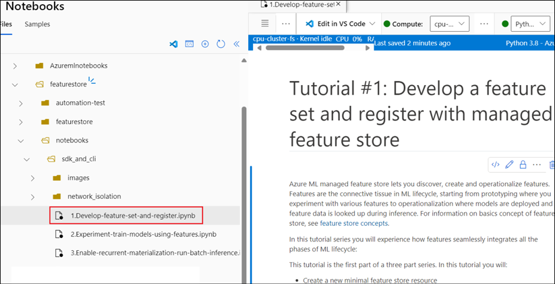

# Lab 03 - Entwickeln und Registrieren eines Feature-Sets mit verwaltetem Feature-Store und Trainieren von Modellen mithilfe von Features

In diesem Lab wird beschrieben, wie Sie eine Feature Set-Spezifikation
mit benutzerdefinierten Transformationen erstellen. Anschließend wird
dieser Feature Set verwendet, um Trainingsdaten zu generieren, die
Materialisierung zu aktivieren und einen Backfill durchzuführen. Bei der
Materialisierung werden die Feature-Werte für ein Feature-Fenster
berechnet und diese Werte dann in einem Materialisierungsspeicher b
gespeichert. Alle Feature-Abfragen können dann diese Werte aus dem
Materialisierungsspeicher verwenden.

Ohne Materialisierung wendet eine Feature Set-Abfrage die
Transformationen direkt auf die Quelle an, um die Features zu berechnen,
bevor die Werte zurückgegeben werden. Dieser Prozess eignet sich gut für
die Prototyping-Phase. Für Trainings- und Rückschlussvorgänge in einer
Produktionsumgebung wird jedoch empfohlen, die Features zu
materialisieren, um die Zuverlässigkeit und Verfügbarkeit zu erhöhen.

Erwartete Dauer – 50 Minuten

## Übung 1: Zuweisen der erforderlichen Rollen:

1.  Wählen Sie auf der Startseite des Azure-Portals auf der
    Registerkarte **Resources** die Ihnen zugewiesene **Resource group**
    aus. Wählen Sie im linken Fensterbereich **Access control(IAM)**
    aus. Klicken Sie auf die Dropdownliste neben **Add**, und wählen Sie
    **Add role assignment** aus.

2.  Suchen Sie nach +++**AzureML Data Scientist**+++ und wählen Sie es
    aus. Klicken Sie auf **Next**.

3.  Klicken Sie auf der Registerkarte Members auf **+ Select members**,
    suchen Sie nach Ihrem **User name**
    +++@lab.CloudPortalCredential(User1).Username +++.

4.  Wählen Sie Ihren **Username** aus und klicken Sie dann auf die
    Schaltfläche **Select**.

5.  Klicken Sie in den nächsten 2 Bildschirmen auf **Review + assign**.

6.  Die hinzugefügte Rollenzuweisungsmeldung wird abgerufen, sobald die
    Zuweisung abgeschlossen ist.

7.  Wiederholen Sie die gleichen Schritte, um die Rollen +++**Storage
    Blob Data Reader**+++ und +++**Storage Blob Data Contributor+++**
    hinzuzufügen.

## Übung 2: Entwickeln eines Feature-Sets und Registrieren beim verwalteten Feature Store

Dieses Tutorial ist der erste Teil der Tutorialreihe zum verwalteten
Feature Store. Hier erfahren Sie, wie Sie:

- Erstellen Sie eine neue, minimale Feature-Store-Ressource.

- Entwickeln und lokales Testen eines Feature-Sets mit
  Feature-Transformationsfunktion.

- Registrieren Sie eine Feature-Store-Entität beim Feature-Store.

- Registrieren Sie den Feature-Set, den Sie entwickelt haben, mit dem
  Feature-Store.

- Generieren Sie einen Beispiel-Trainings-DataFrame mithilfe der
  Features, die Sie erstellt haben.

- Aktivieren Sie die Offline-Materialisierung für die Feature-Sets, und
  füllen Sie die Feature-Daten auf.

### Aufgabe 1: Vorbereiten der Umgebung

1.  Wählen Sie im linken Bereich von Azure Machine Learning Studio unter
    **Authoring** die Option **Notebooks** aus. Klicken Sie auf die drei
    Punkte neben dem Benutzernamen und wählen Sie **Upload folder** aus.

2.  Durchsuchen und wählen Sie den **Featurestore**-Ordner aus
    **C:\Labfiles** aus und klicken Sie auf **Upload**.

3.  Navigieren Sie zu **featurestore-\> notebooks-\>sdk_and_cli** und
    öffnen Sie das Notebook 1. Develop-feature-set-and-register.ipynb

4.  Wählen Sie unter **Compute** die Option **Serverless Spark Compute**
    aus.

5.  Wählen Sie **Configure session** aus, um die Sitzung mit den
    Voraussetzungen zu konfigurieren.

6.  Wählen Sie **Python packages -\> Upload Conda file** aus. Klicken
    Sie auf **Browser** und wählen Sie **conda.yml** aus **C:\Labfiles**
    aus und wählen Sie dann **Apply**.

7.  **Führen Sie** die erste Zelle des Notebooks **aus**. Dadurch werden
    alle **Abhängigkeiten** installiert und die Ausführung
    abgeschlossen. Dies dauert etwa **10 Minuten**.

> 

8.  Sobald die Spark-Sitzung gestartet ist, ersetzen Sie den **User
    name** durch Ihren Benutzernamen und führen Sie die nächste Zelle
    aus

9.  Führen Sie die nächsten 3 Zellen aus, um die Azure CLI einzurichten.

10. Führen Sie in der nächsten Zelle die Schritte in der **Output** aus,
    um sich bei **Azure** anzumelden.

### Aufgabe 2: Erstellen eines minimalen Feature-Stores

1.  **Führen Sie** die **erste** Zelle aus, um den Namen, den
    Speicherort und andere Werte für den Feature-Store festzulegen.

2.  **Führen Sie** die nächste Zelle **aus**, die **den Feature-Store
    erstellt**.

3.  In der nächsten Zelle **wird der Core-SDK-Client des
    AzureML-Features-Stores initialisiert**. **Führen Sie es aus**.

> 

### Aufgabe 3: Prototypisieren und entwickeln Sie in diesem Notebook ein Feature-Set für die rollierende Aggregation von Transaktionen

1.  **Führen Sie** die erste Zelle in diesem Abschnitt aus, um die
    Quelldaten der **Transaktionen** zu untersuchen.

2.  Führen Sie die zweite Zelle aus, um **ein Transaktions-Feature-Set**
    lokal **zu entwickeln** .

3.  Führen Sie die nächste Zelle aus, um **einen Spark-Dataframe** aus
    der Feature-Set-Spezifikation **zu generieren**.

4.  Um die Feature-Set-Spezifikation im Feature-Store zu registrieren,
    muss sie in einem bestimmten Format gespeichert werden. Bitte
    überprüfen Sie die generierten Transaktionen FeaturesetSpec: Öffnen
    Sie diese Datei aus dem Dateibaum, um die Spezifikation anzuzeigen:
    featurestore/featuresets/accounts/spec/FeaturesetSpec.yaml.

Führen Sie die nächste Zelle aus, die als Feature-Set-Spezifikation
exportiert werden soll.

### Aufgabe 4: Registrieren einer Feature Store-Entität

1.  Die Entität hilft bei der Durchsetzung der Best Practice, dass
    dieselben Join-Schlüsseldefinitionen für Feature-Sets verwendet
    werden, die dieselben logischen Entitäten verwenden. Führen Sie die
    Zelle aus, um eine Feature-Store-Entität zu registrieren.

> 

### Aufgabe 5: Registrieren des Transaktion-Feature-Sets im Feature-Store

1.  Navigieren Sie im Azure-Portal (+++https://portal.azure.com+++) zu
    dem **Storage account**, das mit dem **Featureset** unter der Ihnen
    zugewiesenen Ressourcengruppe beginnt.

> 

2.  Wählen Sie im linken Fensterbereich Access Control (IAM) aus. Wählen
    Sie **Add** -\> **Add role assignment** aus.

> 

3.  Suchen Sie nach +++**Storage Blob Data Reader**+++, und wählen Sie
    es aus.

> 

4.  Führen Sie die Rollenzuweisung ähnlich wie in Übung 1 aus.

5.  Fügen Sie auf ähnliche Weise die Rolle +++**Storage Blob Data
    Contributor**+++ hinzu.

6.  Navigieren Sie zurück zu Azure Machine Learning Studio.

7.  Sie registrieren ein Feature-Set-Asset im Feature-Store, damit Sie
    es für andere freigeben und wiederverwenden können. Sie erhalten
    auch verwaltete Funktionen wie Versionierung und Materialisierung.
    Das Feature-Set-Asset verfügt über einen Verweis auf die
    Feature-Set-Spezifikation, die Sie zuvor erstellt haben, sowie über
    zusätzliche Eigenschaften wie Versions- und
    Materialisierungseinstellungen.

8.  **Führen Sie** die nächste Zelle **aus**, um **das
    Transaktions-Feature-Set** im Feature-Store **zu registrieren**.

> 

### Aufgabe 6: Erkunden der Feature Store-UI

1.  Öffnen Sie eine neue Registerkarte im Browser, und navigieren Sie
    zur globalen Azure ML-Landingpage unter
    +++https://ml.azure.com/home+++.

2.  Klicken Sie in der linken Navigation auf **Feature Stores**.

3.  Klicken Sie auf den **featurestore**.

**Hinweis:** Das Erstellen und Aktualisieren von Feature-Store-Assets
(Feature-Sets und Entitäten) ist nur über SDK und CLI möglich. Sie
können die Benutzeroberfläche(UI) verwenden, um den Feature Store zu
durchsuchen.

> 

### Aufgabe 7: Generieren eines Trainingsdaten-Dataframes mithilfe der registrierten Features

1.  Wir beginnen mit der Untersuchung der Beobachtungsdaten.
    Beobachtungsdaten sind in der Regel die Kerndaten, die in Trainings-
    und Rückschlussdaten verwendet werden. Diese werden dann mit
    Featuredaten verknüpft, um die vollständigen Trainingsdaten zu
    erstellen. Beobachtungsdaten sind die Daten, die während der Zeit
    des Ereignisses erfasst wurden: In diesem Fall handelt es sich um
    Kerntransaktionsdaten, einschließlich Transaktions-ID, Konto-ID und
    Transaktionsbetrag. Da es sich in diesem Fall um das Training
    handelt, wird auch die Zielvariable angehängt (is_fraud).

2.  **Führen Sie** die Zelle **aus** und beobachten Sie die
    Ausgabedaten.

> 

3.  **Führen Sie** die nächste Zelle **aus**, um die **registrierte
    Feature-Set** abzurufen und **ihre Features aufzulisten**.

4.  **Führen Sie** die nächste Zelle **aus**, um die **Beispielwerte**
    zu **drucken**.

5.  **Führen Sie** die nächste Zelle **aus**. In diesem Schritt
    **wählen** wir **Features aus**, die Teil der **Trainingsdaten**
    sein sollen, und verwenden das Feature Store SDK, um die
    Trainingsdaten zu generieren.

6.  Führen Sie die nächste Zelle aus, um einen Training-Dataframe
    mithilfe von Feature-Daten und Beobachtungsdaten zu generieren.

### Aufgabe 8: Aktivieren der Offline-Materialisierung für das Transaktions-Feature-Set

Sobald die Materialisierung für ein Feature-Set aktiviert ist, können
Sie Backfill durchführen oder wiederkehrende Materialisierungsaufträge
planen.

1.  Führen Sie die nächste Zelle aus, um spark.sql.shuffle.partitions in
    der yaml-Datei entsprechend der Größe der Feature-Daten festzulegen

2.  Die Spark-Konfiguration spark.sql.shuffle.partitions ist ein
    OPTIONALER Parameter, der sich auf die Anzahl der generierten
    Parquet-Dateien (pro Tag) auswirken kann, wenn der Feature-Set in
    den Offlinespeicher übernommen wird. Der Standardwert dieses
    Parameters ist 200. Es empfiehlt sich, das Generieren vieler kleiner
    Parkettdateien zu vermeiden. Wenn die Offline-Feature-Abfrage nach
    der Materialisierung des Feature-Sets langsam wird, gehen Sie bitte
    zum entsprechenden Ordner im Offline-Store und prüfen Sie, ob das
    Problem durch zu viele kleine Parquet-Dateien (pro Tag) verursacht
    wird. Passen Sie in diesem Fall den Wert dieses Parameters
    entsprechend an.

**Hinweis:** Die in diesem Notebook verwendeten Beispieldaten sind
klein. Daher wird dieser Parameter in der Datei
featureset_asset_offline_enabled.yaml auf 1 gesetzt.

> 

3.  Materialisierung ist der Prozess, bei dem die Merkmalswerte für ein
    bestimmtes Merkmalsfenster berechnet und in einem
    Materialisierungsspeicher gespeichert werden. Die Materialisierung
    der Features erhöht die Zuverlässigkeit und Verfügbarkeit. Bei allen
    Featureabfragen werden die materialisierten Werte aus dem
    Materialisierungsspeicher verwendet. In diesem Schritt führen Sie
    einen einmaligen Backfill für ein Feature-Fenster von 18 Monaten
    durch.

4.  In der folgenden Codezelle werden **die Daten** nach dem aktuellen
    Status "None" oder "Incomplete" für das definierte Featurefenster
    **materialisiert. Führen Sie** es **aus**.

5.  **Drucken** wir **Beispieldaten** aus dem Feature-Set in der
    nächsten Zelle. **Führen Sie es aus**. Aus den Ausgabedaten können
    Sie erkennen, dass die Daten aus dem Materialisierungs-Store
    abgerufen wurden. Die Methode get_offline_features(), die zum
    Abrufen von Trainings- oder Inferenzdaten verwendet wird, nutzt
    standardmäßig ebenfalls den Materialisierungs-Store.

## Übung 3: Experimentieren und Trainieren von Modellen mithilfe von Features

In diesem Notebook lernen Sie Folgendes:

- Prototypisieren Sie eine neue Accounts-Feature-Set-Spezifikation,
  indem Sie vorhandene vorkalkulierte Werte als Features verwenden.
  Registrieren Sie dann die lokale Feature-Set-Spezifikation als
  Feature-Set im Feature-Store. Dieser Prozess unterscheidet sich vom
  ersten Tutorial, in dem Sie ein Feature-Set mit benutzerdefinierten
  Transformationen erstellt haben.

- Wählen Sie Features für das Modell aus den Transactions- und
  Accounts-Feature-Sets aus und speichern Sie sie als
  Feature-Abruf-Spezifikation.

- Führen Sie eine Trainings-Pipeline aus, die die
  Feature-Abruf-Spezifikation verwendet, um ein neues Modell zu
  trainieren. Diese Pipeline nutzt die integrierte
  Feature-Abruf-Komponente, um die Trainingsdaten zu generieren.

### Aufgabe 1: Einrichten der Umgebung

1.  Öffnen Sie im Bereich Notebooks das Notebook **Experiment and train
    models using features**.

2.  Klicken Sie auf **Configure session**, und laden Sie die Datei
    **conda.yaml** hoch , ähnlich wie wir es für das frühere Notebook
    getan haben.

3.  **Führen Sie** die **erste Zelle aus** , um die Sitzung zu starten.
    Dies dauert etwa 10 Minuten.

4.  Ersetzen Sie in der nächsten Zelle den Platzhalter für **\<
    your_user_alias \>** durch Ihren **User Name** in der Ordnerstruktur
    und **führen Sie** die Zelle **aus**.

5.  **Führen Sie** die nächsten **3** Zellen **aus**, um die **CLI
    einzurichten**.

6.  In der nächsten Zelle werden die Variablen des
    Projektarbeitsbereichs initialisiert. **Führen Sie** es **aus**, um
    **die Variablen zu initialisieren**.

7.  In der nächsten Zelle werden die Feature-Store-Variablen
    initialisiert. Führen Sie es aus.

8.  Führen Sie die nächste Zelle aus, um **den
    Feature-Store-Verbraucher-Client zu initialisieren.**

### Aufgabe 2: Erstellen Sie das Accounts-Feature-Set lokal aus vorkalkulierten Daten

Für das Onboarding von vorab berechneten Features können Sie eine
Featuresetspezifikation erstellen, ohne Transformationscode schreiben zu
müssen. Die Featureset-Spezifikation ist eine Spezifikation zum
Entwickeln und Testen eines Featuresets in einer vollständig
lokalen/Entwicklungsumgebung, ohne eine Verbindung zu einem Featurestore
herzustellen. In diesem Schritt erstellen Sie die
Featuresatzspezifikation lokal und ziehen Stichproben für die daraus
abgeleiteten Werte.

1.  Führen Sie die folgende Zelle aus, um **die Quelldaten für Konten zu
    untersuchen.**

2.  Führen Sie die nächste Zelle aus, um die
    **Accounts-Feature-Set-Spezifikation** lokal aus diesen
    vorkalkulierten Features zu **erstellen**.

3.  **Führen Sie** die nächste Zelle **aus**, um **einen
    Spark-Dataframe** aus der Feature-Set-Spezifikation zu
    **generieren**.

4.  Um die Feature-Set-Spezifikation im Feature-Store zu registrieren,
    muss sie in einem bestimmten Format gespeichert werden. Maßnahme:
    Nachdem Sie die folgende Zelle ausgeführt haben, überprüfen Sie
    bitte die generierten Konten FeatureSetSpec: Öffnen Sie diese Datei
    aus dem Dateibaum, um die Spezifikation anzuzeigen:
    featurestore/featuresets/accounts/spec/FeatureSetSpec. **Führen
    Sie** die nächste Zelle **aus**.

### Aufgabe 3: Lokales Experimentieren mit nicht registrierten Features und Registrieren im Feature-Store, wenn Sie fertig sind

Wenn Sie Features entwickeln, sollten Sie lokal testen/validieren, bevor
Sie sich beim Feature Store registrieren oder Trainingspipelines in der
Cloud ausführen. In diesem Schritt generieren Sie Trainingsdaten für das
ML-Modell aus einer Kombination von Features aus einem lokalen, nicht
registrierten Feature Set (Konten) und einem Feature Set, der im Feature
Store (Transaktionen) registriert ist.

1.  **Führen Sie** die nächste Zelle **aus**, um **Features** für das
    **Modell auszuwählen.**

2.  **Führen Sie** die nächsten 2 Zellen **aus**, um lokale
    **Trainingsdaten zu generieren** .

3.  **Führen** Sie die nächste Zelle **aus**, um das
    **Accounts-Feature-Set** im Feature-Store zu **registrieren**.
    Sobald Sie mit verschiedenen Feature-Definitionen lokal
    experimentiert und diese getestet haben, können Sie es im
    Feature-Store registrieren. Dafür registrieren Sie eine
    Feature-Set-Asset-Definition im Feature-Store.

4.  **Führen Sie** die nächsten 2 Zellen **aus**, um das registrierte
    Featureset und den Plausibilitätstest zu erhalten.

### Aufgabe 4: Ausführen eines Trainingsexperiments

1.  Führen Sie die nächste Zelle aus, um Funktionen aus dem SDK zu
    ermitteln.

2.  In den vorherigen Schritten haben Sie Features aus einer Kombination
    aus nicht registrierten und registrierten Feature-Sets für lokale
    Experimente und Tests ausgewählt. Jetzt sind Sie bereit, in der
    Cloud zu experimentieren. Das Speichern der ausgewählten Features
    als Feature-Retrieval-Spezifikation und deren Verwendung im
    mlops/cicd-Flow für Training/Inferenz erhöht Ihre Agilität beim
    Versenden von Modellen.

3.  **Führen Sie** die nächste Zelle **aus**, um **Features für das
    Modell auszuwählen**.

4.  **Führen Sie** die nächste Zelle **aus**, und exportieren Sie die
    ausgewählten Features als **Feature-Retrieval-Spezifikation**.

### Aufgabe 5: Trainieren in der Cloud mithilfe von Pipelines und Registrieren des Modells, wenn zufriedenstellend

In diesem Schritt lösen Sie die Trainingspipeline manuell aus. In einem
Produktionsszenario kann dies durch eine ci/cd-Pipeline ausgelöst
werden, die auf Änderungen an der Featureabrufspezifikation im
Quellrepository basiert.

1.  **Führen Sie** die nächste Zelle **aus**, um **die Trainingspipeline
    auszuführen.**

2.  Klicken Sie im linken Bereich von Studio mit der rechten Maustaste
    auf **Jobs**, und öffnen Sie sie in einer neuen Registerkarte.
    Wählen Sie das Experiment aus, **training_on_fraud_model**.

3.  Klicken Sie auf die **Training Job** und erkunden Sie die Details.
    Das Experiment sollte etwa 5 bis 15 Minuten dauern, bis es
    abgeschlossen ist.

4.  Warten Sie, bis der Vorgang abgeschlossen ist. Wenn Sie fertig sind,
    wählen Sie im linken Fensterbereich **Models** aus. Wählen Sie
    **fraud_model** aus der Liste aus. Dies ist das Modell, das jetzt
    erstellt wurde.

5.  Wählen Sie die Registerkarte **Feature sets** aus. Hier sehen Sie
    sowohl die **Transactions-**als auch die **Accounts**-Feature Sets,
    von denen dieses Modell abhängt.

6.  Öffnen Sie die **Feature Store UI** unter
    +++https://ml.azure.com/home+++. Wählen Sie **Feature stores** -\>
    **featurestore** aus.

7.  Wählen Sie im linken Bereich **Feature-Sets** aus, und wählen Sie
    dann eine der **Feature-Sets** aus.

8.  Klicken Sie auf die Registerkarte **Models**. Sie können die Liste
    der Modelle anzeigen, die die Feature-Sets verwenden (ermittelt
    anhand der Feature-Retrieval-Spezifikation bei der Registrierung des
    Modells).

Zusammenfassung:

In diesem Lab haben wir gelernt, einen Feature-Set mit verwaltetem
Feature-Store zu entwickeln und zu registrieren und Modelle mithilfe von
Features zu trainieren.
