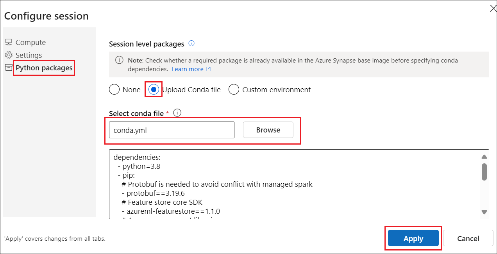
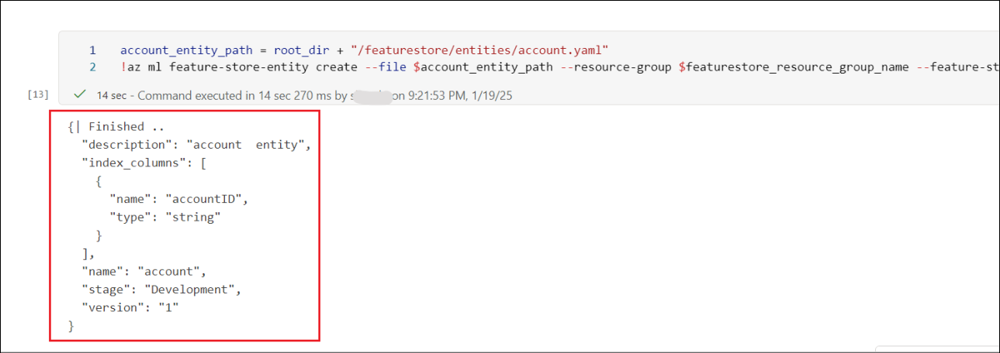
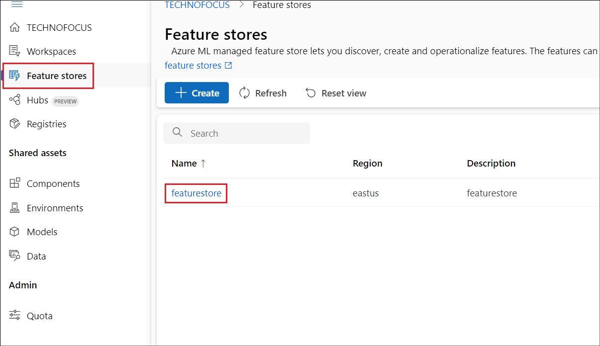
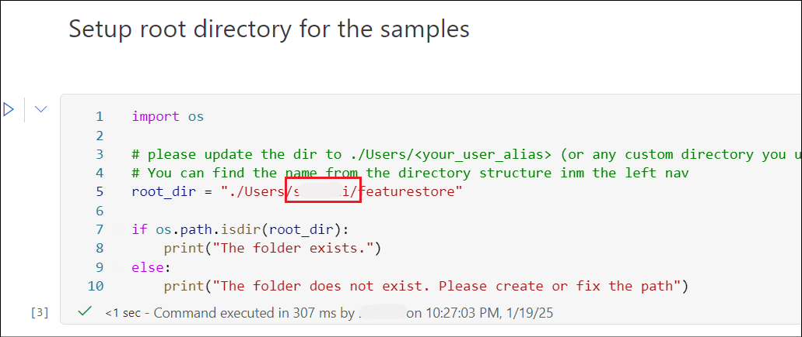

# Lab 03 - Develop and register a feature set with managed feature store and train models by using features

**Lab duration** – 50 minutes

This lab describes how to create a feature set specification with custom
transformations. It then uses that feature set to generate training
data, enable materialization, and perform a backfill. Materialization
computes the feature values for a feature window, and then stores those
values in a materialization store. All feature queries can then use
those values from the materialization store.

Without materialization, a feature set query applies the transformations
to the source on the fly, to compute the features before it returns the
values. This process works well for the prototyping phase. However, for
training and inference operations in a production environment, we
recommend that you materialize the features, for greater reliability and
availability.

## Exercise 1: Assign required roles:

1.  From the Azure portal Home page, select the Resource group
    **RGForMLOps**. From the left pane, select **Access control(IAM)**.
    Click the drop down next to Add and select **Add role assignment**.

    

2.  Search for +++**AzureML Data Scientist**+++ and select it and click
    on **Next**.

    

3.  In the Members tab, click on **+ Select members**, search for your
    **user name** and **Select** it.

    

4.  Click on **Review + assign** in the next 2 screens.

    

5.  Added role assignment message is obtained once the assignment is
    done.

6.  Repeat the same set of steps to add the roles +++**Storage Blob Data
    Reader**+++ and +++**Storage Blob Data Contributor**+++.

## Exercise 2: Develop a feature set and register with managed feature store

This tutorial is the first part of the managed feature store tutorial
series. Here, you learn how to:

    - Create a new, minimal feature store resource.
    
    - Develop and locally test a feature set with feature transformation
      capability.
    
    - Register a feature store entity with the feature store.
    
    - Register the feature set that you developed with the feature store.
    
    - Generate a sample training DataFrame by using the features that you
      created.
    
    - Enable offline materialization on the feature sets, and backfill the
      feature data.

### Task 1: Get the environment ready

1.  From the left pane of the Azure Machine Learning Studio, select
    **Notebooks** under **Authoring**. Click on the three dots next to
    the user name and select **Upload folder**.

    

2.  Browse and select **featurestore** folder from **C:\Labfiles** and
    click on **Upload**.

    

3.  Navigate to **featurestore-\> notebooks-\>sdk_and_cli** and open the
    notebook 1.Develop-feature-set-and-register.ipynb

    

    >[!Note] **Note:** If you get an error stating Jupyter kernel not found, select
Start Jupyter kernel.

    

4.  Select **Serverless Spark Compute** under **Compute**.

    

5.  Select **Configure session** to configure the session with the
    pre-requisites.

    

6.  Select **Python packages -\> Upload Conda file**. Click on
    **Browse** and select **conda.yml** from **C:\Labfiles** and then
    select **Apply**.

    

7.  **Execute** the first cell of the notebook. This will install all
    the **dependencies** and complete its execution. This will take
    around **10 minutes** to complete.

    

    

8.  Once the spark session starts, replace the **User name** with your
    user name and execute the next cell

    

    

9.  Execute the next 3 cells to setup the Azure CLI.

    

10. In the next cell and follow the steps in the **output** to login to
    **Azure**.

    

    

### Task 2: Create a minimal feature store

1.  **Execute** the **first** cell in order to set the name, location
    and other values for the feature store.

    

2.  **Execute** the next cell that **creates the feature store**.

    

3.  The next cell **initializes AzureML feature store core SDK client**.
    **Execute** it.

    

### Task 3: Prototype and develop a transaction rolling aggregation feature set in this notebook

1.  **Execute** the first cell under this section to explore the
    **transactions** source data.

    

2.  Execute the second cell to **Develop a transactions feature set**
    locally.

    

3.  Execute the next cell to **generate a spark dataframe** from the
    feature set specification.

    

4.  In order to register the feature set specification with the feature
    store, it needs to be saved in a specific format. Please inspect the
    generated transactions FeaturesetSpec: Open this file from the file
    tree to see the specification:
    featurestore/featuresets/accounts/spec/FeaturesetSpec.yaml.

    Execute the next cell to export as feature set specification.

    

### Task 4: Register a feature store entity

1.  Entity helps enforce best practice that same join key definitions
    are used across feature sets which uses the same logical entities.
    Execute the cell to register a feature store entity.

    

### Task 5: Register the transaction feature set with the feature store

1.  From the Azure portal(+++https://portal.azure.com+++), navigate to
    the **Storage account** that starts with **featureset** under the
    Resource group **RGForMLOps**.

    

2.  From the left pane, select Access Control(IAM). Select **Add** -\>
    **Add role assignment**.

    

3.  Search for and select +++**Storage Blob Data Reader**+++.

    

4.  Complete the role assignment similar to the ones we did in Exercise
    1.

5.  Similarly add the +++**Storage Blob Data Contributor**+++ role.

6.  Navigate back to the Azure Machine Learning Studio.

7.  You register a feature set asset with the feature store so that you
    can share and reuse with others. You also get managed capabilities
    like versioning and materialization. The feature set asset has
    reference to the feature set spec that you created earlier and
    additional properties like version and materialization settings.

8.  **Execute** the next cell to **register the transaction feature
    set** with the feature store.

    

### Task 6: Explore the feature store UI

1.  Open a new tab in the browser and navigate to the Azure ML global
    landing page at +++https://ml.azure.com/home+++.

2.  Click on **Feature stores** in the left navigation.

    

3.  Click on the **featurestore**.

    >[!Note] **Note:** Creating and updating feature store assets (feature sets and
entities) is possible only through SDK and CLI. You can use the UI to
search/browse the feature store.

    

### Task 7: Generate a training data dataframe using the registered features

1.  We start by exploring the observation data. Observation data is
    typically the core data used in training and inference data. This is
    then joined with feature data to create the full training data.
    Observation data is the data captured during the time of the event:
    in this case it has core transaction data including transaction ID,
    account ID, transaction amount. In this case, since it is for
    training, it also has the target variable appended (is_fraud).

2.  **Execute** the cel land observe the output data.

    

3.  **Execute** the next cell to get the **registered feature set** and
    **list its features**.

    

4.  **Execute** the next cell to **print** the **sample values**.

    

5.  **Execute** the next cell. In this step we will **select features**
    that we would like to be part of **training data** and use the
    feature store SDK to generate the training data.

    

6.  Execute the next cell to generate training dataframe by using
    feature data and observation data.

    

### Task 8: Enable offline materialization on transactions feature set

Once materialization is enabled on a feature set, you can perform
backfill or schedule recurrent materialization jobs.

1.  Execute the next cell to set spark.sql.shuffle.partitions in the
    yaml file according to the feature data size

2.  The spark configuration spark.sql.shuffle.partitions is an OPTIONAL
    parameter that can affect the number of parquet files generated (per
    day) when the feature set is materialized into the offline store.
    The default value of this parameter is 200. The best practice is to
    avoid generating many small parquet files. If offline feature
    retrieval turns out to become slow after the feature set is
    materialized, please go to the corresponding folder in the offline
    store to check whether it is the issue of having too many small
    parquet files (per day), and adjust the value of this parameter
    accordingly.

**Note:** The sample data used in this notebook is small. So this
parameter is set to 1 in the featureset_asset_offline_enabled.yaml file.

    

3.  Materialization is the process of computing the feature values for a
    given feature window and storing this in an materialization store.
    Materializing the features will increase its reliability and
    availability. All feature queries will use the materialized values
    from the materialization store. In this step you perform a one-time
    backfill for a feature window of 18 months.

4.  The following code cell will **materialize data** by current status
    None or Incomplete for the defined feature window. **Execute** it.

    

5.  Let's **print sample data** from the feature set in he next cell.
    **Execute** it. You can notice from the output information that the
    data was retrieved from the materilization store.
    get_offline_features() method that is used to retrieve
    training/inference data will also use the materialization store by
    default.

    

## Exercise 3: Experiment and train models using features

In this notebook, you learn how to:

- Prototype a new accounts feature set specification, through use of
  existing precomputed values as features. Then, register the local
  feature set specification as a feature set in the feature store. This
  process differs from the first tutorial, where you created a feature
  set that had custom transformations.

- Select features for the model from
  the transactions and accounts feature sets, and save them as a feature
  retrieval specification.

- Run a training pipeline that uses the feature retrieval specification
  to train a new model. This pipeline uses the built-in feature
  retrieval component to generate the training data.

### Task 1: Setup the environment

1.  From the Notebooks pane, open the notebook **Experiment and train
    models using features**.

2.  Click on **Configure session** and upload the **conda.yaml** similar
    to the way we did for the earlier notebook.

3.  **Execute** the **first cell** to start the session. This will take
    around 10 minutes.

    

4.  In the next cell, replace the place holder for **\< your_user_alias
    \>** with your **user name** in the folder structure and **execute**
    the cell.

    

5.  **Execute** the next **3** cells to **setup CLI**.

6.  The next cell initializes the project workspace variables.
    **Execute** it to **initialize the variables**.

    

7.  The next cell initializes the feature store variables. Execute it.

    

8.  Execute the next cell to **Initialize the feature store consumption
    client.**

    

### Task 2: Create accounts featureset locally from precomputed data

For onboarding precomputed features, you can create a featureset spec
without writing any transformation code. Featureset spec is a
specification to develop and test a featureset in a fully local/dev
environment without connecting to any featurestore. In this step you
will create the feature set spec locally and sample the values from it.

1.  Execute the below cell to **explore the source data for accounts.**

    

2.  Execute the next cell to **create accounts feature set spec** in
    local from these precomputed features.

    

    

3.  **Execute** the next cell to **generate a spark dataframe** from the
    feature set specification.

    

4.  In order to register the feature set spec with the feature store, it
    needs to be saved in a specific format. Action: After running the
    below cell, please inspect the generated accounts FeatureSetSpec:
    Open this file from the file tree to see the spec:
    featurestore/featuresets/accounts/spec/FeatureSetSpec. **Execute**
    the next cell.

    

### Task 3: Experiment with unregistered features locally and register with feature store when ready

When you are developing features, you might want to test/validate
locally before registering with the feature store or running training
pipelines in the cloud. In this step you will generate training data for
the ML model from combination of features from a local unregistered
feature set (accounts) and feature set registered in the feature store
(transactions).

1.  **Execute** the next cell to **select features** for **model.**

    

2.  **Execute** the next 2 cells to **generate training data** locally.

    

    

3.  **Execute** the next cell to **register the accounts featureset**
    with the featurestore. Once you have experimented with different
    feature definitions locally and sanity tested it, you can register
    it with the feature store. For this you will register a featureset
    asset definition with the feature store.

    

4.  **Execute** the next 2 cells to get registered featureset and sanity
    test.

    

### Task 4: Run training experiment

1.  Execute the next cell to discover features from SDK.

    

2.  In the previous steps, you selected features from a combination
    unregistered and registered feature sets for local experimentation
    and testing. Now you are ready to experiment in the cloud. Saving
    the selected features as a feature-retrieval spec and using it in
    the mlops/cicd flow for training/inference increases your agility in
    shipping models.

3.  **Execute** the next cell to **select features for the model**.

    

4.  **Execute** the next cell to and export the selected features as a
    **feature-retrieval spec**.

    

### Task 5: Train in the cloud using pipelines and register model if satisfactory

In this step you will manually trigger the training pipeline. In a
production scenario, this could be triggered by a ci/cd pipeline based
on changes to the feature-retrieval spec in the source repository.

1.  **Execute** the next cell to **run the training pipeline.**

    

    

2.  From the left pane of the studio, right click on **Jobs** and open
    in a new tab. Select the experiment, **training_on_fraud_model**.

    

3.  Click on the **training job** and explore the details. The
    experiment should take around 5 to 15 minutes to get completed.

    

    

4.  Wait for it to complete. Once completed, select **Models** from the
    left pane. Select **fraud_model** from the list. This is the model
    that has been created now.

    

5.  Select **Feature sets** tab. Here you can see both **transactions**
    and **accounts** featuresets that this model depends on.

    

6.  Open the **feature store UI** at +++https://ml.azure.com/home+++.
    Select **Feature stores** -\> **featurestore**.

    

7.  Select **Feature sets** from the left pane and then select any one
    of the **feature sets**.

    

8.  Click on **Models** tab. You can see the list of models that are
    using the feature sets (determined from the feature retrieval spec
    when the model was registered).

    

## Exercise 4: Clean up the resources

1.  From the Azure portal, select the Resource group **RGForMLOps** and
    select **Delete resource group**.

    

2.  Enter +++RGForMLOps+++ in the text box and click **Enter**.

    

3.  Click on **Delete** in the confirmation dialog box.

    

4.  Ensure that the Resource group is deleted by the success message.

**Summary:**

In this lab, we have learnt to develop and register a feature set with
managed feature store and train models by using features.
