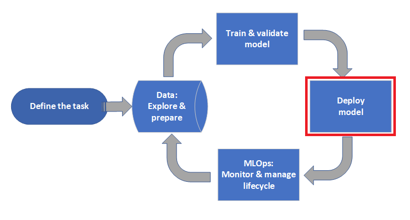
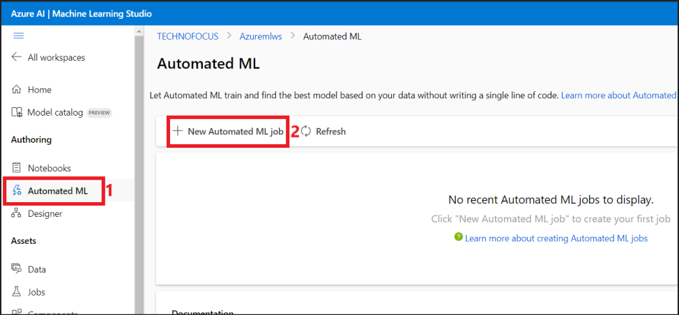
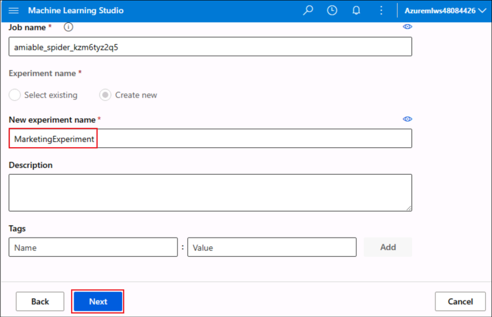
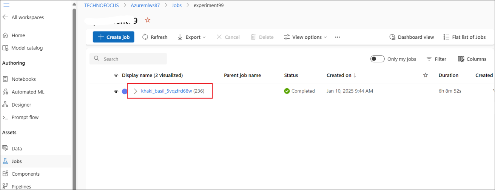
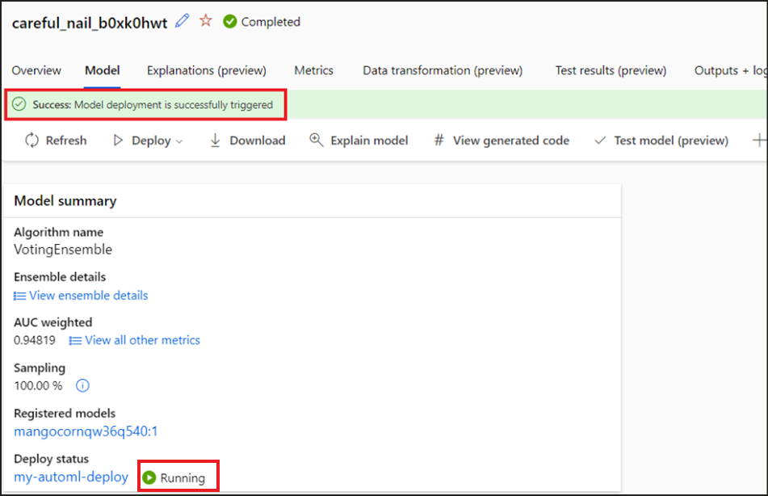
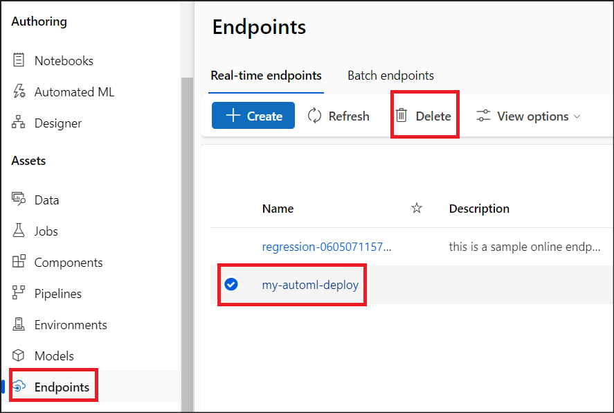

**Laboratorio 04 – Entrenamiento de un modelo de clasificación con
AutoML sin código en Azure Machine Learning Studio**

**Objetivo**

En este laboratorio, aprenderemos a entrenar un modelo de clasificación
con AutoML sin código mediante el aprendizaje automático automatizado de
Azure Machine Learning en Azure Machine Learning Studio. Este modelo de
clasificación predice si un cliente suscribirá un depósito a plazo fijo
con una institución financiera. El aprendizaje automático automatizado
itera rápidamente sobre diversas combinaciones de algoritmos e
hiperparámetros para ayudarle a encontrar el mejor modelo según la
métrica de éxito que elija.

Tiempo estimado: 60 minutos

Estamos en la fase **Deploy Model** de Azure Machine Learning.

## **Ejercicio 1: Cree un espacio de trabajo de Azure Machine Learning**

1.  Inicie sesión en el portal de Azure – +++
    **https://portal.azure.com** +++ usando las credenciales de la
    pestaña **Resources**.

2.  Desde la página de inicio del portal de Azure, seleccione **+ Create
    a resource**.

3.  En **Create a resource**, usa la barra de búsqueda para encontrar
    +++**Azure Machine Learning**+++. Seleccione **Azure Machine
    Learning** en **Marketplace** .

> 

4.  En **Marketplace** , haga clic en el menú desplegable **Create** y
    seleccione **Azure Machine Learning.**

> 

5.  Proporcione la siguiente información para configurar su nuevo
    espacio de trabajo:

    - **Subscription**: Seleccione su **suscripción de Azure asignada.**

    - **Resource group**: Seleccione su grupo de recursos asignado.

> 

**Detalles del espacio de trabajo:**

- **Workspace name: +++ Azuremlws@lab.LabInstanceId +++**

&nbsp;

- **Region**: Seleccione la región **North Central US.**

- **Container registry:** Seleccione **Create new.** Ingrese **+++
  Azuremlcr@lab.LabInstanceId** +++

> 

6.  Una vez que haya terminado de configurar el espacio de trabajo,
    seleccione **Review + Create**.

7.  Una vez pasada la validación, haga clic en **Create**.

8.  Haga clic en **Go to resource** para ver el nuevo espacio de
    trabajo.

9.  **En la página Microsoft.MachineLEarningServices | Overview**,
    seleccione **Launch studio** en **Work with your model in Azure
    Machine Learning studio**.

## **Ejercicio 2: Cree un Automated ML job**

1.  Vaya a la pestaña Azure Machine Learning Studio.

2.  Desde el panel izquierdo, seleccione **Automated ML** en la sección
    **Authoring**.

3.  Haga clic en **+ New Automated ML job**.

### **Tarea 1: Cree un data asset**

1.  En la página **Basic settings**, asigne al nuevo experimento el
    nombre +++ MarketingExperiment +++, acepte los demás valores
    predeterminados y haga clic en **Next**.

2.  En la página Task type & data, seleccione **Classification** en
    **Select task type** y seleccione **+ Create** en **Select data.**

3.  En la página Create data asset, proporcione los siguientes detalles.

- **Name** – +++ marketingdata +++

- **Type** – **Tabular**

- Haga clic en **Next**.

4.  En el panel **Data source**, seleccione **From local files** y haga
    clic en **Next**.

5.  En **Destination storage type,** seleccione el almacén de datos
    predeterminado que se configuró automáticamente al crear su espacio
    de trabajo: **workspaceblobstore**. Suba su archivo de datos a esta
    ubicación para que esté disponible en su espacio de trabajo.
    Seleccione **Next.**

6.  En **File or folder selection**, seleccione **Upload files or
    folder** \> **Upload files**. Seleccione el archivo
    **bankmarketing_train.csv** desde **C:/Labfiles**. Seleccione
    **Next**.

7.  Al finalizar la carga, el área **de Data preview** se completa según
    el tipo de archivo. En el formulario **Settings**, revise los
    valores de sus datos. Luego, seleccione **Next**.

[TABLE]

> 

8.  El formulario **Schema** permite configurar con más detalle los
    datos para este experimento. Para este ejemplo, active el
    interruptor de **day_of_week** para no incluirlo. Seleccione
    **Next.**

9.  En el formulario **Review**, verifique la información y seleccione
    **Create** para completar la creación de su **data asset**.

10. De regreso en la página **Create a new Automated ML job**, se
    muestra un mensaje de éxito por la creación del recurso de datos.
    Seleccione el recurso de datos **marketingdata** creado y haga clic
    en **Next**.

> **Nota:** Si no se muestran los **marketingdata**, haga clic en
> Refresh para que aparezcan.

### **Tarea 2: Configure el Job**

1.  En la página **Task Settings**, seleccione **y (String)** como la
    **Target column**, que es lo que desea predecir. Esta columna indica
    si el cliente se suscribió a un depósito a plazo fijo o no.

2.  Seleccione **View additional configuration settings** y complete los
    campos como se indica a continuación. Estos ajustes sirven para
    controlar mejor el trabajo de entrenamiento. De lo contrario, se
    aplican los valores predeterminados según la selección del
    experimento y los datos.

- Primary metric – AUCWeighted

- Explain best model – Enable

- Use all supported models - Enable

- Blocked models – None

3.  Seleccione **Limits** e ingrese +++ **60** +++ para el campo
    **Experiment timeout(minutes)**.

4.  En **Validate and test**, proporcione los siguientes valores y haga
    clic en **Next**.

- Validation type: Seleccione **k-fold cross-validation**

- Number of cross validations – Seleccione **2**

5.  En la página Compute, seleccione Select compute type como **Compute
    cluster** y haga clic en **+ New**.

6.  En el panel **Create compute cluster**, seleccione los siguientes
    detalles y haga clic **en Next**.

- Location: **North Central US** (igual que la ubicación de su espacio
  de trabajo de Azure Machine Learning)

- Virtual machine tier – **Dedicated**

- Virtual machine type – **CPU**

- Virtual machine size -Seleccione **Standard_DS12_v2**

7.  En la configuración avanzada, proporcione los siguientes detalles y
    seleccione **Create.**

Compute name - +++automl-compute+++

Minimum number of nodes - 0

Maximum number of nodes – 1

> 

8.  Seleccione **Next** una vez que el aprovisionamiento del cómputo sea
    exitoso.

> 

9.  En la página **Review**, seleccione **Submit the training job**.

> 

10. La pantalla **Overview** se abre con el **Status** en la parte
    superior al comenzar la preparación del experimento. Este estado se
    actualiza a medida que avanza el experimento. También aparecen
    notificaciones en el estudio para informarle sobre el estado de su
    experimento.

> **Nota:** La capacitación tarda aproximadamente 40 minutos en
> completarse.

## **Ejercicio 3: Explore modelos**

Mientras el entrenamiento está en progreso, puede explorar los modelos
asociados.

1.  Vaya a la pestaña **Models + child** jobs secundarios para ver los
    algoritmos (modelos) probados.

> 

2.  Seleccione **StandardScalerWrapper, XGBoostClassifier ​** modelo.

3.  Haga clic en **Metrics** y explore los detalles en la pestaña
    Metrics.

4.  Mientras espera a que finalicen todos los modelos experimentales,
    seleccione el **Algorithm name** de un modelo completado para
    explorar los detalles de su rendimiento. Seleccione las pestañas
    **Overview** y **Metrics** para obtener información sobre el
    trabajo.

> **Importante:** El entrenamiento del modelo tarda aproximadamente 40
> minutos en completarse. Continúe con el siguiente laboratorio mientras
> esté en curso. Reanude este laboratorio cuando el estado cambie a
> **Completed**.

## **Ejercicio 4: Explicaciones del modelo**

Las explicaciones del modelo se pueden generar a demanda. El panel de
explicaciones del modelo, que forma parte de la pestaña **Explanations
(preview),** resume estas explicaciones.

1.  En la pestaña Models + child jobs (del trabajo principal),
    seleccione **MaxAbsScaler, LightGBM.**

2.  Seleccione la pestaña **Explain model.**

3.  En el panel Explain model que se abre, seleccione

    1.  Select compute type - **Compute cluster**

    2.  Select AzureML compute instance - Seleccione **automl-compute**

Seleccione **Create.**

4.  Se muestra un mensaje de éxito. Seleccione la pestaña
    **Explanations(preview)**. Esta pestaña se completa al finalizar la
    ejecución de la explicación.

5.  Expanda el panel izquierdo. En **Features**, seleccione la fila
    **raw**. Seleccione la pestaña **Aggregate feature importance**.
    Este gráfico muestra qué características de los datos influyeron en
    las predicciones del modelo seleccionado.

En este ejemplo, **duration** parece tener la mayor influencia en las
predicciones de este modelo.

## **Ejercicio 5: Implemente el best model**

La interfaz de *automated machine learning* permite implementar el mejor
modelo como un servicio web. La implementación consiste en integrar el
modelo para que pueda realizar predicciones sobre nuevos datos e
identificar posibles áreas de oportunidad. En este experimento, la
implementación como servicio web implica que la institución financiera
dispone ahora de una solución web iterativa y escalable para identificar
posibles clientes de depósitos a plazo fijo.  
  
Una vez finalizada la ejecución del experimento, la página **Details**
se completa con una sección de **Best model summary**. En el contexto de
este experimento, **VotingEnsemble** se considera el mejor modelo, según
la métrica **AUCWeighted**.

1.  Seleccione **Jobs** en el panel izquierdo y seleccione el
    experimento que ha creado.

2.  Haga clic en el nombre para mostrar del experimento.

3.  Comprueba si el estado es **Completed**.

4.  Una vez finalizado el experimento, la página **Details** incluye una
    sección con el **Best model summary** . En este contexto,
    **VotingEnsemble** se considera el mejor modelo, según la métrica
    **AUC_weighted** .

> 

Implementamos este modelo, pero tenga en cuenta que la implementación
tarda unos 20 minutos. El proceso de implementación consta de varios
pasos, como el registro del modelo, la generación de recursos y su
configuración para el servicio web.

5.  Seleccione **VotingEnsemble** para abrir la página específica del
    modelo.

6.  Seleccione el menú **Deploy** en la parte superior izquierda y
    seleccione **Deploy to web service**.

7.  Complete el panel **Deploy a model** de la siguiente manera:

[TABLE]

> Haga clic en **Deploy**.

8.  En la pantalla del modelo se muestra un mensaje de éxito indicando
    que la implementación del modelo se ha iniciado correctamente, y el
    estado aparece como **Running**.

9.  Una vez completada la implementación, el estado cambia a
    **Completed**.

> Ahora tiene un servicio web operativo para generar predicciones.

## **Ejercicio 6: Elimine los recursos**

### **Tarea 1: Elimine el endpoint**

1.  Desde el panel izquierdo de AML Studio, haga clic en **Endpoints**.

2.  Seleccione el endpoint, **my- automl -deploy** y haga clic en
    **Delete**.

3.  Seleccione **Delete** en el cuadro de diálogo Delete real-time
    endpoint.

4.  Debería recibir un mensaje de éxito una vez que se elimine el
    endpoint.

**Resumen**

En este laboratorio, aprendimos a entrenar un modelo de clasificación
sin código AutoML en Azure Machine Learning Studio e implementamos el
mejor modelo como un servicio web.
