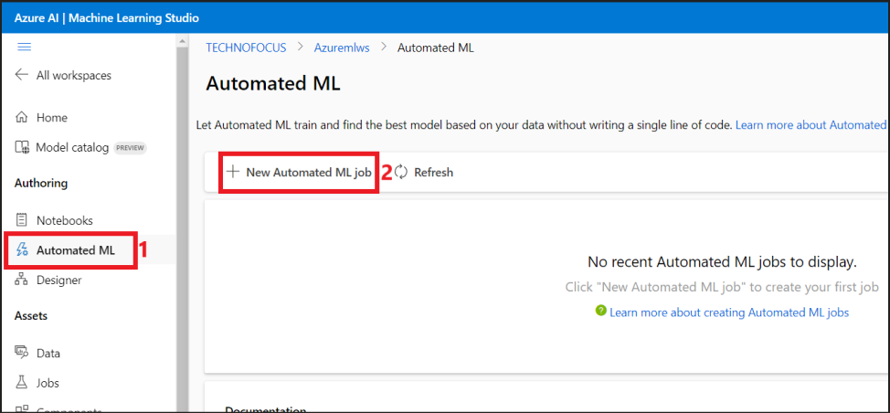

# **Lab 04 – Training a classification model with no-code AutoML in the Azure Machine Learning Studio**

**Objective**

In this lab, we will learn how to train a classification model with
no-code AutoML using Azure Machine Learning automated ML in the Azure
Machine Learning studio. This classification model predicts if a client
will subscribe to a fixed term deposit with a financial institution.
Automated machine learning rapidly iterates over many combinations of
algorithms and hyperparameters to help you find the best model based on
a success metric of your choosing.

Expected duration – 60 minutes

We are at the **Deploy Model** phase of the Azure Machine Learning.

## **Exercise 1: Create an Azure Machine Learning workspace**

1.  Sign in to Azure portal – +++**https://portal.azure.com**+++ using
    the credentials from the **Resources** tab.

2.  From the Azure portal home page, select **+ Create a resource**.

3.  On **Create a resource**, use the search bar to find +++**Azure
    Machine Learning**+++. Select **Azure Machine Learning** under
    **Marketplace**.

> 

4.  Under **Marketplace**, click on **Create** dropdown and select
    **Azure Machine Learning**.

> 

5.  Provide the following information to configure your new workspace:

    - **Subscription**: Select your **assigned Azure subscription**

    - **Resource group**: Select your assigned Resource Group

> 

**Workspace Details:**

- **Workspace name: +++Azuremlws@lab.LabInstanceId+++**

&nbsp;

- **Region**: Select Region **North Central US** is used here

- **Container registry:** Select **Create new.** Enter
  **+++Azuremlcr@lab.LabInstanceId**+++

> 

6.  Once you are done configuring the workspace, select **Review +
    Create**.

7.  Once the Validation is passed, click on **Create**.

8.  Click on **Go to resource**, to view the new workspace.

9.  **On the Microsoft.MachineLEarningServices | Overview page**,
    select **Launch studio** under **Work with your model in Azure
    Machine Learning studio**.

## **Exercise 2: Create an Automated ML job**

1.  Navigate to the Azure Machine Learning Studio tab.

2.  From the left pane, select **Automated ML** under
    the **Authoring** section.

3.  Click on **+ New Automated ML job**.

### **Task 1: Create data asset**

1.  On the **Basic settings** page, give the New experiment name as
    +++MarketingExperiment+++, accept the other defaults and click
    **Next**.

2.  In the Task type & data page, select **Classification** under
    **Select task type** and select **+ Create** under **Select data.**

3.  In the Create data asset page, provide the below details.

- **Name** – +++marketingdata+++

- **Type** – **Tabular**

- Click on **Next**.

4.  On the **Data source** pane, select **From local files** and click
    on **Next**.

5.  In **Destination storage type,** select the default datastore that
    was automatically set up during your workspace creation:
    **workspaceblobstore**. You upload your data file to this location
    to make it available to your workspace. Select **Next**.

6.  In **File or folder selection**, select **Upload files or
    folder** \> **Upload files**. Choose
    the **bankmarketing_train.csv** file from **C:/Labfiles**. Select
    **Next**.

7.  When the upload finishes, the **Data preview** area is populated
    based on the file type. In the **Settings** form, review the values
    for your data. Then select **Next**.

[TABLE]

> 

8.  The **Schema** form allows for further configuration of your data
    for this experiment. For this example, select the toggle switch for
    the **day_of_week**, so as to not include it. Select **Next**.

9.  In the **Review** form, verify that the information and
    select **Create** to complete the creation of your **data asset**.

10. Back in the **Create a new Automated ML job** page, a **success**
    message for the data asset creation gets displayed. Select the
    created **marketingdata** data asset and click on **Next**.

> **Note:** If the **marketingdata** is not displayed, click on Refresh
> to get it listed.

### **Task 2: Configure job**

1.  In the **Task Settings** page, select **y (String)** as the **Target
    column**, which is what you want to predict. This column indicates
    whether the client subscribed to a term deposit or not.

2.  Select **View additional configuration settings** and populate the
    fields as follows. These settings are to better control the training
    job. Otherwise, defaults are applied based on experiment selection
    and data.

- Primary metric – AUCWeighted

- Explain best model – Enable

- Use all supported models - Enable

- Blocked models – None

3.  Select **Limits** and enter +++**60**+++ for the **Experiment
    timeout(minutes)** field.

4.  Under **Validate and test**, provide the below values and click on
    **Next**.

- Validation type - Select **k-fold cross-validation**

- Number of cross validations – Select **2**

5.  In the Compute page, select the Select compute type as **Compute
    cluster** and click on **+ New**.

6.  In the **Create compute cluster** pane, select the below details and
    click **Next**.

- Location – **North Central US** (Same as the location of your Azure
  Machine Learning workspace)

- Virtual machine tier – **Dedicated**

- Virtual machine type - **CPU**

- Virtual machine size -Select **Standard_DS12_v2**

7.  In the Advanced settings, provide the below details and select
    **Create**.

- Compute name - +++automl-compute+++

- Minimum number of nodes - 0

- Maximum number of nodes – 1

> 

8.  Select **Next** once the compute provisioning succeeds.

> 

9.  In the **Review** page, select **Submit the training job**.

> 

10. The **Overview** screen opens with the **Status** at the top as the
    experiment preparation begins. This status updates as the experiment
    progresses. Notifications also appear in the studio to inform you of
    the status of your experiment.

> **Note:** The training takes around 40 minutes to complete.

## **Exercise 3: Explore models**

While the training is in progress, you can explore the models associated
with.

1.  Navigate to the **Models + child** jobs tab to see the algorithms
    (models) tested.

> 

2.  Select the **StandardScalerWrapper, XGBoostClassifier** model.

3.  Click on **Metrics** and explore the details under the Metrics tab.

4.  While you wait for all of the experiment models to finish, select
    the **Algorithm name** of a completed model to explore its
    performance details. Select the **Overview** and
    the **Metrics** tabs for information about the job.

> **Important:** The model training takes around 40 minutes to complete.
> Please proceed with the next lab while this is in progress. Resume to
> this lab once the status changes to **Completed**.

## **Exercise 4: Model Explanations**

The model explanations can be generated on demand. The model
explanations dashboard that's part of the **Explanations (preview)** tab
summarizes these explanations.

1.  Under the Models + child jobs tab(from the parent job), select
    **MaxAbsScaler, LightGBM.**

2.  Select the **Explain model** tab.

3.  On the Explain model pane that opens up, select

    1.  Select compute type - **Compute cluster**

    2.  Select AzureML compute instance - Select **automl-compute**

Select **Create**.

4.  Success message is displayed. Select the **Explanations(preview)**
    tab. This tab populates after the explainability run completes.

5.  Expand the left pane. Under **Features**, select the row that
    says **raw**. Select the **Aggregate feature importance** tab. This
    chart shows which data features influenced the predictions of the
    selected model.

In this example, the **duration** appears to have the most influence on
the predictions of this model.

## **Exercise 5: Deploy the best model**

The automated machine learning interface allows you to deploy the best
model as a web service. *Deployment* is the integration of the model so
it can predict on new data and identify potential areas of opportunity.
For this experiment, deployment to a web service means that the
financial institution now has an iterative and scalable web solution for
identifying potential fixed term deposit customers.

After the experiment run is complete, the **Details** page is populated
with a **Best model summary** section. In this experiment
context, **VotingEnsemble** is considered the best model, based on
the **AUCWeighted** metric.

1.  Select **Jobs** from the left pane and select the experiment that
    you created.

2.  Click on the display name of the experiment.

3.  Check if the status is **Completed**.

4.  Once the experiment run is complete, the **Details** page is
    populated with a **Best model summary** section. In this experiment
    context, **VotingEnsemble** is considered the best model, based on
    the **AUC_weighted** metric.

> 

We deploy this model, but be advised, deployment takes about 20 minutes
to complete. The deployment process entails several steps including
registering the model, generating resources, and configuring them for
the web service.

5.  Select **VotingEnsemble** to open the model-specific page.

6.  Select the **Deploy** menu in the top-left and select **Deploy to
    web service**.

7.  Populate the **Deploy a model** pane as follows:

[TABLE]

> Click on **Deploy**.

8.  A success message stating **Model deployment is successfully
    triggered** is displayed on the Model screen and the status is
    **Running**.

9.  Once the deployment is complete, the status changes to
    **Completed**.

> Now you have an operational web service to generate predictions.

## **Exercise 6: Delete the resources**

### **Task 1: Delete Endpoint**

1.  From the left pane of AML Studio, click on **Endpoints**.

2.  Select the endpoint, **my-automl-deploy** and click on **Delete**.

3.  Select **Delete** in the Delete real-time endpoint dialog.

4.  You should receive a success message once the endpoint is deleted.

**Summary**

In this lab, we have learnt on training a classification model with no
code AutoML in the Azure Machine Learning studio and deploy the best
model as a web service.
