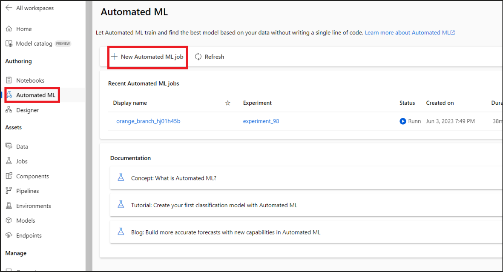
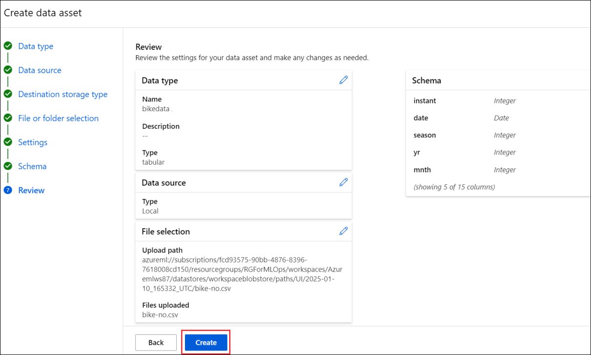
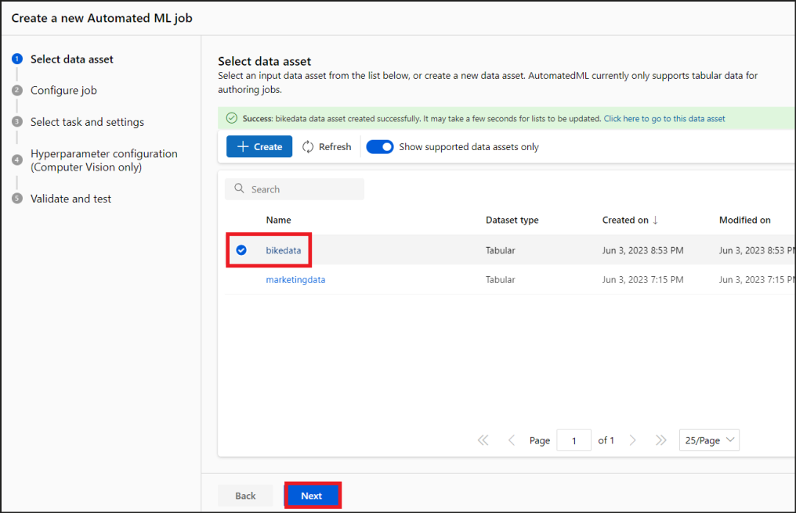
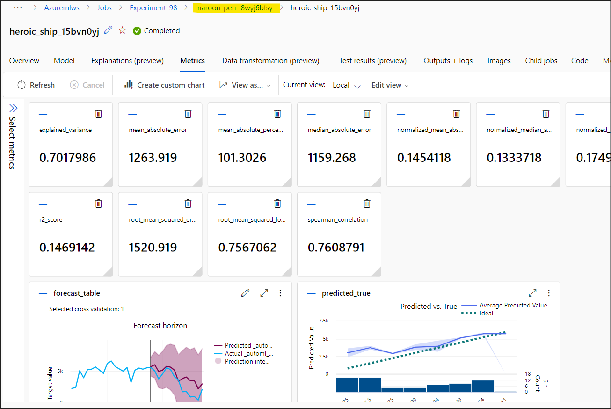

# **Lab 05: Prognostizieren des Bedarfs mit No-Code automatisiertem Machine Learning in Azure Machine Learning Studio**

**Objektiv**

In diesem Lab erfahren Sie, wie Sie mithilfe von automatisiertem
maschinellem Lernen in Azure Machine Learning Studio ein
Zeitreihenprognosemodell erstellen, ohne eine einzige Codezeile
schreiben zu müssen. Dieses Modell wird die Mietnachfrage für einen
Bike-Sharing-Dienst vorhersagen.

In diesem Lab werden Sie keinen Code schreiben. Sie verwenden die
Studio-Benutzeroberfläche, um Schulungen durchzuführen.

Erwartete Dauer – 60 Minuten

## **Übung 1: Vorbereiten der Umgebung**

### **Aufgabe 1: Starten des AML-Arbeitsbereichs**

1.  Melden Sie sich beim Azure-Portal an, +++
    **https://portal.azure.com+++**, falls Sie noch nicht angemeldet
    sind.

2.  Wählen Sie im Menü des Azure-Portals die Option **All resources**
    aus.

3.  Wählen Sie den Azure Machine Learning-Arbeitsbereich
    (**Azuemlws@lab.LabInstanceId**) aus.

4.  Klicken Sie auf **Launch Studio**.

## **Übung 2: Erstellen eines automatisierten ML-Jobs**

1.  Klicken Sie in Azure Machine Learning Studio im linken Bereich im
    Abschnitt **"Author"** auf " **Automated ML** ".

2.  Wählen Sie **+ New Automated ML job** aus.

### **Aufgabe 1: Erstellen eines Datenassets**

1.  Geben Sie den Experimentnamen als +++ **experiment_forecast** +++
    ein, übernehmen Sie die anderen Standardwerte, und wählen Sie
    **Next** aus.

> 

2.  Wählen Sie **Select task type** als **Time series forecasting** und
    klicken Sie dann auf **+ Create.**

3.  Geben Sie auf der Seite Create data asset die folgenden Details an.

    1.  Name – +++ **bikedata** +++

    2.  Typ – Tabular

> Klicken Sie auf **Next**.
>
> 

4.  Wählen Sie im Bereich **Data source** die Option **From local
    files** aus, und klicken Sie auf **Next**.

5.  Wählen Sie unter **Destination storage type** den workspaceblob aus,
    und klicken Sie auf **Next**.

6.  Wählen Sie in der File or folder selection **Upload files** aus,
    wählen Sie **bike-no.csv** aus dem Ordner **C:\Labfiles** aus und
    klicken Sie auf **Next**.

7.  Vergewissern Sie sich, dass das Formular **Settings and preview**
    wie folgt ausgefüllt ist, und wählen Sie **Next** aus.

[TABLE]

8.  Das **Schema**-Formular ermöglicht die weitere Konfiguration Ihrer
    Daten für dieses Experiment. Wählen Sie in diesem Beispiel den
    **Toggle-Switch** aus, der sich im ausgeschalteten Zustand für die

    1.  **casual** und

    2.  **Registered** Spalten.

> Klicken Sie auf **Next**.

Diese Spalten sind eine Aufschlüsselung der **cnt**-Spalte, daher nehmen
wir sie nicht auf.

> 

9.  Überprüfen Sie im Formular **Review** die Informationen und klicken
    Sie auf **Create**, um die Erstellung Ihres Datenassets
    abzuschließen.

> 

10. Auf der Seite **" Create a new Automated ML job** " wird eine
    **Erfolgsmeldung** für die Erstellung des Datenassets angezeigt.

11. Wählen Sie die neu erstellten **bikedata** aus und klicken Sie auf
    **Next**.

> **Hinweis: Aktualisieren Sie** den Bereich "Datenasset", wenn bikedata
> nicht angezeigt wird.
>
> 

### **Aufgabe 2: Job konfigurieren**

1.  Geben Sie auf der Seite **Task settings** die folgenden Details an,
    und wählen Sie **View additional configuration settings** aus.

> Target column – **cnt(Integer)**
>
> Time column **– date (Date)**
>
> **Deaktivieren Sie die Option “Autodetect forecast horizon”**, und
> geben Sie den Wert als +++**14**+++ an.
>
> 

2.  Geben Sie im Bereich Zusätzliche Konfiguration die folgenden Details
    ein und klicken Sie auf **Save**.

- Primäre Metrik – **Normalized root mean squared error**

- Erklären Sie das beste Modell – **Enable**

- Blockierte Algorithmen - **Extreme Random Trees**

> Erweitern Sie die Option Additional forecasting settings

- Autodetect Forecast target lags – **UnSelected**

- Autodetect Target rolling window size – **UnSelected**

> 

3.  Wählen Sie **Limits** aus, und geben Sie +++**60**+++ in das Feld
    **Experiment Timeout(Minutes)** ein .

4.  Wählen Sie unter **Validate and test** die folgenden Werte aus, und
    wählen Sie dann **Next** aus.

> Validierungstyp – **k-fold cross-validation**
>
> Anzahl der Kreuzvalidierungen – **5**
>
> 

5.  Wählen Sie **automl-compute** aus (das Dokument, das wir im
    vorherigen Lab erstellt haben). Klicken Sie auf **Next.**

> 

6.  Überprüfen Sie die Details, und wählen Sie **Submit training job**
    aus.

> 

7.  Auf der Statusseite wird der Anfangsstatus als **“Running”**
    angezeigt. Aktualisieren Sie die Seite ständig, um den Status zu
    erfahren.

> 

8.  Sobald die Schulung abgeschlossen ist, ändert sich der Status in
    **Completed**.

**Hinweis:** Die Schulung dauert ca. 30 bis 45 Minuten.

## **Übung 3: Untersuchen von Modellen**

1.  Navigieren Sie zur Registerkarte **Models**, um die getesteten
    Algorithmen (Modelle) anzuzeigen. Standardmäßig werden die Modelle
    nach Abschluss nach Metrikbewertung sortiert.

2.  In diesem Tutorial steht das Modell, das basierend auf der
    ausgewählten Metrik **Normalized root mean squared error** die
    höchste Punktzahl erzielt, ganz oben in der Liste.

3.  Während Sie darauf warten, dass alle Experimentmodelle abgeschlossen
    sind, wählen Sie den **Algorithm name** eines abgeschlossenen
    Modells aus, um dessen Leistungsdetails zu untersuchen.

> 

4.  Klicken Sie auf die **Overview** und sehen Sie sich die Details an.

> 

5.  Klicken Sie auf die Registerkarte **Metrics** und erkunden Sie die
    Details.

> 
>
> **Wichtig:** Fahren Sie mit der Ausführung des nächsten Labs fort,
> während dieses Training abgeschlossen ist. Kehren Sie von hier aus zu
> diesem Lab fort, sobald das Training abgeschlossen ist.
>
> 

## **Übung 4: Identifizieren des besten Modells**

Mit automatisiertem Machine Learning in Azure Machine Learning Studio
können Sie in wenigen Schritten das beste Modell als Webdienst
bereitstellen. Deployment ist die Integration des Modells, damit es auf
der Grundlage neuer Daten Vorhersagen treffen und potenzielle
Chancenbereiche identifizieren kann.

1.  Sobald der Job abgeschlossen ist, navigieren Sie zurück zur
    übergeordneten Jobseite, indem Sie den **Jobnamen** oben auf dem
    Bildschirm auswählen.

2.  Im Abschnitt **Best model summary** wird das beste Modell im Kontext
    dieses Experiments basierend auf der **Metrik Normalized root mean
    squared error** ausgewählt.

3.  Klicken Sie auf den Namen des Algorithmus, um ihn zu öffnen und die
    Details zu erkunden.

4.  Das Modell kann auch als Webdienst bereitgestellt werden**.**

**Zusammenfassung**

In diesem Lab haben Sie automatisiertes ML in Azure Machine Learning
Studio verwendet, um ein Zeitreihen-Prognosemodell zu erstellen, das die
Mietnachfrage für Fahrräder vorhersagt.
