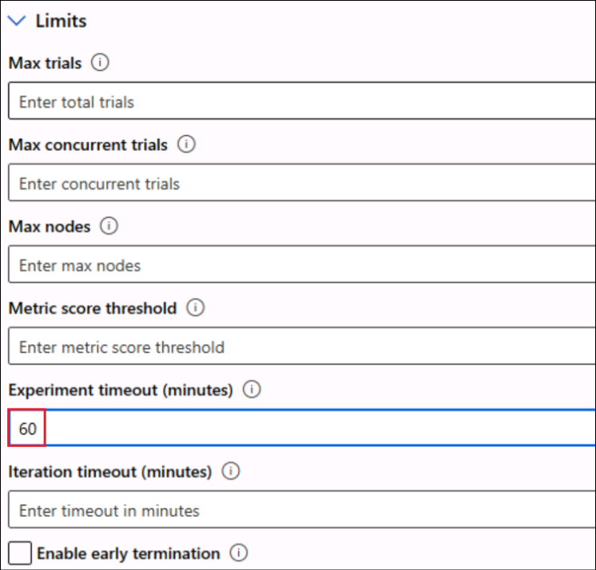
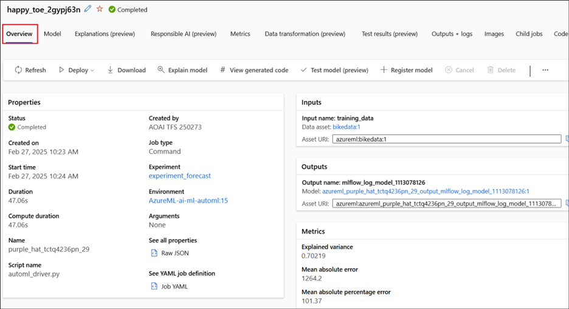

# **Lab 05 - Forecasting demand with no-code Automated Machine Learning in the Azure Machine Learning studio**

**Lab Type** – Instructor Led

**Expected Duration** – 50 minutes

**Objective**

In this lab, you will learn how to create a time-series forecasting
model without writing a single line of code using automated machine
learning in the Azure Machine Learning studio. This model will predict
rental demand for a bike sharing service.

You won't write any code in this tutorial, you'll use the studio
interface to perform training.

## **Exercise 1: Getting the environment ready**

### **Task 1: Launch the AML Workspace**

1.  Login to the Azure portal, +++**https://portal.azure.com+++** if not
    logged in already.

2.  From the Azure portal menu , select **All resources.**

    

3.  Select the Azure Machine Learning Workspace (**AzuemlwsXX**).

    

4.  Click on **Launch studio**.

    

## **Exercise 2: Create an Automated ML job**

1.  Once the Azure Machine Learning Studio is launched, click on
    **Automated ML** under **Author** section from the left pane.

2.  Select **+ New Automated ML job.**

    

### **Task 1: Create data asset**

1.	Select **Create New** under **Experiment name** and enter +++**experiment_forecast**+++ the **New experiment name**, accept the other defaults and select **Next**. 

    

2.  Select **Select task type** as **Time series forecasting** and then
    click on **+ Create.**

    

3.  On the Create data asset page, provide the following details.

    -  Name – !!**bikedata**!!

    -  Type – Tabular

    Click on **Next**.

    

4.  On the **Data source** pane, select **From local files** and click
    on **Next**.

    

5.  On the **Destination storage type**, select the workspaceblob and
    select **Next**..

    

6.  On the File or folder selection, select **Upload files** and select
    **bike-no.csv** from **C:\Labfiles** folder and click on **Next**.

    

7.  Verify that the **Settings and preview** form is populated as
    follows and select **Next**.

    | **Field** | **Value for tutorial** |
    |:-----|:--------|
    | File format | Delimited |
    | Delimiter | Comma |
    | Encoding | UTF-8 |
    | Column headers | Only first file has headers |
    | Skip rows | None |

    

8.  The **Schema** form allows for further configuration of your data
    for this experiment. For this example, select the **toggle switch**
    to be in the **off** state for the 

    -  **casual** and 

    -  **registered** columns.

    Click **Next**.

    These columns are a breakdown of the **cnt** column so, therefore we
don't include them.

  

9.  On the **Review** form, verify the information and click on
    **Create** to complete the creation of your data asset.

    

10. Back in the **Submit an Automated ML job page**, a **success**
    message for the data asset creation gets displayed.

12. Select the newly created **bikedata** and click on **Next**.

    >[!Note] **Note:** **Refresh** the data asset pane if bikedata is not getting displayed.

    

### **Task 2: Configure Job**

1.  On the **Task settings** page, provide the below details and select
    **View additional configuration settings**.

    Target column – **cnt(Integer)**

    Time column **– date (Date)**

    **Deselect Autodetect forecast horizon** and provide the value as +++**14**+++.

    

2.  In the Additional configuration pane, provide the below details and
    click on **Save**.

    - Primary metric - **Normalized root mean squared error**
    
    - Explain best model – **Enable**
    
    - Blocked models - **Extreme Random Trees**

    Expand the Additional forecasting settings

    - Autodetect Forecast target lags – **UnSelected**
    
    - Autodetect Target rolling window size – **UnSelected**

  

3.	Select **Limits** and enter +++**60**+++ for the **Experiment timeout(minutes)** field.
   
    
   
4.  Select the below values under **Validate and test** and then select
    **Next**.

    Validation type – **k-fold cross-validation**

    Number of cross validations – **5**

    

5.	Select the below details and click on Next.

    -    Select compute type – Select **Compute cluster**
  	
    -    Select Azure ML Compute cluster - Select **automl-compute** (The one we created in the previous lab)

    

5.  Review the details and select **Submit training job**.

    

6.  The status page shows the initial status as **Running.** Keep
    refreshing the page to know the status.

    

7.  Once the training completes, the status changes to **Completed**.

    >[!Note] **Note:** The training takes around 30to 45 minutes to complete.

## **Exercise 3: Explore models**

1.  Navigate to the **Models + child jobs** tab to see the algorithms (models)
    tested. By default, the models are ordered by metric score as they
    complete.

2.  For this tutorial, the model that scores the highest based on the
    chosen **Normalized root mean squared error** metric is at the top
    of the list.

3.  While you wait for all of the experiment models to finish, select
    the **Algorithm name** of a completed model to explore its
    performance details.

    

4.  Click on the **Overview** and view its details.

    

5.  Click on the **Metrics** tab and explore the details.

    

    >[!Alert] **Important:** Please continue to execute the next lab while this training completes. Resume to this lab from here, once the training is completed.

    Check if the training is completed, by selecing **Jobs -> experiment forecast -> experiment**.
    
    

## **Exercise 4: Identify the best model**

Automated Machine Learning in Azure Machine Learning studio allows you
to deploy the best model as a web service in a few steps. Deployment is
the integration of the model so it can predict on new data and identify
potential areas of opportunity.

1.  In the **Best model summary** section, the best model in the context
    of this experiment, is selected based on the **Normalized root mean
    squared error metric.**

    

2.  Click on the Algorithm name to open it and explore the details.

3.  The model can also be deployed as a web service.

**Summary**

In this lab, you used automated ML in the Azure Machine Learning studio
to create a time series forecasting model that predicts bike share
rental demand.
