# Laboratorio 06: Entrenamiento del mejor modelo de regresión para el conjunto de datos de hardware

**Objetivo**

En este laboratorio, repasaremos cómo utilizar AutoML para entrenar un
modelo de regresión. Usaremos el conjunto de datos de rendimiento de
hardware para entrenar e implementar el modelo para su uso en escenarios
de inferencia. El objetivo de regresión es predecir el rendimiento de
ciertas combinaciones de componentes de hardware.

Tiempo estimado – 60 minutos

# Ejercicio 0: Prepare el entorno

### **Tarea 1: Inicie el espacio de trabajo de AML**

1.  Inicie sesión en el portal
    Azure,+++[**https://portal.azure.com**](https://portal.azure.com)+++
    si aún no ha iniciado sesión.

2.  En el menú del portal Azure, seleccione **All resources.**

3.  Seleccione el Azure Machine Learning Workspace
    (**Azuemlws@lab.LabInstanceId**).

4.  Haga clic en **Launch studio**.

5.  Seleccione **Compute** en el panel izquierdo para crear una
    instancia Compute. Seleccione **+ New**.

6.  Indique los siguientes datos y haga clic en **Review + Create**.

- Compute name - +++**auto-compute**+++

- Virtual machine type – **CPU**

- Virtual Machine – **Standard E4ds_v4**

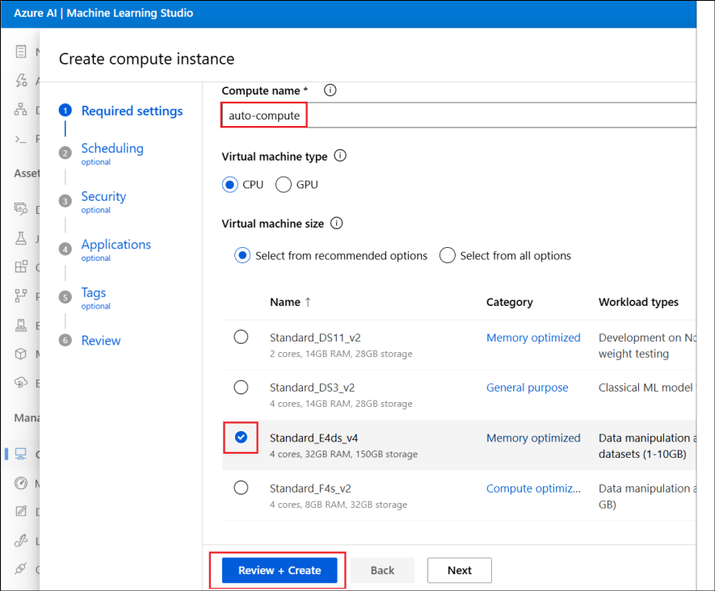

7.  Seleccione **Create** para crear la instancia de cálculo.

### **Tarea 2: Suba el notebook al espacio de trabajo de AML**

1.  Haga clic en **Notebooks** en el panel izquierdo. Luego, haga clic
    en los tres puntos junto al **username** bajo **Users** y seleccione
    **Upload folder.**

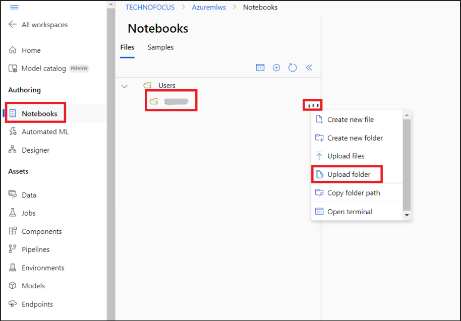

2.  Seleccione Click to browse and select folder(s), luego navegue hasta
    **C:\Labfiles** para seleccionar la carpeta
    **automl-regression-task-hardware-performance** y haga clic en
    **Upload**.

3.  Si aparece una ventana emergente preguntando **Upload 3 files to
    this site?,** haga clic en **Upload**.

4.  Seleccione la casilla **I trust contents of these files** y luego
    seleccione **Upload.**

5.  Abra el notebook (el archivo .ipynb),
    **automl-regression-task-hardware-performance**. El notebook se
    conectará automáticamente al cómputo que creamos anteriormente.

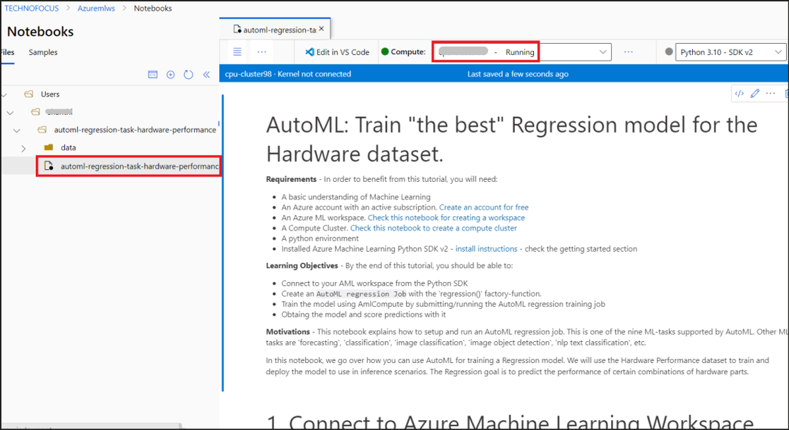

## **Ejercicio 1: Conectar al espacio de trabajo de Azure Machine Learning**

### **Tarea 1: Importe las bibliotecas necesarias**

1.  Ejecute la primera celda bajo **1.1** **Import the required
    libraries** para importar las bibliotecas requeridas para la
    ejecución de este laboratorio haciendo clic en el botón **Run cell**
    en la parte superior izquierda de la celda.

2.  Asegúrese de que la ejecución sea exitosa buscando un símbolo de
    marca de verificación en la parte inferior izquierda de la celda.

### **Tarea 2: Configure los detalles del espacio de trabajo y obtenga un manejador para el espacio de trabajo**

1.  En la casilla **1.2. Configure workspace details and get a handle to
    the workspace,** sustituya:

- SUBSCRIPTION_ID - +++**@lab.CloudSubscription.Id**+++

- RESOURCE_GROUP – **El nombre de su grupo de recursos asignado**

- AML_WORKSPACE_NAME – +++**Azuremlws@lab.LabInstanceId**+++

2.  Haga clic en la opción **Run cell** en la parte superior izquierda
    de la celda y asegúrese de que aparezca un símbolo de marca de
    verificación en la parte inferior izquierda una vez que la ejecución
    sea exitosa.

3.  Debajo de la celda se muestra el mensaje **Found the config file in
    : /config.json,** que indica que se ha encontrado el archivo de
    configuración en **: /config.json**.

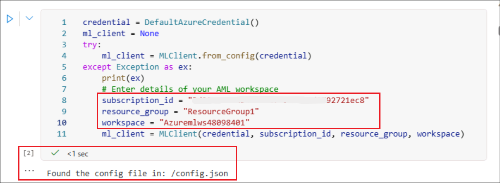

### **Tarea 3: Muestre la información del espacio de trabajo de Azure ML**

1.  Ejecute la siguiente celda (la celda debajo de **Show Azure ML
    Workspace information**).

2.  Asegúrese de que los detalles del espacio de trabajo, suscripción,
    ubicación y grupo de recursos que aparecen como salida debajo de la
    celda sean correctos.

## **Ejercicio 2: MLTable con datos de entrenamiento de entrada**

### **Tarea 1: Cree datos de entrada de MLTable**

1.  Ejecute la siguiente celda (la que está debajo de **2.1 Create
    MLTable data input**).

2.  Asegúrese de que la ejecución sea exitosa.

## **Ejercicio 3: Configure y ejecute el trabajo de entrenamiento de AutoML Regression**

1.  Ejecute las celdas bajo el título **4.1 Configure and run the AutoML
    Regression training job** una por una y asegúrese de que cada celda
    se ejecute correctamente.

2.  La celda bajo **4.2 Run the Command** envía el trabajo de AutoML.

1.  Puede verificar el estado del trabajo haciendo clic en **Jobs** en
    el panel izquierdo y seleccionando el experimento que está en estado
    **Running.**

**Nota:** Esto tarda alrededor de 10 a 15 minutos en completarse.

2.  La siguiente celda en el notebook espera hasta que el trabajo de
    AutoML se haya terminado.

3.  Ejecute la celda y espere hasta que la ejecución se complete antes
    de continuar con la siguiente celda.

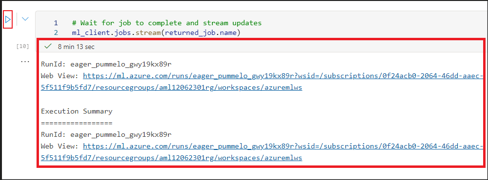

4.  Proceda al siguiente paso solo una vez que la ejecución haya
    finalizado.

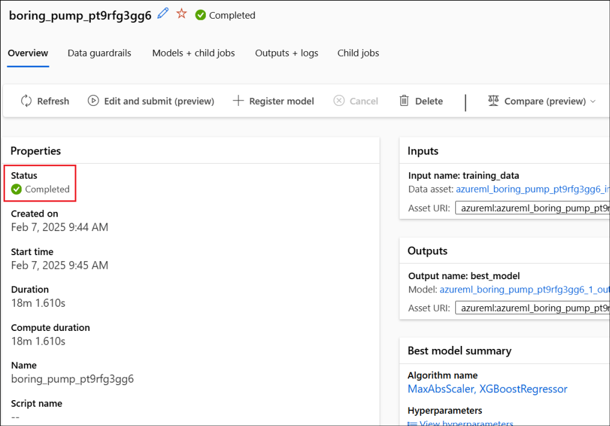

5.  Ejecute las siguientes 2 celdas una por una, que recuperan la URL y
    el nombre del trabajo.

## **Ejercicio 4: Recupere el Best Trial (Best Model's trial/run)**

1.  Agregue una celda encima de la primera celda bajo este ejercicio.

2.  Copie el siguiente código. Haga clic en **Run cell.**

> **%pip install azureml-mlflow**
>
> **%pip install mlflow**

3.  Continúe ejecutando las siguientes 3 celdas una por una, analizando
    cada código y su salida.

4.  Ejecute la siguiente celda para **Get the parent run**.

5.  Ejecute la siguiente celda para **print the parent tags**.

6.  Ejecute la siguiente celda para **Get the AutoML best child run**.

7.  Ejecute la siguiente celda para **Get the best model run’s
    metrics**.

8.  Ejecute las siguientes 3 celdas para **Download the best model
    locally**.

## **Ejercicio 5: Registre el Best model e impleméntelo**

### **Tarea 1: Cree un endpoint administrado en línea**

1.  Ejecute las 2 primeras celdas de esta tarea.

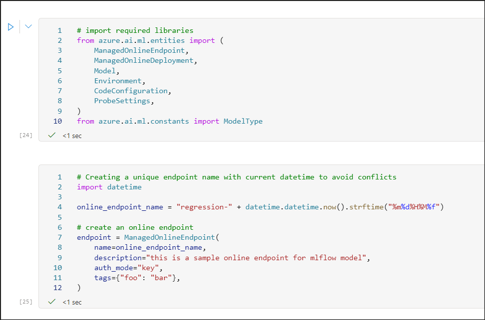

2.  Ejecute la siguiente celda con el código,

**ml_client.begin_create_or_update(endpoint).result()**

Esto crea un endpoint en línea llamado
**regression-\<Currentdate&time\>.**

3.  Compruebe si aparece la notificación **Endpoint
    "regression-\<Currentdate&time\>" update completed.**

> 

### **Tarea 2: Registre el Best model y realice la implementación**

1.  Ejecute la primera celda en Register best model and deploy →
    **Register model**, para registrar el modelo con el nombre
    hardware-performance-model.

2.  Una vez que la ejecución sea exitosa, ejecute la siguiente celda
    para obtener el **ID del modelo
    registrado**.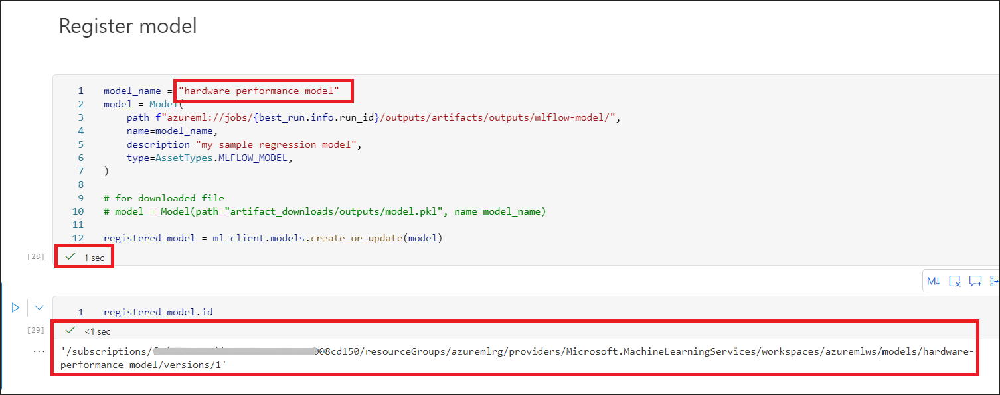

### **Tarea 3: Implemente**

1.  En la primera celda bajo **Deploy**, reemplace el valor
    **instance_type** con **Standard_E4s_v3.**

2.  Luego, ejecute la celda para implementar el Best Model.

3.  Ejecute la siguiente celda para crear la implementación.

4.  **Esto tomará alrededor de 40 minutos en completarse**. También
    puede verificar el estado desde la sección **Endpoints** (seleccione
    Endpoints en el panel izquierdo y luego haga clic en
    **regression-XXXXXXX** endpoint que implementó anteriormente).

5.  Una vez que se complete la ejecución y la implementación sea
    exitosa, la celda mostrará los detalles de la implementación.

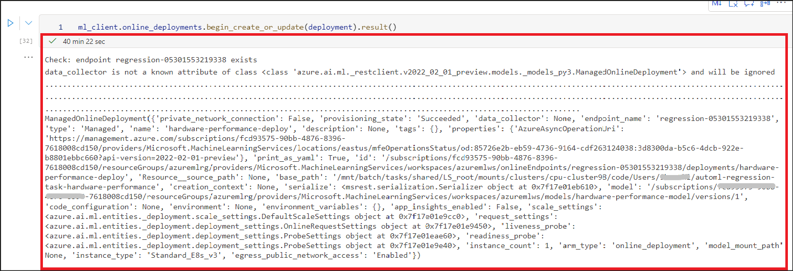

6.  Además, en la página de detalles de Endpoints, el estado de la
    implementación se convierte en **Succeeded**.

7.  Ejecute la siguiente celda en el notebook para que la implementación
    reciba el 100 % del tráfico.

8.  Verifique que la asignación de tráfico en vivo sea del 100 % en la
    página de detalles de los Endpoints.

## **Exercise 6: Pruebe la implementación**

1.  Ejecute la celda debajo de Test the deployment.

2.  Verifique la salida.

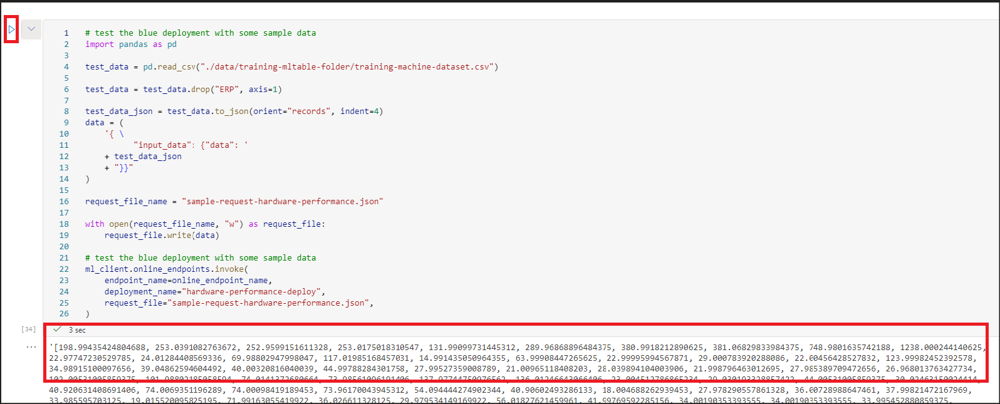

3.  Siga y ejecute las celdas restantes para eliminar el endpoint.

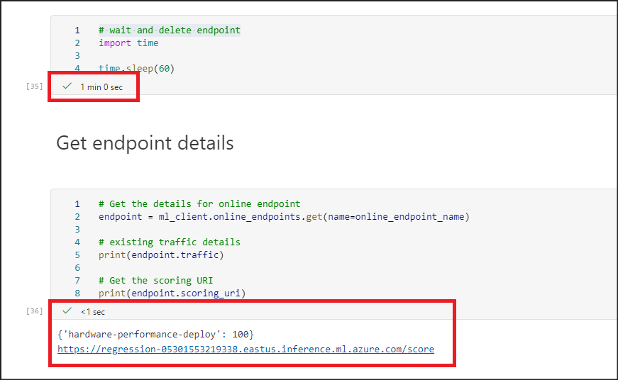

4.  Verifique el estado del endpoint en la pestaña de Endpoints.

**Resumen**

En este laboratorio, aprendimos a:

> • Conectar su espacio de trabajo de AML desde el SDK de Python.
>
> • Crear un trabajo de AutoML para regresión con la función
> regression() de fábrica.
>
> • Entrenar el modelo utilizando AmlCompute mediante el envío/ejecución
> del trabajo de entrenamiento de regresión de AutoML.
>
> • Obtener el modelo y realizar predicciones de puntuación con él.
