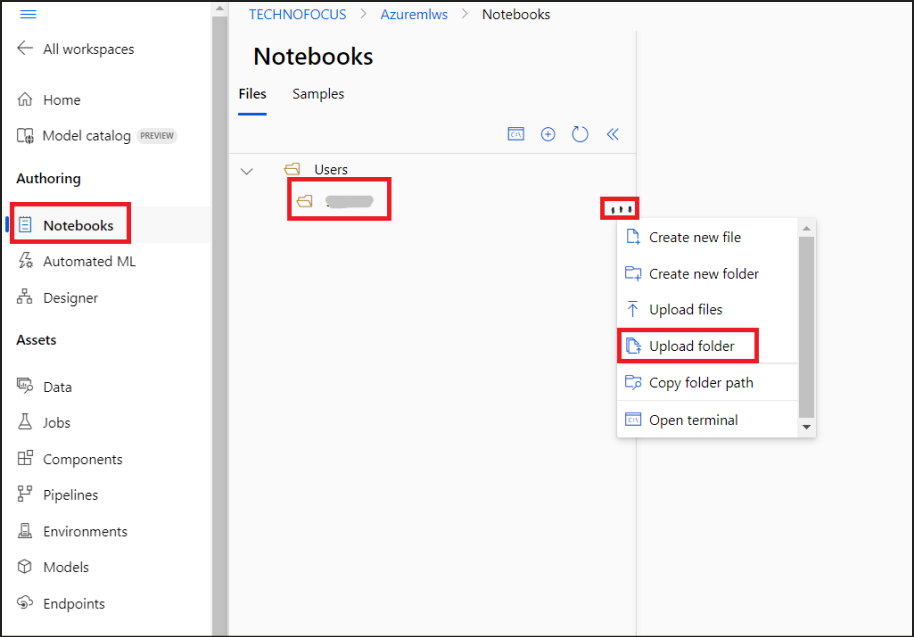
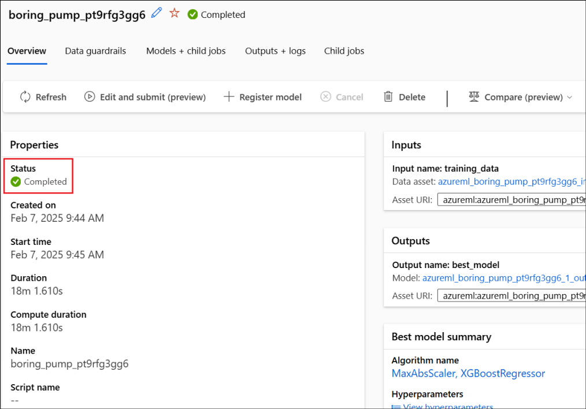
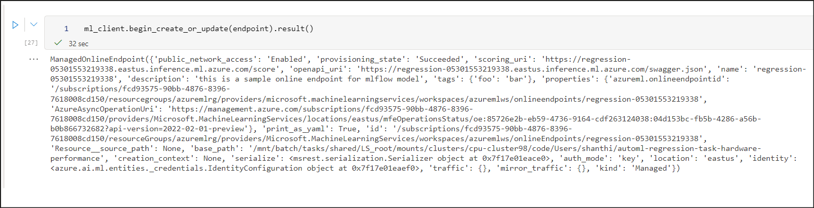
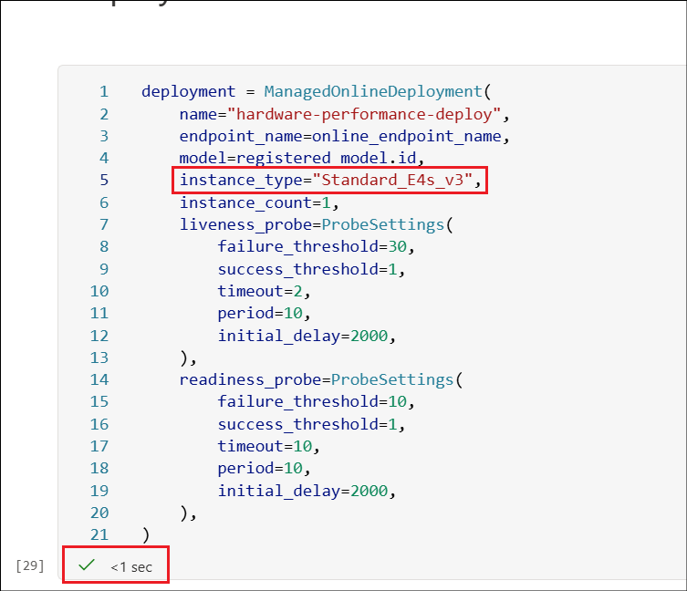
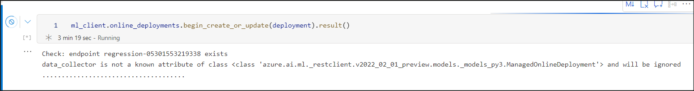
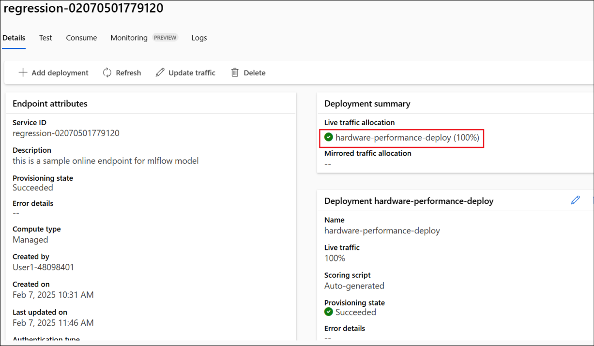
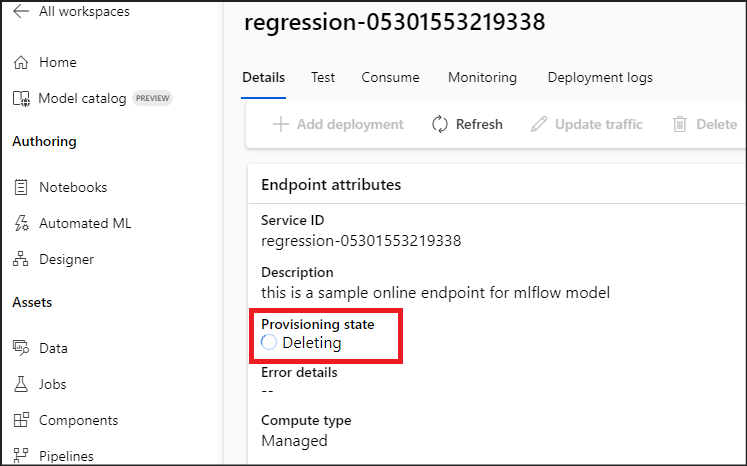

# Lab 06 - Training the best Regression model for the Hardware dataset

**Lab Type** – Instructor Led

**Expected Duration** – 50 minutes

Objective

In this lab, we go over how you can use AutoML for training a Regression
model. We will use the Hardware Performance dataset to train and deploy
the model to use in inference scenarios. The Regression goal is to
predict the performance of certain combinations of hardware parts.

# Exercise 0: Get the environment ready

### **Task 1: Launch the AML Workspace**

1.  Login to the Azure portal,
    +++[**https://portal.azure.com**](https://portal.azure.com)+++ if
    not logged in already.

2.  From the Azure portal menu , select **All resources.**

    

3.  Select the Azure Machine Learning Workspace (**AzuemlwsXX**).

    

4.  Click on **Launch studio**.

    

5.  Select **Compute** from the left pane to create a Compute instance.
    Select **+ New**.

    

6.  Provide the below details and click on **Review + Create**.

    - Compute name - +++**auto-compute**+++
    
    - Virtual machine type – **CPU**
    
    - Virtual Machine – **Standard E4ds_v4**

    

7.  Select **Create** to create the compute instance.

    

### **Task 2: Upload the notebook to AML Workspace**

1.  Click on the **Notebook** from the left pane. Click on the three
    dots next to the **username** under **Users** and select **Upload
    folder**.

    

2.  Select Click to browse and select folder(s) and browse
    **C:\Labfiles** to select the folder
    **automl-regression-task-hardware-performance** and click on
    **Upload.**

    

3.  If you get a pop up asking Upload 3 files to this site?, click on
    **Upload**.

    

4.  Select the checkbox, **I trust contents of these files** and then
    select **Upload**.

    

5.  Open the Notebook(the .ipynb file),
    **automl-regression-task-hardware-performance**. The Notebook is
    automatically connected to the compute that we created earlier.

    

## **Exercise 1: Connect to Azure Machine Learning Workspace**

### **Task 1: Import the required libraries**

1.  Execute the cell first cell under **1.1** **Import the required
    libraries** to import the libraries required for this lab execution
    by clicking on the Run cell button at the top left of the cell.

2.  Ensure that the execution is successful by looking for a tick symbol
    at the bottom left of the cell.

    

### **Task 2: Configure workspace details and get a handle to the workspace**

1.  In the cell under **1.2. Configure workspace details and get a
    handle to the workspace,** replace

    - SUBSCRIPTION_ID - **your subscription id**
    
    - RESOURCE_GROUP – **Your assigned Resourcegroup name**
    
    - AML_WORKSPACE_NAME - **AzuremlwsXX(**XX being the random number)

2.  Click on the Run cell option on the top left of the cell and ensure
    that you get a tick symbol at the bottom left once the execution is
    successful.

3.  An output stating, **Found the config file in : /config.json** is
    displayed below the cell.

    

### **Task 3: Show Azure ML Workspace information**

1.  Execute the next cell (the cell below Show Azure ML Workspace
    information).

2.  Ensure that the details of the workspace, subscription, location,
    and Resource group that gets listed as output below the cell are all
    correct.

    

## **Exercise 2: MLTable with input Training Data**

### **Task 1: Create MLTable data input**

1.  Execute the next cell, (the one under **2.1 Create MLTable data
    input**).

2.  Ensure that the execution is successful.

    

## **Exercise 3: Configure and run the AutoML Regression training job**

1.  Execute the cells under the **4.1 Configure and run the AutoML
    Regression training job** one by one and ensure that each cell gets
    executed successfully.

2.  The cell under **4.2 Run the Command**, submits the AutoML job.

    

3.  You can check the status of the job by clicking on the **Jobs** from
    the left pane and selecting the experiment that is in the Running
    state.

    

    

    >[!Note] **Note:** This takes around 10 to 15 minutes to complete.

4.  The next cell in the Notebook waits until the AutoMLjob is finished.

5.  Execute it and wait till the execution is completed to move to the
    next cell.

    

6.  Proceed to the next step only once the execution is completed.

    

7.  Execute the next 2 cells one by one which retrieves the url and the
    job name.

    

## **Exercise 4: Retrieve the Best Trial (Best Model's trial/run)**

1.  Add a cell above the first cell under this exercise.

    

2.  Copy the below code. Click on **Run cell.**

  +++%pip install azureml-mlflow+++
  
  +++%pip install mlflow+++

    

3.  Continue executing the next 3 cells one by one analyzing each code
    and its output.

    

4.  Execute the next cell to **Get the parent run**.

    

5.  Execute the next cell to **print the parent tags**.

    

6.  Execute the next cell to **Get the AutoML best child run**.

    

7.  Execute the next cell to **Get the best model run’s metrics**.

    

8.  Execute the next 3 cells to **Download the best model locally**.

    

## **Exercise 5: Register Best Model and Deploy**

### **Task 1: Create managed online endpoint**

1.  Execute the first 2 cells under this task.

    

2.  This creates an online endpoint named
    **regression-\<Currentdate&time\>.**

    

3.  Execute the next cell with the code,

    **ml_client.begin_create_or_update(endpoint).result()**

    

4.  Check for the notification stating **Endpoint
    "regression- < Currentdate&time >" update completed.**

    

    

### **Task 2: Register best model and deploy**

1.  Execute the first cell under Register best model and deploy -\>
    **Register model**, to register the model named
    **hardware-performance-model**.

2.  Once the execution is successful, execute the next cell to retrieve
    the registered model id.

    

### **Task 3: Deploy**

1.  In the first cell under Deploy, replace the value **instance_type**
    with **Standard_E4s_v3.**

2.  Then, execute the cell to deploy the best model.

    

3.  A few minutes after the above cell is executed, a notification
    appears with the message, **Endpoint deployment in progress**. This
    will take around 10 minutes to complete. Check the status using the
    **job details** link in the notification.

    

4.  Execute the next cell to create the deployment.

    

5.  **This will take around 40 minutes to complete**. You can also check
    for the status from under the **Endpoints**(select **Endpoints**
    from the left pane and then click on the **regression-XXXXXXX**
    endpoint that you deployed earlier).

    

6.  Once the execution is completed and the deployment is successful,
    the cell outputs the deployment details.

    

7.  Also, in the Endpoints details page, the deployment status becomes
    **Succeeded**.

    

8.  Execute the next cell in the notebook for the deployment to take
    100% traffic.

    

9.  Check the Live traffic allocation to be 100% in the Endpoints
    details page.

    

## **Exercise 6: Test the deployment**

1.  Execute the cell under the Test the deployment.

2.  Verify the output.

    

3.  Follow and execute the remaining cells to delete the endpoint.

    

    

4.  Check for the status of the endpoint from under the Endpoints tab.

    

    

## Exercise 7: Load the best model and try predictions

Loading the models locally assume that you are running the notebook in
an environment compatible with the model. The list of dependencies that
is expected by the model is specified in the MLFlow model produced by
AutoML (in the 'conda.yaml' file within the mlflow-model folder).

Since the AutoML model was trained remotelly in a different environment
with different dependencies to your current local conda environment
where you are running this notebook, if you want to load the model you
have several options:

1.  A recommended way to locally load the model in memory and try
    predictions is to create a new/clean conda environment with the
    dependencies specified in the conda.yaml file within the MLFlow
    model's folder, then use MLFlow to load the model and call
    .predict() as explained in the
    notebook **mlflow-model-local-inference-test.ipynb** in this same
    folder.

2.  You can install all the packages/dependencies specified in
    conda.yaml into your current conda environment you used for using
    Azure ML SDK and AutoML. MLflow SDK also have a method to install
    the dependencies in the current environment. However, this option
    could have risks of package version conflicts depending on what's
    installed in your current environment.

3.  You can also use: mlflow models serve -m 'xxxxxxx'

## Exercise 8: Clean up the resources

1.  From the Azure portal, select the Resource group **RGForMLOps** and
    select **Delete resource group**.

    

2.  Enter +++RGForMLOps+++ in the text box and click **Enter**.

    

3.  Click on **Delete** in the confirmation dialog box.

    

4.  Ensure that the Resource group is deleted by the success message.

**Summary**

In this lab, we learnt on how to

- Connect to your AML workspace from the Python SDK

- Create an AutoML regression Job with the 'regression()'
  factory-function.

- Train the model using AmlCompute by submitting/running the AutoML
  regression training job

- Obtaining the model and score predictions with it
