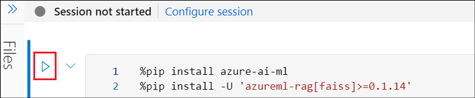
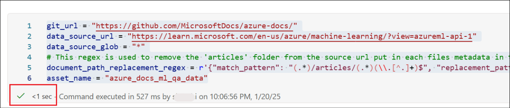

# Lab 08 – Implementazione della generazione di data QA con RAG utilizzando un flusso di prompt

**Obiettivo:**

La generazione di data QA fa parte del processo di creazione RAG
(Retrieval Augmented Generation) in cui il set di data QA generato
automaticamente viene utilizzato per ottenere il miglior prompt per RAG
e per ottenere metriche di valutazione per RAG

In questo lab imparerai come creare un set di data QA dai suoii data.

Durata prevista – 60 minuti

## Esercizio 1: Creare distribuzioni AOAI 

In questo esercizio verranno create le distribuzioni dei modelli
gpt-35-turbo usando la risorsa Azure OpenAI creata nel lab precedente.

1.  In Azure Machine Learning Studio selezionare **Model Catalog** nel
    riquadro sinistro. Cerca +++**gpt-35-turbo**+++ e seleziona
    **gpt-35-turbo** dall'elenco dei modelli.

2.  Assicurarsi che la risorsa AOAI **AOAI-PF@lab.LabInstanceId** sia
    selezionata nel campo della **Azure OpenAI resource** . Selezionare
    **Deploy** per distribuire il modello.

3.  Accettare il **Deployment name** e selezionare **Deploy**.

4.  Ripetere la distribuzione del modello per **text-embedding-ada-002**
    con il nome della distribuzione come
    +++**text-embedding-ada-002-2**+++

## Esercizio 2: Configurare l'ambiente

1.  Nel riquadro sinistro di Studio selezionare **Notebooks**. Fare clic
    sui tre punti accanto al nome utente e selezionare **Upload files**.

2.  Passare a **C:\LabFiles** e selezionare il file
    **qa_data_generation.ipynb**. Seleziona **I trust contents of this
    file** e fai clic su **Upload**.

3.  Aprire il notebook e selezionare **Serverless Spark Compute** nell'
    opzione **Compute**.

4.  Dopo aver collegato il calcolo, selezionare **Configure session**
    per caricare il file conda.yml e configurare l'ambiente per
    l'esecuzione usandolo.

5.  Seleziona **Python packages** -\> **Upload Conda file** -\> clicca
    su **Browse**.

6.  Seleziona il **conda.yml** da **C:\LabFiles** e seleziona **Apply**.

> 

## Esercizio 3: Ottenere il client per l'area di lavoro AzureML

1.  Eseguire la prima cella del notebook per installare le dipendenze

**Nota:** il completamento dell'operazione richiederà dai 10 ai 15
minuti

2.  Eseguire la cella successiva con az **login** per accedere
    all'interfaccia della riga di comando di **Azure** .

3.  L'area di lavoro è la risorsa di primo livello per Azure Machine
    Learning e offre una posizione centralizzata in cui lavorare con
    tutti gli artefatti creati quando si usa Azure Machine Learning. In
    questa sezione ci collegheremo all'area di lavoro in cui verrà
    eseguito il processo. MLClient è il modo in cui si interagisce con
    AzureML

4.  Sostituire i segnaposto per la **Subscription ID** con +++@lab.
    Subscription()+++, **Resource group** con il nome del **Resource
    group name** e **Azure ML Workspace** con
    +++**Azuremlws@lab.LabInstanceId+++** nella cella successiva per
    creare MClient.

5.  **Execute** la cella successiva che imposta il della **connection
    name**. Se hai usato un altro nome durante la creazione della
    connessione, fornisci quel valore in questa cella e poi esegui.

6.  Sostituire il valore della **key** con la **Azure openAI key** e il
    valore di **target** con il valore **Endpoint** della risorsa Azure
    OpenAI salvata in precedenza.

**Execute** la cella dopo aver sostituito i valori.

7.  Ora che l'area di lavoro ha una connessione ad Azure OpenAI, ci
    assicureremo che il modello gpt-35-turbo sia stato distribuito
    pronto per l'inferenza.

8.  **Execute** la cella successiva per impostare i nomi del modello e
    della **deployment** . Sostituire i valori del nome del modello e
    del nome della distribuzione se sono stati assegnati nomi diversi
    durante la creazione del modello e la distribuzione.

9.  Infine, le informazioni sulla distribuzione e sul modello verranno
    combinate in un formato URI che i componenti di incorporamento di
    AzureML prevedono come input. **Execute** la cella successiva per
    eseguire questa operazione.

## Esercizio 4: Impostazione della pipeline

Le pipeline di AzureML connettono più componenti. Ogni componente
definisce gli input, il codice che utilizza gli input e gli output
prodotti dal codice. Le pipeline stesse possono avere input e output
prodotti collegando insieme singoli sottocomponenti. Per elaborare i
data per l'incorporamento e l'indicizzazione, conneteremo più
componenti, ognuno dei quali esegue la propria fase del flusso di
lavoro.

I componenti vengono pubblicati in un registro, azureml, a cui dovrebbe
avere accesso per impostazione predefinita, è possibile accedervi da
qualsiasi area di lavoro. Nella cella seguente si ottengono le
definizioni dei componenti dal registro azureml.

1.  Esegui la cella successiva e assicurati che venga eseguita senza
    alcun problema.

2.  Ogni componente dispone di una documentazione che fornisce una
    descrizione generale dello scopo dei componenti e di ciascuno degli
    input/output. Ad esempio, possiamo capire cosa fa
    **data_generation_component** ispezionando la definizione del
    componente. **Execute** la cella successiva per questo e osservare
    l'output.

3.  Di seguito viene costruita una pipeline definendo una funzione
    python che concatena insieme i componenti di cui sopra input e
    output. Gli argomenti della funzione sono input per la pipeline
    stessa e il valore restituito è un dizionario che definisce gli
    output della pipeline. Assicurarsi che la **next cell** venga
    **executed** correttamente.

4.  Le impostazioni seguenti illustrano come i diversi parametri git e
    data_source possono essere impostati per elaborare solo la
    documentazione di AzureML dal repository git di AzureDocs più grande
    e garantire che l'URL di origine per ogni documento venga elaborato
    per il collegamento all'URL ospitato pubblicamente anziché all'URL
    git.

5.  Esegui le due celle successive e assicurati che vengano eseguite
    correttamente.

## Esercizio 5: Invio della pipeline

1.  L'output di ogni passaggio nella pipeline può essere ispezionato
    tramite l'interfaccia utente dell'area di lavoro, fare clic sul
    collegamento in "Pagina dei dettagli" dopo aver eseguito la cella
    sottostante.

2.  Esegui la cella successiva e fai clic sul collegamento nell'output
    per visualizzare lo stato del flusso

3.  L'esecuzione viene aperta nel flusso di prompt. Esplora ogni fase
    del flusso.

6.  Una volta che il flusso è andato a buon fine, vai al passaggio
    successivo.

## Esercizio 6: Esaminare i data QA generati

1.  Esegui le 2 celle successive e rivedi l'output per i data QA.

> 

**Sommario**:

In questo laboratorio, abbiamo imparato a creare un set di data QA dai
suoii data.
