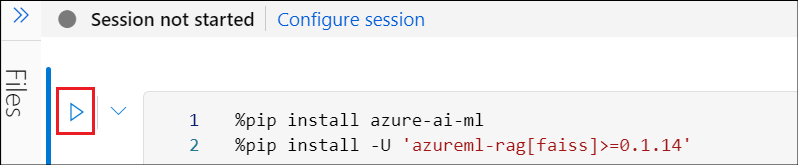
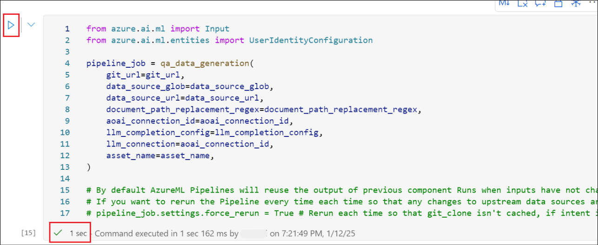

# Atelier 08 – Mise en œuvre de la génération de données d'assurance qualité avec RAG à l'aide d'un flux d'invite

**Objectif :**

La génération de données d'assurance qualité fait partie du processus de
création de RAG (Retrieval Augmented Generation) dans le cadre duquel
l'ensemble de données d'assurance qualité généré automatiquement est
utilisé pour obtenir la meilleure invite pour RAG et pour obtenir des
métriques d'évaluation pour RAG

Dans cet atelier, vous allez apprendre à créer un ensemble de données
d'assurance qualité à partir de vos données.

Durée prévue – 60 minutes

## Exercice 1 : Création de déploiements AOAI 

Dans cet exercice, nous allons créer les déploiements de modèles
gpt-35-turbo à l'aide de la ressource Azure OpenAI que nous avons créée
dans le labo précédent.

1.  Dans Azure Machine Learning Studio, sélectionnez **Model Catalog**
    dans le volet gauche. Recherchez +++**gpt-35-turbo+++ et**
    sélectionnez **gpt-35-turbo** dans la liste des modèles.

2.  Assurez-vous que la ressource AOAI **AOAI-PF@lab.LabInstanceId** est
    sélectionnée dans le champ de **Azure OpenAI resource**.
    Sélectionnez **Deploy** pour déployer le modèle.

3.  Acceptez le **Deployment name** et sélectionnez **Deploy**.

4.  Répétez le déploiement du modèle pour **text-embedding-ada-002**
    avec le nom de déploiement sous la forme
    +++**text-embedding-ada-002-2**+++

## Exercice 2 : Mettre en place l'environnement

1.  Dans le volet gauche du Studio, sélectionnez **Notebooks**. Cliquez
    sur les trois points à côté du nom d'utilisateur et sélectionnez
    Télécharger des **Upload files**.

2.  Accédez à **C :\LabFiles** et sélectionnez le fichier
    **qa_data_generation.ipynb**. Cochez **I trust contents of this
    file** et cliquez sur **Upload**.

3.  Ouvrez le bloc-notes et sélectionnez **Serverless Spark Compute**
    dans l'option Calcul.

4.  Une fois le calcul attaché, sélectionnez **Configure session** pour
    charger le fichier conda.yml et configurer l'environnement pour
    l'exécution à l'aide de celui-ci.

5.  Sélectionnez **Python packages** -\>**Upload Conda file** -\>
    cliquez sur **Browse**.

6.  Sélectionnez le **conda.yml** dans **C :\LabFiles** et sélectionnez
    **Apply**.

> 

## Exercice 3 : Obtenir le client pour AzureML Workspace

1.  Exécuter la première cellule du notebook pour installer les
    dépendances

**Remarque :** Cela prendra 10 à 15 minutes

2.  Exécutez la cellule suivante avec az login pour **login** à
    **Azure** CLI.

3.  L'espace de travail est la ressource de niveau supérieur pour Azure
    Machine Learning, fournissant un emplacement centralisé pour
    travailler avec tous les artefacts que vous créez lorsque vous
    utilisez Azure Machine Learning. Dans cette section, nous allons
    nous connecter à l'espace de travail dans lequel le travail sera
    exécuté. MLClient est la façon dont vous interagissez avec AzureML

4.  Remplacez les espaces réservés pour **Subscription ID** par +++@lab.
    Subscription()+++, **Resource group** avec **Resource group name**
    et **Azure ML Workspace** avec +++**Azuremlws@lab.LabInstanceId+++**
    dans la cellule suivante pour créer le MClient.

5.  **Exécutez** la cellule suivante qui définit **connection name**. Si
    vous avez utilisé un autre nom lors de la création de la connexion,
    donnez cette valeur dans cette cellule, puis exécutez-le.

6.  Remplacez la valeur de la **key** par **Azure openAI key** et la
    valeur **target** par la valeur du **Endpoint** de Azure OpenAI
    resource que nous avons enregistrée précédemment.

**Exécutez** la cellule après avoir remplacé les valeurs.

7.  Maintenant que votre espace de travail dispose d'une connexion à
    Azure OpenAI, nous allons nous assurer que le modèle gpt-35-turbo a
    été déployé, prêt pour l'inférence.

8.  **Exécutez** la cellule suivante pour définir les noms du modèle et
    du **deployment** . Remplacez les valeurs du nom du modèle et du nom
    du déploiement si vous avez donné des noms différents lors de la
    création du modèle et du déploiement.

9.  Enfin, nous combinerons les informations de déploiement et de modèle
    dans une forme d'uri que les composants d'intégration AzureML
    attendent en entrée. **Exécutez** la cellule suivante pour effectuer
    cette opération.

## Exercice 4 : Configurer le pipeline

Les pipelines AzureML connectent plusieurs composants. Chaque composant
définit des entrées, un code qui consomme les entrées et les sorties
produites à partir du code. Les pipelines eux-mêmes peuvent avoir des
entrées et des sorties produites en connectant des sous-composants
individuels. Pour traiter vos données pour l'intégration et
l'indexation, nous allons enchaîner plusieurs composants, chacun
effectuant sa propre étape du flux de travail.

Les composants sont publiés dans un registre, azureml, qui doit avoir
accès par défaut, il est accessible depuis n'importe quel espace de
travail. Dans la cellule ci-dessous, nous obtenons les définitions de
composants du registre azureml.

1.  Exécutez la cellule suivante et assurez-vous qu'elle s'exécute sans
    aucun problème.

2.  Chaque composant dispose d'une documentation qui fournit une
    description globale de l'objectif des composants et de chacune des
    entrées/sorties. Par exemple, nous pouvons voir comprendre ce que
    fait **data_generation_component** en inspectant la définition du
    composant. **Exécutez** la cellule suivante pour cela et observez le
    résultat.

3.  Below a Pipeline est construit en définissant une fonction python
    qui enchaîne les entrées, sorties et composants ci-dessus. Les
    arguments de la fonction sont des entrées du pipeline lui-même et la
    valeur de retour est un dictionnaire définissant les sorties du
    pipeline. Assurez-vous que la **next** **cell** est **exécuted**
    avec succès.

4.  Les paramètres ci-dessous montrent comment les différents paramètres
    git et data_source peuvent être définis pour traiter uniquement la
    documentation AzureML à partir du référentiel git AzureDocs plus
    volumineux, et assurez-vous que l'URL source de chaque document est
    traitée pour être liée à l'URL hébergée publiquement au lieu de
    l'URL git au lieu de l'URL git.

5.  Exécutez les deux cellules suivantes et assurez-vous qu'elles sont
    exécutées avec succès.

## Exercice 5 : Soumettre le pipeline

1.  Le résultat de chaque étape du pipeline peut être inspecté via
    l'interface utilisateur de l'espace de travail, cliquez sur le lien
    sous « Page de détails » après avoir exécuté la cellule ci-dessous.

2.  Exécutez la cellule suivante et cliquez sur le lien dans la sortie
    pour afficher l'état du flux

3.  L'exécution est ouverte dans Prompt flow. Explorez chaque étape du
    flux.

6.  Une fois le flux réussi, passez à l'étape suivante.

## Exercice 6 : Examiner les données d'assurance qualité générées

1.  Exécutez les 2 cellules suivantes et examinez la sortie des données
    d'assurance qualité.

> 

Résumé :

Dans cet atelier, nous avons appris à créer un ensemble de données
d'assurance qualité à partir de vos données.
