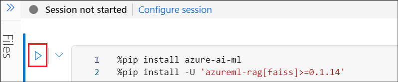
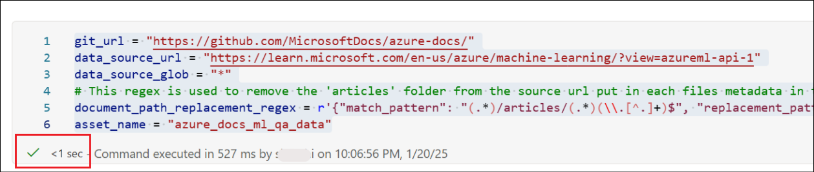

# Lab 08 – Implementing QA data generation with RAG using a prompt flow

**Objective:**

QA Data Generation is a part of RAG (Retrieval Augmented Generation)
creation process where the autogenerated QA dataset is used to get the
best prompt for RAG and to get evaluation metrics for RAG

In this lab, you will learn how to create a QA dataset from your data.

Expected Duration – 60 minutes

## Exercise 1: Create AOAI deployments 

In this exercise, we will create the gpt-35-turbo models deployments
using the Azure OpenAI resource we created in the previous lab.

1.  From the Azure Machine Learning Studio, select **Model Catalog**
    from the left pane. Search for +++**gpt-35-turbo**+++ and select
    **gpt-35-turbo** from the models list.

    

2.  Ensure that the AOAI resource **AOAI-PF@lab.LabInstanceId** is
    selected in the **Azure OpenAI resource** field. Select **Deploy**
    to deploy the model.

    

3.  Accept the **Deployment name** and select **Deploy**.

    

4.  Repeat the model deployment for **text-embedding-ada-002** with the
    deployment name as +++**text-embedding-ada-002-2**+++

    

## Exercise 2: Set up the environment

1.  From the left pane of the Studio, select **Notebooks**. Click on the
    three dots next to the user name and select **Upload files**.

    

2.  Browse to **C:\LabFiles** and select the
    **qa_data_generation.ipynb** file. Select **I trust contents of this
    file** checkbox and click on **Upload**.

    

3.  Open the notebook and select **Serverless Spark Compute** in the
    **Compute** option.

    

4.  Once the compute is attached, select **Configure session** to upload
    the conda.yml file and set up the environment for execution using
    it.

    

5.  Select **Python packages** -\>**Upload Conda file** -\> click on
    **Browse**.

    

6.  Select the **conda.yml** from **C:\LabFiles** and select **Apply**.

    

## Exercise 3: Get client for AzureML Workspace

1.  Execute the first cell of the notebook to install the dependencies

    

    

    >[!Note] **Note:** This will take 10 to 15 minutes to complete

2.  Execute the next cell with az login to **login** to **Azure** CLI.

    

3.  The workspace is the top-level resource for Azure Machine Learning,
    providing a centralized place to work with all the artifacts you
    create when you use Azure Machine Learning. In this section we will
    connect to the workspace in which the job will be run. MLClient is
    how you interact with AzureML

4.  Replace placeholders for **Subscription ID** with
    +++@lab.Subscription()+++, **Resource group** with your **Resource
    group name** and **Azure ML Workspace** with
    +++**Azuremlws@lab.LabInstanceId+++** in the next cell to create the
    MClient.

    

    

5.  **Execute** the next cell which sets the **connection name**. If you
    have used any other name while creating the connection, give that
    value in this cell and then execute.

    

6.  Replace the **key** value with **Azure openAI key** and the
    **target** value with the **Endpoint** value of Azure OpenAI
    resource that we saved earlier.

    **Execute** the cell after replacing the values.

    

7.  Now that your Workspace has a connection to Azure OpenAI we will
    make sure the gpt-35-turbo model has been deployed ready for
    inference.

8.  **Execute** the next cell to set the model and **deployment** names.
    Replace the values of the model name and the deployment name if you
    have given different names while creating the model and deployment.

    

9.  Finally we will combine the deployment and model information into a
    uri form which the AzureML embeddings components expect as input.
    **Execute** the next cell to perform this.

    

## Exercise 4: Setup Pipeline

AzureML Pipelines connect together multiple Components. Each Component
defines inputs, code that consumes the inputs and outputs produced from
the code. Pipelines themselves can have inputs, and outputs produced by
connecting together individual sub Components. To process your data for
embedding and indexing we will chain together multiple components each
performing their own step of the workflow.

The Components are published to a Registry, azureml, which should have
access to by default, it can be accessed from any Workspace. In the
below cell we get the Component Definitions from the azureml registry.

1.  Execute the next cell and ensure that it gets executed without any
    issue.

    

2.  Each Component has documentation which provides an overall
    description of the Components purpose and each of the
    inputs/outputs. For example we can see understand what
    **data_generation_component** does by inspecting the Component
    definition. **Execute** the next cell for this and observe the
    output.

    

3.  Below a Pipeline is built by defining a python function which chains
    together the above components inputs and outputs. Arguments to the
    function are inputs to the Pipeline itself and the return value is a
    dictionary defining the outputs of the Pipeline. Ensure that the
    **next cell** gets **executed** successfully.

    

    

4.  The settings below show how the different git and data_source
    parameters can be set to processes only the AzureML documentation
    from the larger AzureDocs git repo, and ensure the source url for
    each document is processed to link to the publicly hosted URL
    instead of the git url.

5.  Execute the next two cells and ensure that they get executed
    successfully.

    

    

## Exercise 5: Submit Pipeline

1.  The output of each step in the pipeline can be inspected via the
    Workspace UI, click the link under 'Details Page' after running the
    below cell.

2.  Execute the next cell and click on the link in the output to view
    the flow status

    

3.  The execution gets opened in the prompt flow. Explore each stage of
    the flow.

    

    

6.  Once the flow is successful, move to the next step.

## Exercise 6: Review generated QA data

1.  Execute the next 2 cells and review the output for the QA data.

    

    

**Summary:**

In this lab, we have learnt to create a QA dataset from your data.
