# **Lab 09 - Setting up MLOps with GitHub**

**Lab Type:** Instructor led

**Expected Duration:** 50 minutes

**Objective:**

Azure Machine Learning allows you to integrate with **GitHub
Actions** to automate the machine learning lifecycle.

In this lab, you will learn about using Azure Machine Learning to set up
an end-to-end MLOps pipeline that runs a linear regression to predict
taxi fares in NYC. The pipeline is made up of components, each serving
different functions, which can be registered with the workspace,
versioned, and reused with various inputs and outputs.

We are at the MLOps phase of the Azure Machine Learning

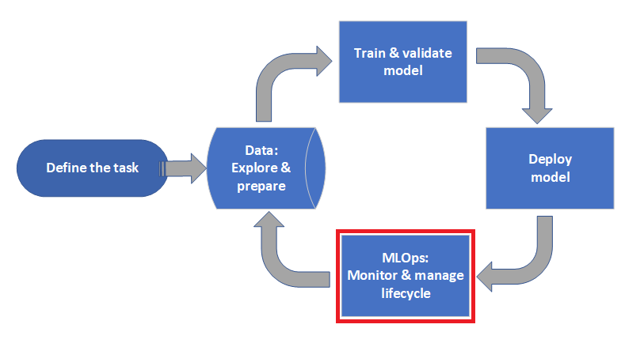

## **Exercise 1: Getting the Azure resources ready**

### **Task 1: Create an Azure Machine Learning workspace**

1.  Sign in to the Azure portal at +++https://portal.azure.com+++ if
    not already logged in.

2.  From the Azure portal home page, select **+ Create a resource**.

    

3.  On the **Create a resource** page, use the search bar to find
    +++Azure Machine Learning+++

4.  Select **Machine Learning**.

    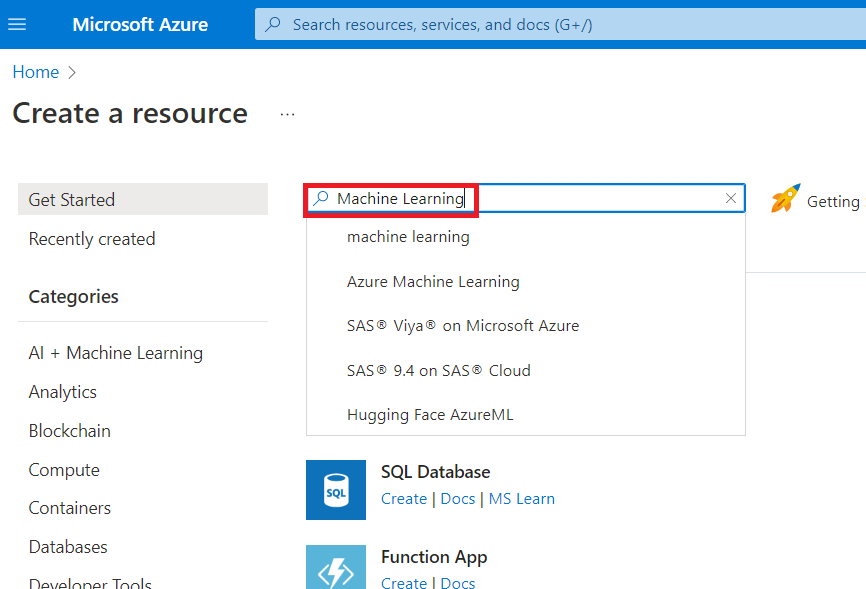

5.  Under **Marketplace**, click on **Create dropdown** and select
    **Azure Machine Learning**.

    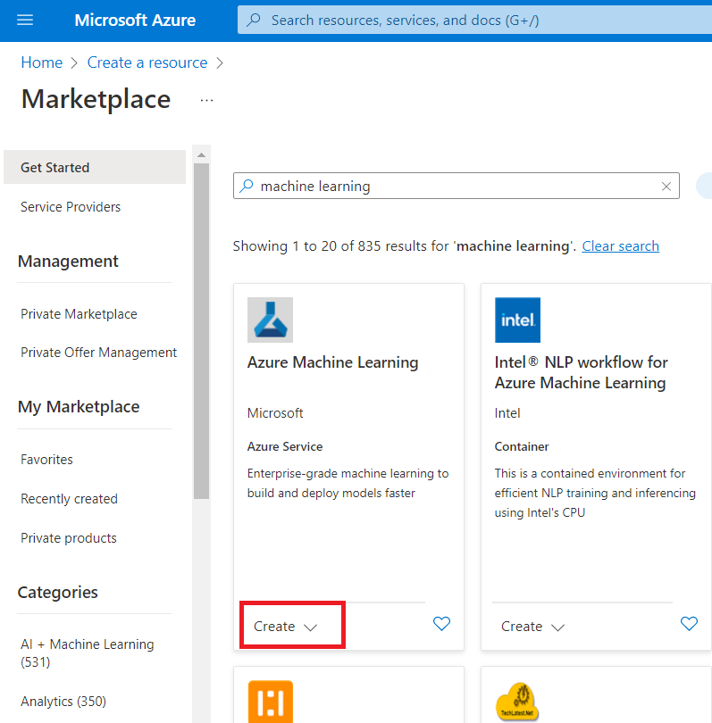

7.  Provide the following information to configure your new workspace:

    - **Subscription**: Select your **assigned Azure subscription**

    - **Resource group**: Click on **Create New** and enter
      +++**RGForMLOps**+++ as the name.

    **Workspace Details:**

    - **Workspace name: +++AzuremlwsXX**+++ (Replace **XX** with a unique
      number)
    
    - **Region**: Select your nearest region (North Central US is used
        here)
    
    - **Container registry:** Select **Create new**. Enter
      +++**AzuremlcrXX**+++ (Replace **XX** with a unique number)

    

7.  Once you are done configuring the workspace, select **Review +
    Create**.

    

8.  Once the Validation is passed, click on **Create**.

    

9.  Click on **Go to resource**, to view the new workspace.

    

10. **On the Microsoft.MachineLEarningServices | Overview page**,
    select **Launch studio** under **Work with your model in Azure
    Machine Learning studio**.

    

### **Task 2: Create a compute**

1.  Once the Azure Machine Learning Studio opens, click on **Compute**
    under **Manage** from the left pane.

    

2.  Select the **Compute clusters** tab and click on **+ New**.

    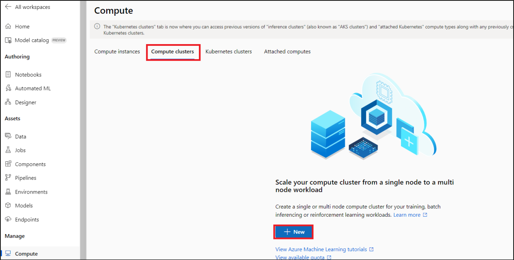

3.  On the **Create compute cluster** screen, enter the below details.

    -  Location – Select the **Region** in which you had created your
        Azure Machine Learning Workspace

    -  Virtual machine tier – **Dedicated**

    -  Virtual machine type – **CPU**

    -  Virtual machine size –Select **Standard_E4s_v3** (Check Select
        from all options to find the VM Size)

    Click on **Next**.

    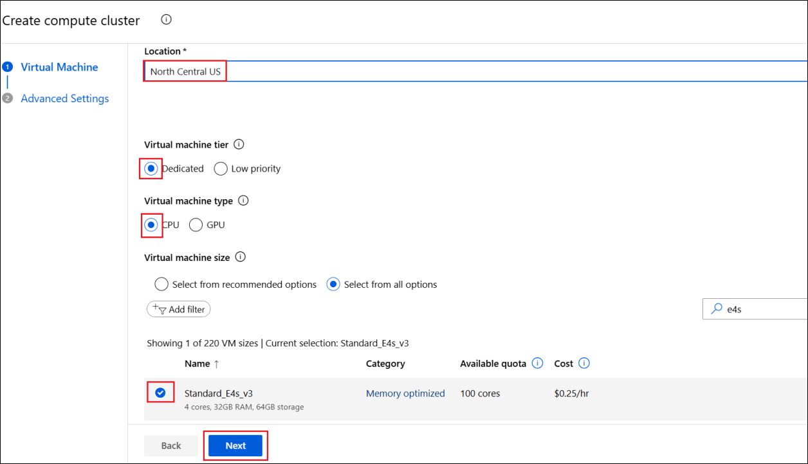

4.  On the **Advanced Settings** page, enter the below details.

    -  Compute name – +++**cpu-cluster**+++
    
    -  Minimum number of nodes – 0
    
    -  Maximum number of nodes – 1

    Click on **Create**.

    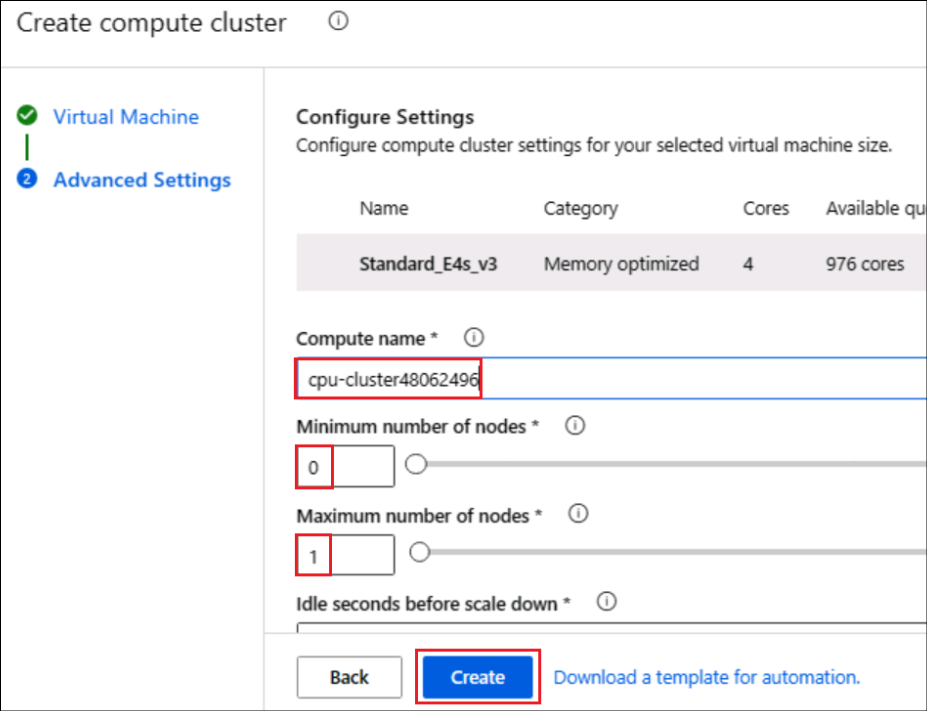

    >[!Note] **Note:** The compute takes around 10 minutes to come up to the Running
state.

    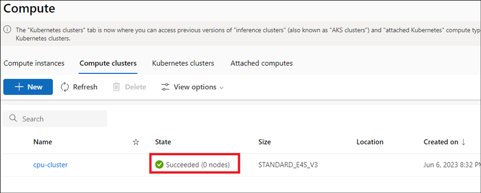

## **Exercise 2: Retrieve the Azure resources and Create a Service Principal**

1.  From the Azure portal (<https://portal.azure.com>), open the
    Resourcegroup **RGForMLOps** and make a note of the names of the
    following resources,

    -  **Azure Machine Learning Workspace**

    -  **Application Insights**

    -  **Key Vault**

    -  **Container Registry**

    -  **Storage account**

    And save them locally in a notepad to be updated in the config file.

    

2.	In the Azure portal, click on the **[>_] (Cloud Shell)** button at the top of the page to the right of the search box. A Cloud Shell pane will open at the bottom of the portal. The first time you open the Cloud Shell, you may be prompted to choose the type of shell you want to use (**Bash** or **PowerShell**). Select **Bash**. If you don't see this option, then skip this step.
   
	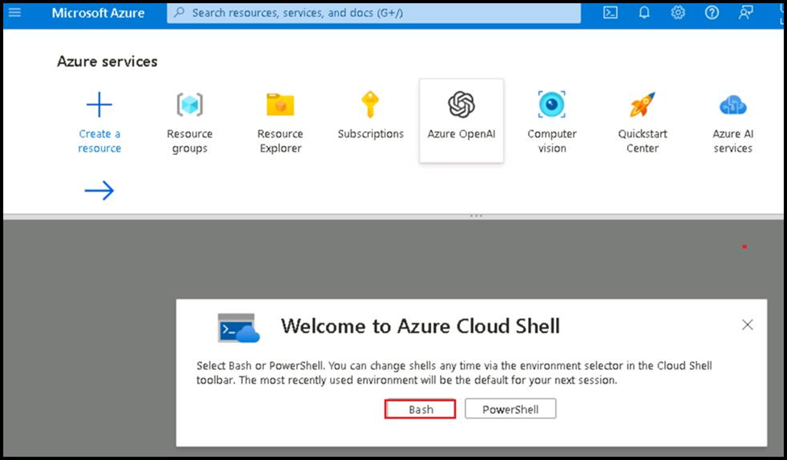

	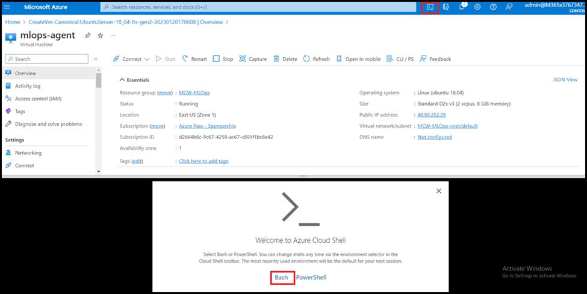

3.	In the **Getting Started** dialog, select **Mount storage account**, select your **subscription** and then click on **Apply**.
   
	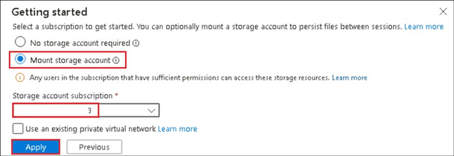

4.	In the **Mount storage account** dialog, select **we will create a storage account for you** and click on **Next**.

	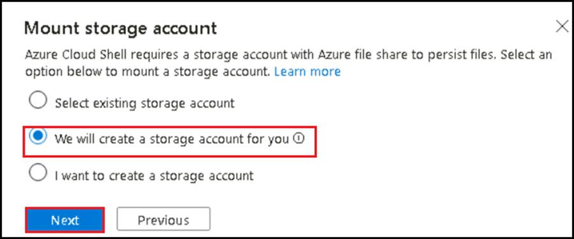

	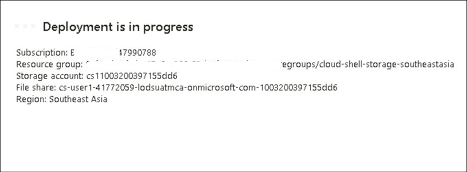

5.	Ensure the type of shell indicated on the top left of the Cloud Shell pane is switched to **Bash**. If it's **PowerShell**, switch to **Bash** by using the drop-down menu.

	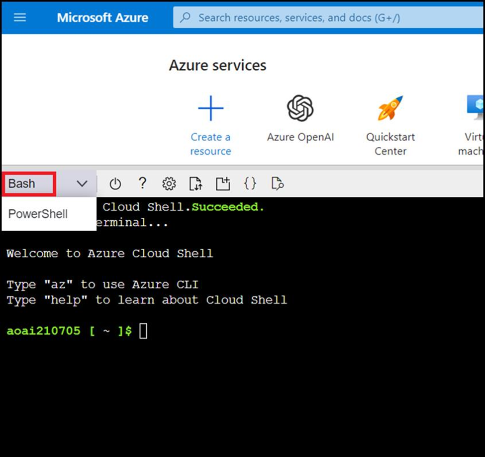

6.	**Execute** the below command to create a **Service Principal**, replacing **< Subscription ID >** with your **Subscription ID**.

    ```
    az ad sp create-for-rbac --name mlOpsSP --role contributor  --scopes /subscriptions/< Subscription ID >
    ```
    
    **Save** the output completely to a notepad.

	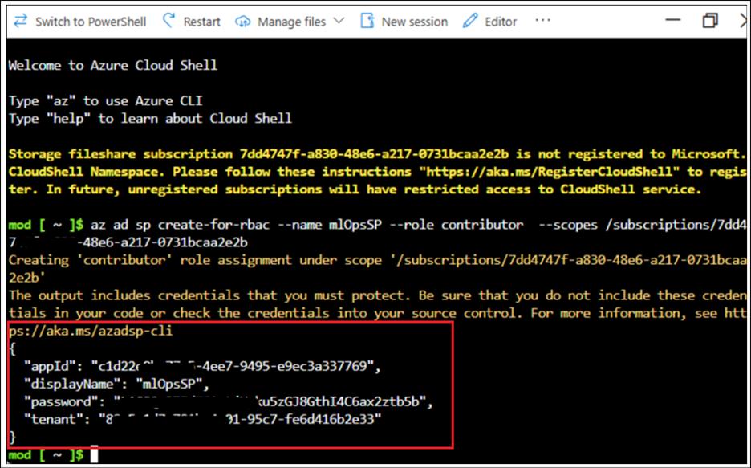

## **Exercise 3: Getting the GitHub account and resources ready**

>[!Note] **Note:** If you do not have an account with GitHub already, create one
from here +++**https://github.com/**+++ -> **Signup**.

### **Task 2: Fork the repo mlops demo into your GitHub account**

1.  Open a browser and enter this link -
    +++https://github.com/getazureready/mlops-v2-gha-demo+++

2.  Click on **Fork** on the top right.

    

3.  This opens a **Create a new fork** page. Click on **Create fork.**

    

4.  From your GitHub project, select **Settings**.

    

5.  Select **Actions** under **Secrets and variables.**

    

6.  Select **New repository secret**.

    

7.  Name this secret as **+++AZURE_CREDENTIALS+++**. Paste the below block of details in the **Secret** field, replacing the place holders of **appId**, **password**, **subscription id** and **tenant** with the values from the output obtained, when the Service Principal was created. You saved it earlier in the notepad. Select **Add secret**.
    
    ```
    {
      "clientId": "< appId >",
      "clientSecret": "< password >",
      "subscriptionId": "< Your Subscription ID >",
      "tenantId": "< tenant >",
      "activeDirectoryEndpointUrl": "https://login.microsoftonline.com",
      "resourceManagerEndpointUrl": "https://management.azure.com/",
      "activeDirectoryGraphResourceId": "https://graph.windows.net/",
      "sqlManagementEndpointUrl": "https://management.core.windows.net:8443/",
      "galleryEndpointUrl": "https://gallery.azure.com/",
      "managementEndpointUrl": "https://management.core.windows.net/"
    }
    ```

    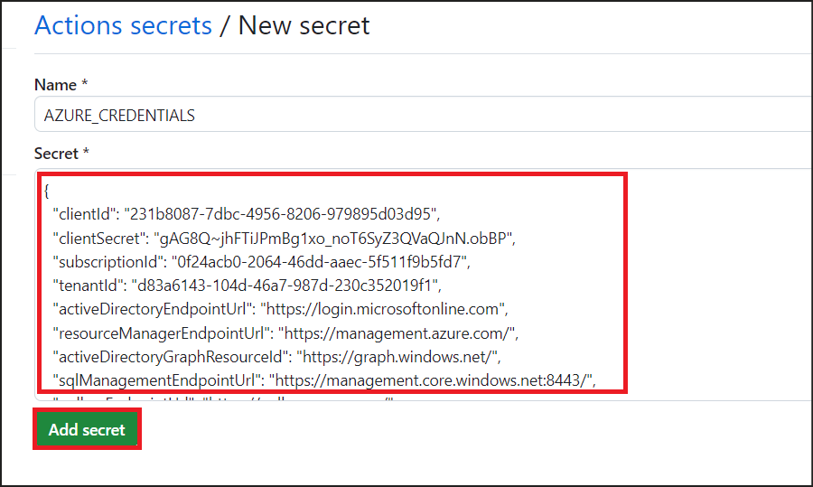

9.  The secret **AZURE_CREDENTIALS** that is added, gets displayed under
    **Repository secrets**.

    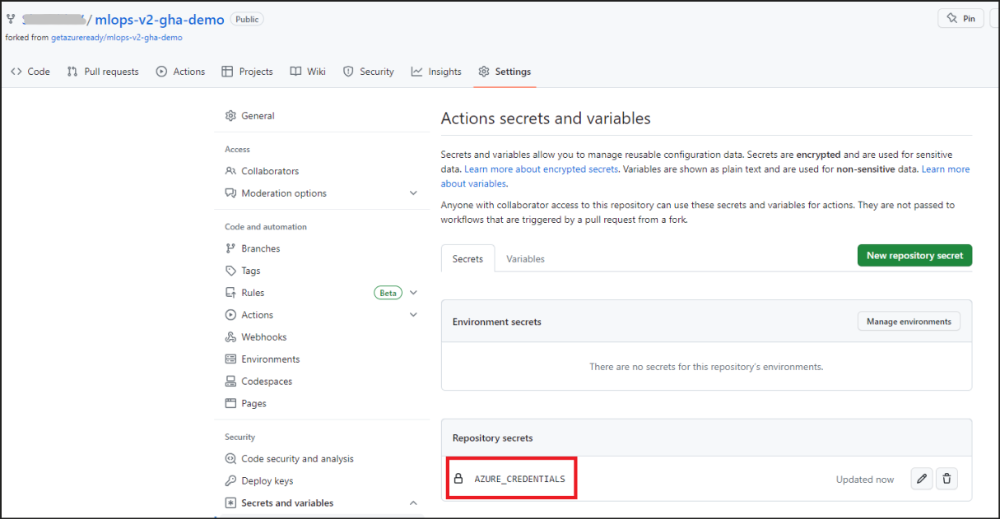

10.  Click on **New repository secret**.

    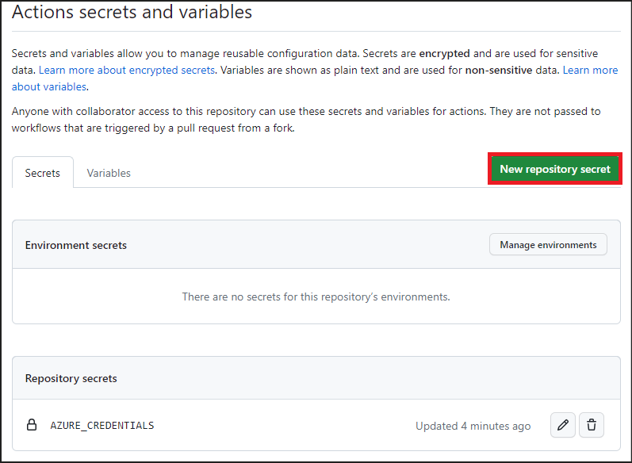

11. Provide the below details.

    -  Name – **+++ARM_CLIENT_ID+++**

    -  Secret – **< App ID >**

    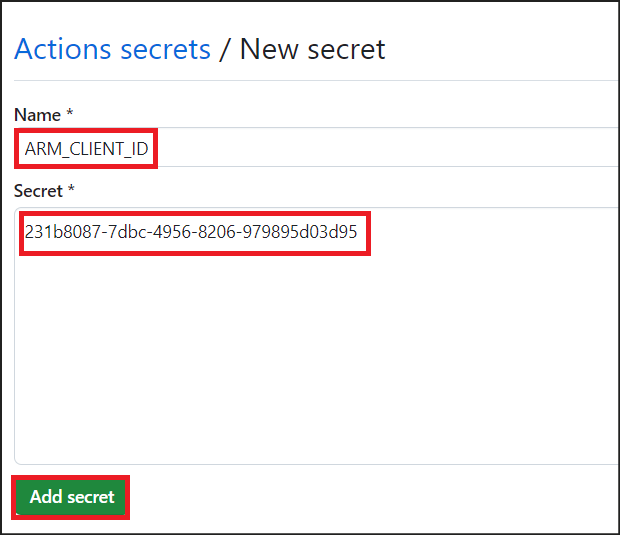

12. Repeat steps 9 and 10 for the following values, creating additional
    GitHub secrets.

    - **+++ARM_CLIENT_SECRET+++** - **< Password>**

    - **+++ARM_SUBSCRIPTION_ID+++** - **< Your Azure subscription id >**

    - **+++ARM_TENANT_ID+++** - **< Tenant >**

## **Exercise 4: Configure Machine Learning environment parameters**

1. From the secrets page, navigate to the repository page by clicking
on **mlops-v2-gha-demo** next to your GitHub id on the top left.

    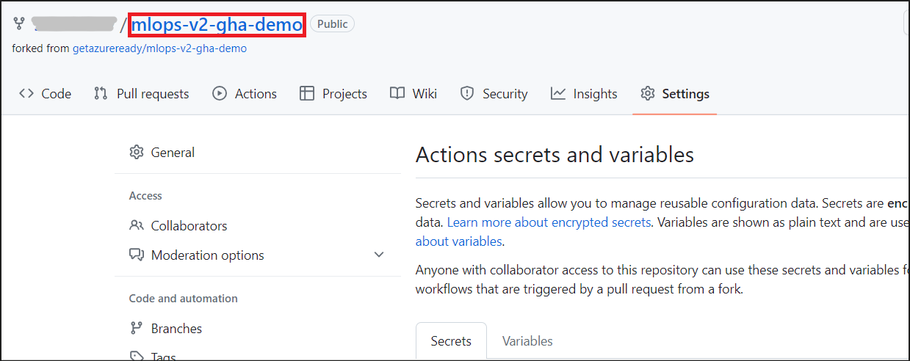

2.  Select the **config-infra-prod.yml** file in the root. Click on
    **Edit** (The pencil icon).

    

3.  Change the values,

    -  **Namespace** – **mlopsliteXX**(Replace XX with a random number)

    -  **Postfix** – **c**

    -  **location** – **Same as your workspace region**

    Click on **Commit changes**.

    Under the **For pipeline reference section**, replace the **values** of the Azure Resources with the values that we fetched and saved in Exercise 2.

    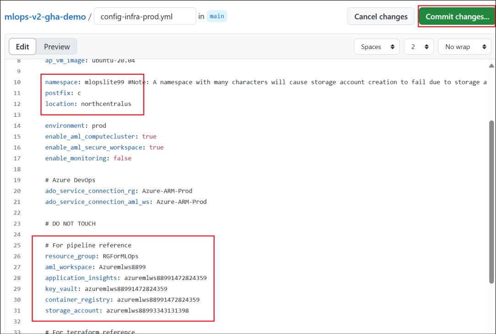

4.  Click on **Commit changes** in the commit changes pane.

    

5.  Open **deploy-model-training-pipeline-classical.yml** from
    **.github/workflows**. Click on **Edit**(The pencil icon).

    

6.  In the contents of the file, replace the value of **Size** with
    **+++Standard_E4s_v3+++**

    Select **Commit changes**.

    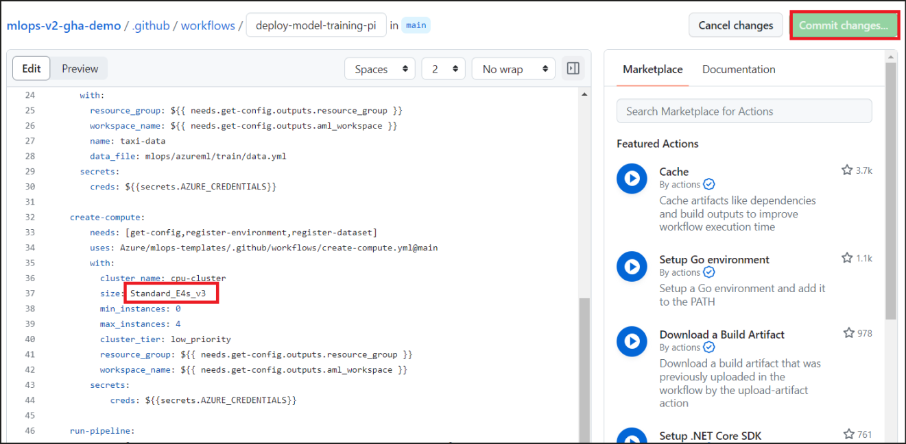

7.  Open the file **online-deployment.yml** from
    **mlops/azureml/deploy/online.** Click on **Edit**(the pencil icon).

    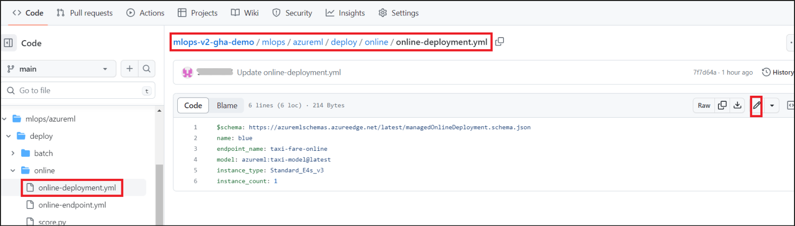

8.  Replace the value of **instance_type** as **+++Standard_E4s_v3+++**.
    Click on **Commit changes**.

    

9.  Open **tf-gha-deploy-infra.yml** file under **.github/workflows**.
    Click on **Edit** and replace Azure with +++CoursesTF+++ in lines 9
    and 14.

    Select **Commit changes**.

    

10. From the top menu bar, select **Actions**. Click on **I understand
    my workflows, go ahead and enable them**.

    

11. This displays the pre-defined GitHub workflows associated with your
    project.

    

## **Exercise 5: Deploy Machine Learning infrastructure**

1.  Select **tf-gha-deploy-infra.yml**. Click on **Runworkflow**.

    Select

    - Branch – **main**
    
    Select **Run workflow**

    

2.  This would deploy the Machine Learning infrastructure using GitHub
    Actions and Terraform.

3.  Track the status of the job and confirm that the execution is
    successful.

    

    >[!Note] **Note:** This workflow takes around 5 minutes to complete.

**Sample Training and Deployment Scenario:**

The solution accelerator includes code and data for a sample end-to-end
machine learning pipeline which runs a linear regression to predict taxi
fares in NYC. The pipeline is made up of components, each serving
different functions, which can be registered with the workspace,
versioned, and reused with various inputs and outputs. Sample pipelines
and workflows for the Computer Vision and NLP scenarios will have
different steps and deployment steps.

This training pipeline contains the following steps:

- Prepare Data

- Train Model

- Evaluate Model

- Register Model

## **Exercise 6: Deploying the Model Training Pipeline**

Next, you will deploy the model training pipeline to your new Machine
Learning workspace.

This pipeline will create a compute cluster instance, register a
training environment defining the necessary Docker image and python
packages, register a training dataset, then start the training pipeline
described in the last section. 

1.  From the **tf-gha-deploy-infra.yml** workflow page, Click on
    **Actions**.

    

2.  This displays the pre-defined GitHub workflows associated with your
    project. Select **deploy-model-training-pipeline** from the list.

    

3.  Click on **Run workflow** -\> **Run workflow**.

    

4.  Click on the pipeline that has just started, to track the progress.

    

5.  This pipeline takes around 15 to 45 minutes to complete.

    

6.  A screenshot of the successful pipeline execution is below.

    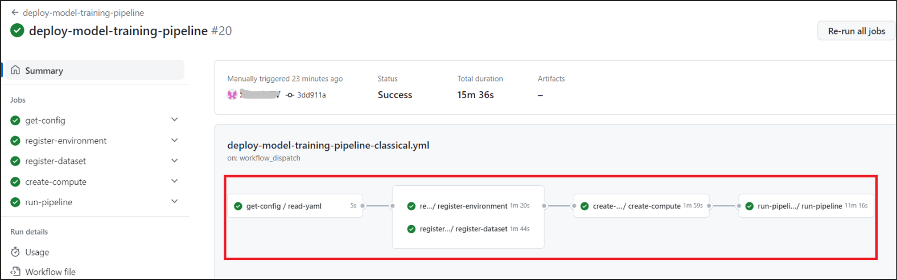

7.  This execution will register the model in the Machine Learning
    workspace.

8.  Login to the AzureMachineLearning studio at <https://ml.azure.com/>
    and click on **Data** from the left pane to check that the
    **taxi-data** has been added there. This is done as part of the
    **register-dataset** job of the workflow.

    

9.  Click on **Jobs** from the left pane and select
    **taxi-fare-training**. This is executed in the **run-pipeline** job
    of the workflow.

    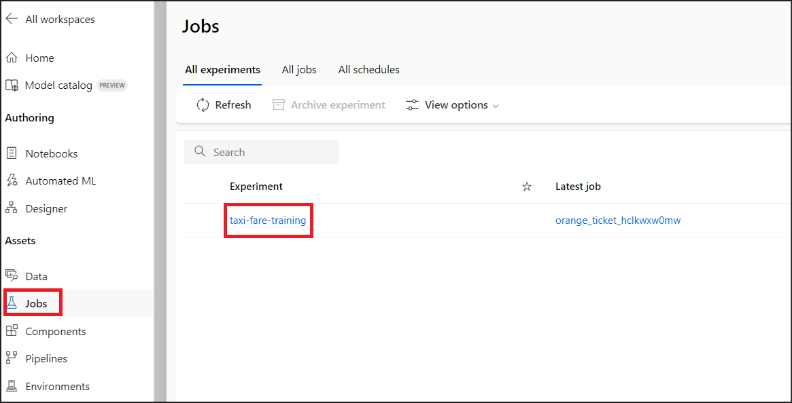

10. Select the latest execution’s Display name.

    

11. Explore the stages and the details involved in the training.

    

With the trained model registered in the Machine learning workspace, you
are ready to deploy the model for scoring.

## **Exercise 7: Delete Resources**

1.  From the left pane of the AML workspace, select **Compute**.

2.  Select the **Compute clusters** tab, select the compute and then
    click on **Delete**.

    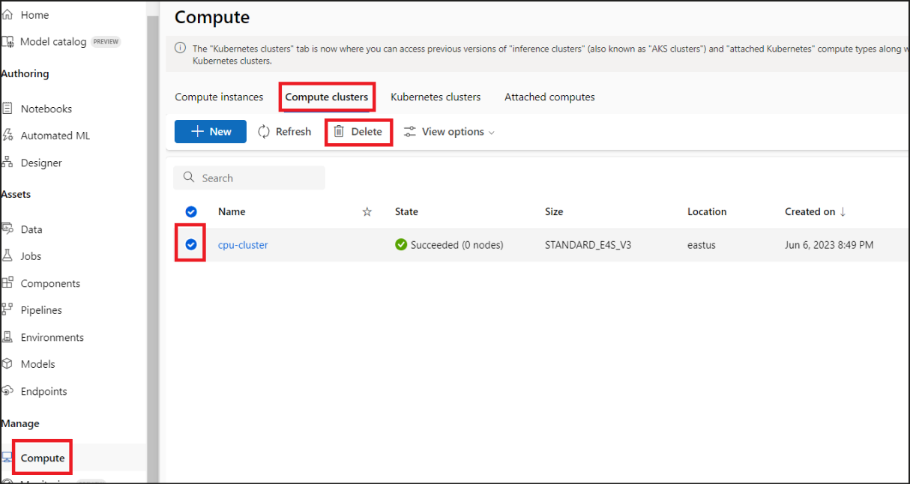

3. A notification for successful compute deletion is obtained once the deletion is completed.

    

**Summary**

In this lab we have learnt on using Azure Machine Learning to set up an
end-to-end MLOps pipeline, which prepared the data and deployed the
model training pipeline to your new Machine Learning workspace.
