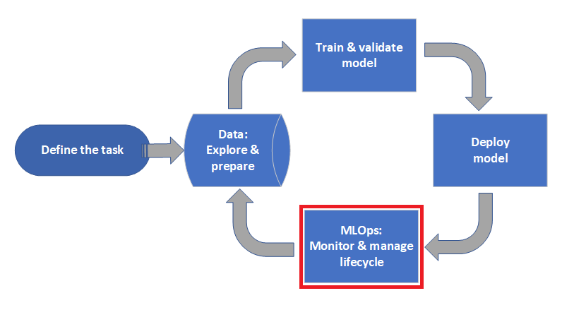
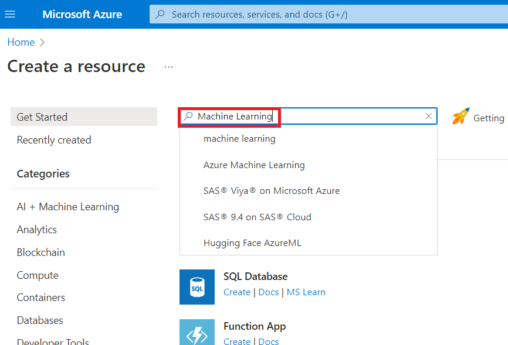
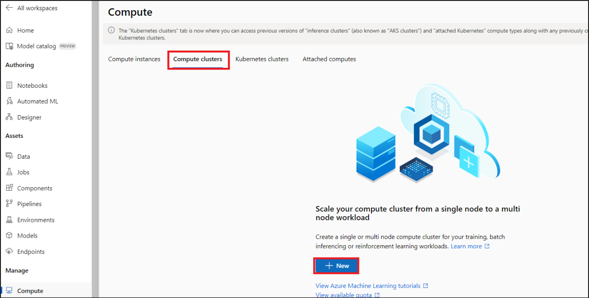
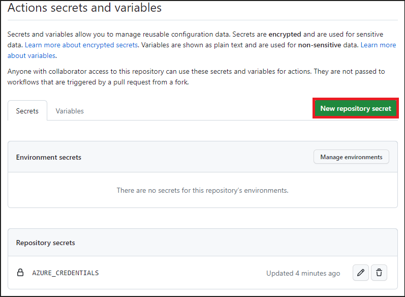
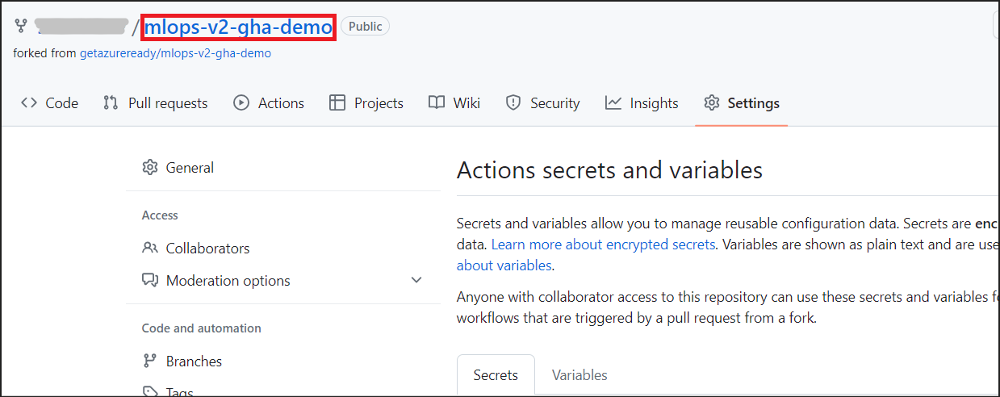
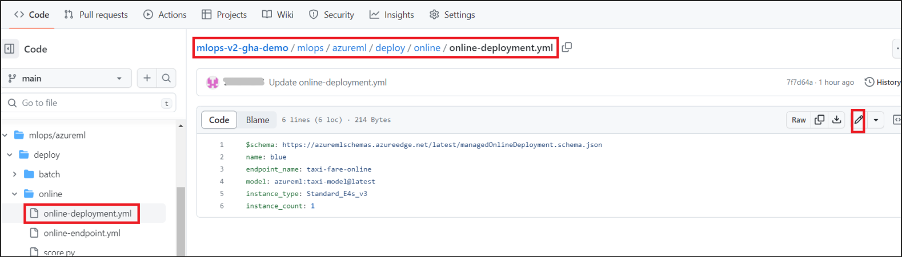
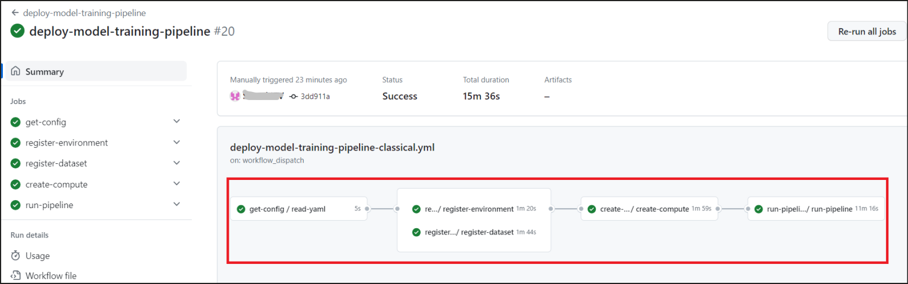
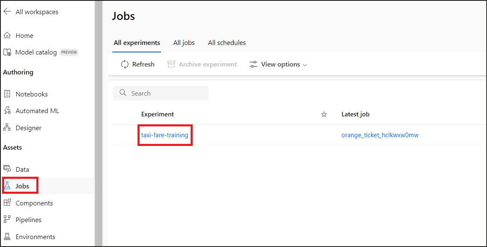

# **Atelier 09 - Configuration du MLOps avec GitHub**

**Objectif :**

Azure Machine Learning vous permet d'intégrer **GitHub Actions** pour
automatiser le cycle de vie du Machine Learning.

Dans cet atelier, vous allez apprendre à utiliser Azure Machine Learning
pour configurer un pipeline MLOps de bout en bout qui exécute une
régression linéaire pour prédire les tarifs des taxis à New York. Le
pipeline est composé de composants, chacun ayant des fonctions
différentes, qui peuvent être enregistrés dans l'espace de travail,
versionnés et réutilisés avec diverses entrées et sorties.

Durée prévue : 60 minutes

Nous sommes à la phase MLOps d'Azure Machine Learning

## **Exercice 1 : Préparation des ressources Azure**

### **Tâche 1 : Créer un espace de travail Azure Machine Learning**

1.  Connectez-vous au portail Azure à l'adresse
    +++<https://portal.azure.com>+++ si vous n'êtes pas déjà connecté.

2.  Dans la page d'accueil du portail Azure, sélectionnez **+ Create a
    resource**.

3.  Sur la page **Create a resource**, utilisez la barre de recherche
    pour trouver +++Azure Machine Learning+++

4.  Sélectionnez **Machine Learning**.

> 

5.  Sous **Marketplace**, cliquez sur **le menu déroulant Create** et
    sélectionnez **Azure Machine Learning**.

> 

6.  Fournissez les informations suivantes pour configurer votre nouvel
    espace de travail :

    - **Subscription**: sélectionnez l**'abonnement Azure** qui vous **a
      été attribué**

    - **Resource group** : sélectionnez le **Resource group** qui vous
      est attribué.

> **Workspace Details:**

- **Workspace name:** +++**Azuremlws@lab.LabInstance.Id**+++

- **Region** : sélectionnez la région la plus proche **(North Central
  US** est sélectionné ici)

&nbsp;

- **Container registry: Select Create new. Enter
  +++azuremlcr@lab.LabInstance.Id+++**

7.  Une fois la Validation passée, cliquez sur **Create**.

8.  Cliquez sur **Go to resource**, pour afficher le nouvel espace de
    travail.

9.  **On the Microsoft.MachineLEarningServices | Overview page**,
    sélectionnez **Launch studio** sous **Work with your model in Azure
    Machine Learning studio**.

### **Tâche 2 : Créer un calcul (compute)**

1.  Une fois qu'Azure Machine Learning Studio s'ouvre, cliquez sur
    **Compute** sous **Manage** dans le volet gauche.

2.  Sélectionnez l'onglet **Compute clusters** et cliquez sur **+ New**

3.  Sur l'écran **Create compute cluster**, entrez les détails
    ci-dessous.

    1.  Location : sélectionnez **Region** dans laquelle vous avez créé
        votre Azure Machine Learning Workspace

    2.  Virtual machine tier – **Dedicated**

    3.  Virtual machine type – **CPU**

    4.  Virtual machine size –Sélectionnez **Standard_E4s_v3 (**cochez
        Sélectionner parmi toutes les options pour trouver la taille de
        la machine virtuelle**)**

> Cliquez sur **Next**.
>
> 

4.  Sur la page **Advanced Settings**, entrez les détails ci-dessous.

&nbsp;

1.  Compute name : +++**cpu-cluster@lab. LabInstanceId**+++

2.  Minimum number of nodes – 0

3.  Maximum number of nodes – 1

> Cliquez sur **Create**.

**Remarque :** Le calcul (compute) prend environ 10 minutes pour
atteindre l'état En cours d'exécution.

## **Exercice 2 : Récupérer les ressources Azure**

1.  À partir du portail Azure (<https://portal.azure.com>), ouvrez votre
    groupe de ressources et notez les noms des ressources suivantes :

    1.  **Azure Machine Learning Workspace**

    2.  **Application Insights**

    3.  **Key Vault**

    4.  **Container Registry**

    5.  **Storage account**

> Et enregistrez-les localement dans un bloc-notes pour les mettre à
> jour dans le fichier de configuration.

## **Exercice 3 : Préparation du compte et des ressources GitHub**

**Remarque :** Si vous n'avez pas encore de compte GitHub, créez-en un à
partir d'ici +++https://github.com/+++ -\> **Signup**.

### **Tâche 2 : Forker la démo mlops du dépôt dans votre compte GitHub**

1.  Ouvrez un navigateur et entrez ce lien -
    +++<https://github.com/getazureready/mlops-v2-gha-demo>+++

2.  Cliquez sur **Fork** en haut à droite.

3.  Cela ouvre une page **Create a new fork**. Cliquez sur **Create
    fork.**

4.  Dans votre projet GitHub, sélectionnez **Settings**.

5.  Sélectionnez **Actions** sous **Secrets and variables.**

6.  Sélectionnez **New repository secret**.

7.  Nommez ce secret sous la forme **+++AZURE_CREDENTIALS+++** et collez
    la sortie du **Service principal** ci-dessous comme contenu du
    secret. Ce principal de service est pré-créé pour vous. Sélectionnez
    **Add secret**.

> {
>
> "clientId": "+++@lab .Variable(spAppId)+++",
>
>   "clientSecret": "+++@lab .Variable(spClientSecret)+++",
>
>   "subscriptionId": "+++@lab.CloudSubscription.Id+++",
>
>   "tenantId": "+++@lab.CloudSubscription.TenantId+++",
>
>   "activeDirectoryEndpointUrl": "https://login.microsoftonline.com",
>
>   "resourceManagerEndpointUrl": "https://management.azure.com/",
>
>   "activeDirectoryGraphResourceId": "https://graph.windows.net/",
>
>   "sqlManagementEndpointUrl":
> "https://management.core.windows.net:8443/",
>
>   "galleryEndpointUrl": "https://gallery.azure.com/",
>
>   "managementEndpointUrl": "https://management.core.windows.net/"
>
> }
>
> 

8.  Le secret **AZURE_CREDENTIALS** ajouté s'affiche sous **Repository
    secrets**.

9.  Cliquez sur **New repository secret**.

10. Fournissez les détails ci-dessous.

    1.  Name – +++ARM_CLIENT_ID+++

    2.  Secret – +++@lab .Variable(spAppId)+++

> 

11. Répétez les étapes 9 et 10 pour les valeurs suivantes, en créant des
    secrets GitHub supplémentaires.

    - +++ARM_CLIENT_SECRET+++ - +++@lab . Variable(spClientSecret)+++

    - +++ARM_SUBSCRIPTION_ID+++ - +++@lab.CloudSubscription.Id+++

    - +++ARM_TENANT_ID+++++ - +++@lab. CloudSubscription.TenantId+++

## **Exercice 4 : Configurer les paramètres de l'environnement Machine Learning**

1.  À partir de la page des secrets, accédez à la page du référentiel en
    cliquant sur **mlops-v2-gha-demo** à côté de votre identifiant
    GitHub en haut à gauche.

2.  Sélectionnez le fichier **config-infra-prod.yml** à la racine.
    Cliquez sur **Edit** (l'icône en forme de crayon).

3.  Modifiez les valeurs,

    1.  **Namespace** – **mlopsliteXX (**Remplacer XX par un nombre
        aléatoire)

    2.  **Postfix** – **c**

    3.  **location** : **identique à la région de votre Workspace**

> Cliquez sur **Commit changes**.
>
> Dans **For pipeline reference section**, remplacez les **valeurs
> (values)** des ressources Azure par les valeurs que nous avons
> récupérées et enregistrées dans l'exercice 2.
>
> 

4.  Cliquez sur **Commit changes** dans le volet Commit changes.

5.  Ouvrez **deploy-model-training-pipeline-classical.yml** à partir de
    **.github/workflows**. Cliquez sur **Edit** (l'icône du crayon).

6.  Dans le contenu du fichier, remplacez la valeur de **Size** par
    **+++Standard_E4s_v3+++**

Sélectionnez **Commit changes**.

> 

7.  Ouvrez le fichier **online-deployment.yml** partir de
    **mlops/azureml/deploy/online.** Cliquez sur **Edit** (l'icône du
    crayon).

8.  Remplacez la valeur de **instance_type** par
    **+++Standard_E4s_v3+++**. Cliquez sur **Commit changes**.

9.  Ouvrez **tf-gha-deploy-infra.yml** fichier sous
    **.github/workflows**. Cliquez sur **Edit** et remplacez Azure par
    +++CoursesTF+++ aux lignes 9 et 14.

Sélectionnez **Commit changes**.

10. Dans la barre de menu supérieure, sélectionnez **Actions**. Cliquez
    sur **Je comprends mes workflow, allez-y et activez-les**.

11. Cela affiche les workflow GitHub prédéfinis associés à votre projet.

## **Exercice 5 : Déployer l'infrastructure de Machine Learning**

1.  Sélectionnez **tf-gha-deploy-infra.yml**. Cliquez sur **Run
    workflow**.

Choisir

- Branch – **main**

Sélectionnez **Run workflow**

2.  Cela déploie l'infrastructure de Machine Learning à l'aide de GitHub
    Actions et de Terraform.

3.  Suivez l'état de la tâche et confirmez que l'exécution a réussi.

**Remarque :** Ce workflow prend environ 5 minutes.

## **Exercice 6 : Déploiement du pipeline d'entraînement du modèle**

Ensuite, vous allez déployer le pipeline d'entraînement du modèle dans
votre nouvel espace de travail Machine Learning.

Ce pipeline crée une instance de cluster de calcul, inscrit un
environnement d'entraînement définissant l'image Docker et les packages
python nécessaires, inscrit un jeu de données d'entraînement, puis
démarre le pipeline d'entraînement décrit dans la dernière section.

1.  Sur la page de workflow tf-gha-deploy-infra.yml, cliquez sur
    **Actions**.

2.  Cela affiche les workflow GitHub prédéfinis associés à votre projet.
    Sélectionnez **deploy-model-training-pipeline** dans la liste.

3.  Cliquez sur **Run workflow** -\> **Run workflow**.

4.  Cliquez sur le pipeline qui vient de démarrer pour suivre la
    progression.

5.  Ce pipeline prend environ 15 à 45 minutes.

6.  Vous trouverez ci-dessous une capture d'écran de l'exécution réussie
    du pipeline.

7.  Cette exécution enregistre le modèle dans l'espace de travail
    Machine Learning.

8.  Connectez-vous au studio AzureMachineLearning à l'adresse
    <https://ml.azure.com/> et cliquez sur **Data** dans le volet gauche
    pour vérifier que les **taxi-data** y ont été ajoutées. Cette
    opération est effectuée dans le cadre de la tâche
    **register-dataset** du workflow.

9.  Cliquez sur **Jobs** dans le volet de gauche et sélectionnez
    **taxi-fare-training**. Ceci est exécuté dans la tâche
    **run-pipeline** du workflow.

10. Sélectionnez le nom d'affichage de la dernière exécution.

11. Explorez les étapes et les détails de la formation.

Une fois le modèle formé inscrit dans l'espace de travail Machine
Learning, vous êtes prêt à déployer le modèle pour l'évaluation.

**Résumé**

Dans cet atelier, nous avons appris à utiliser Azure Machine Learning
pour configurer un pipeline MLOps de bout en bout, qui a préparé les
données et déployé le pipeline d'entraînement de modèle dans votre
nouvel espace de travail Machine Learning.
